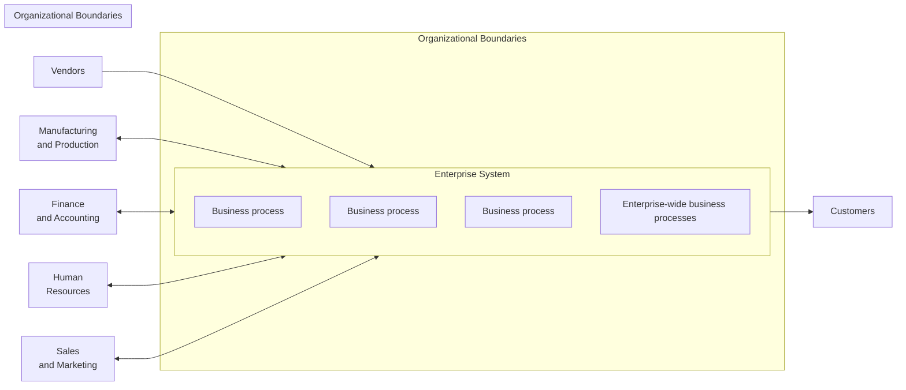

## 业务流程：
以提供有价值的产品或服务为中心而进行的一系列业务工作的组织和协调方式
企业信息化的核心基础
- 物料、信息、知识的流动
- 活动、步骤的集合 set of activities and procedures
- 可能与企业的一个部门相关，也可以是跨部门的 cross-functional
- 企业：可以被看做是业务流程的集合
- 业务流程可以是企业的资产或企业的负债
  业务流程

## 主要应用系统
1. 销售营销系统
2. 生产制造系统
3. 财务会计系统
4. 人力资源系统

### 事务处理系统 `TPS`
面向业务经理和员工；最基础；
解决事先定义、结构化的目标和管理决策问题；

### 商务智能系统 `BI`
- `MIS` 管理报告系统
    - 面向低层
- `DSS` 决策支持系统
    - 面向中层
    - 怎么构建？数据哪里来？哪里去？
- `SIS`, `ESS` 主管战略支持系统
    - 面向高层

### 企业系统 `ERP`
为什么要实施信息系统集成？怎样做？
解决了数据碎片化和信息孤岛问题
有利于：
- 日常事务处理之间协调
- 快速响应客户订单（生产和库存）
- 帮助管理人员对日常运营和长远计划作出决策

### 企业应用系统

1. `ES` 企业系统 (包括`ERP`)
2. `SCM` 供应链管理系统
    - 管理企业与供应商之间的关系，与供应商共享信息
    - 目标: `just-in-time` 以最少的时间和最低的成本将合适数量的产品送到目的地
3. `CRM` 客户关系管理系统
    - 三方面: 销售、营销、客户服务
    - 帮助公司去识别、吸引和留住最有利可图的用户
4. `KMS` 知识管理系统
    - 在公司内部收集知识和经验，并让员工共享使用

### 协同和社会化企业系统
协同：
- 可以是短暂/长久、正规/非正规
- 计算机工作更需要信息协同

社交商务

### 企业信息系统管理机构
###  企业信息系统管理部门
信息主管、CIO、CKO，...