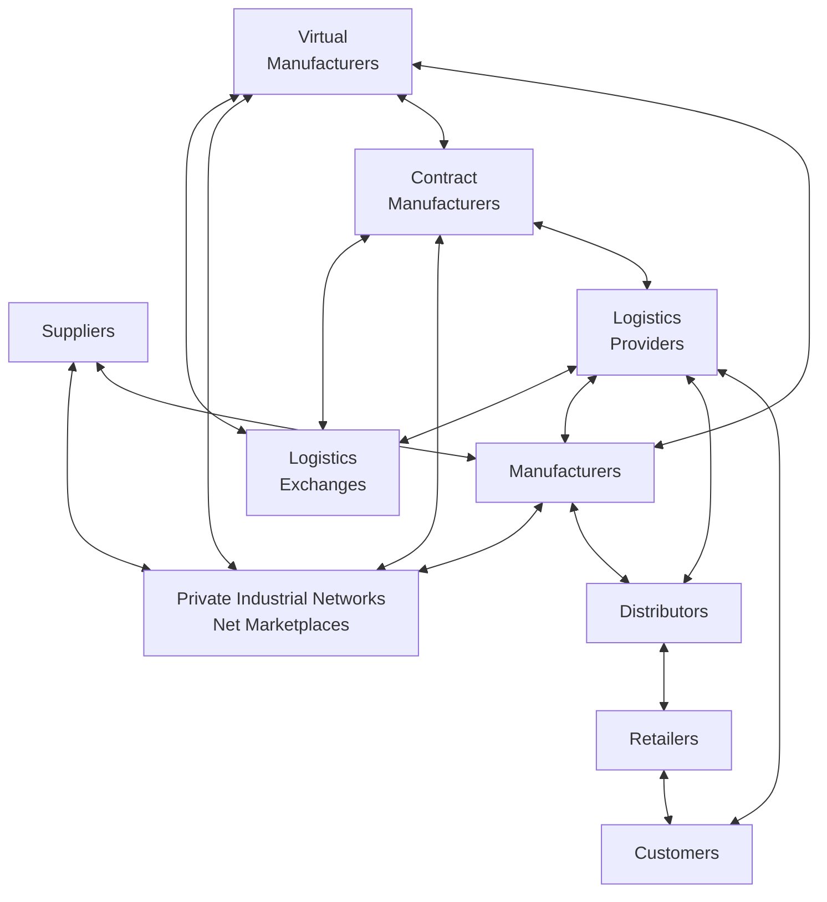

# `ERP` 企业资源计划系统
## 主要特点
- 模块化设计`Modular Design`，根据需要选择独立的功能模块；
- 中央数据库`Central DBMS`，一个应用系统、一个统一平台；
- 集成式业务流程`Seamless information flow`，部门之间无缝衔接和流动；
- 集成企业最佳的企业实践`Best business practices`，围绕预定义业务流程；
- 可配置的、灵活的；
- 数据与业务处理的实时性；
- 互联网驱动`Internet enabled`；

## 演变过程
`MRP`(1970) -> `MRPII`(1980) -> `ERP`(1990) -> `ERPII`(2000)

## 主要供应商
- 国内：用友、金蝶、鼎捷
- 海外：SAP, 科仁, SSA, Microsoft

## 财务系统
作为扩展，管理进销存

## 生产管理
CRP MRP

# `SCM` 供应链管理系统
## 定义
- 组织和流程的网络 Network of organizations and processes for:
- 从原材料采购、生产制造和产品销售全过程
- 供应链的上游 Upstream supply chain：
  - 公司的供应商、供应商的供应商及其相互之间关系的管理
- 供应链的下游 Downstream supply chain：
  - 分销商、负责向客户交付产品的组织和流程
- 供应链内部 Internal supply chain

## 解决问题
1. 供应链运营效率低
2. 准时生产策略*
3. 安全库存
4. 牛鞭效应*

## 管理软件
1. 供应链计划系统
2. 供应链执行系统

需求驱动的供应链、互联网驱动的供应链

# `CRM` 客户关系管理系统
商业价值
目标：将客户信息分发到企业的各个系统和客户接触点中去；

## 分类
1. 操作型CRM
   - 面向客户的应用程序
2. 分析型CRM
   - 基于操作性CRM和客户接触点数据分析