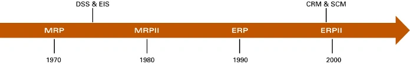
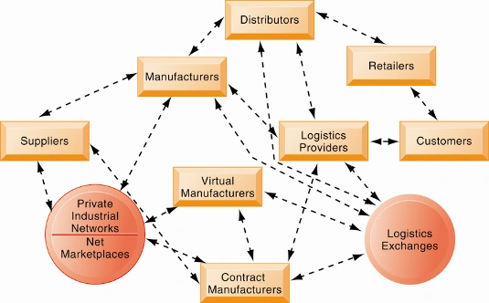

# `ERP` 企业资源计划系统

## 主要特点

- 模块化设计 _Modular Design_，根据需要选择独立的功能模块；
- 中央数据库 _Central DBMS_，一个应用系统、一个统一平台；
- 集成式业务流程 _Seamless information flow_，部门之间无缝衔接和流动；
- 集成企业最佳的企业实践 _Best business practices_，围绕能体现最佳商业实践的预定义业务流程；
- 可配置的、灵活的；
- 数据与业务处理的实时性；
- 互联网驱动 _Internet enabled_；

## 演变过程

`MRP`(1970) -> `MRPII`(1980) -> `ERP`(1990) -> `ERPII`(2000)

## 主要供应商

- 国内：用友、金蝶、鼎捷
- 海外：SAP, 科仁, SSA, Microsoft

# `SCM` 供应链管理系统

## 定义

- 组织和流程的网络 _Network of organizations and processes for_:
- 从原材料采购、生产制造和产品销售全过程
- 供应链的上游 _Upstream supply chain_：
    - 公司的供应商、供应商的供应商及其相互之间关系的管理
- 供应链的下游 _Downstream supply chain_：
    - 分销商、负责向客户交付产品的组织和流程
- 供应链内部 _Internal supply chain_

## 要解决的问题

1. 提高供应链运营效率：降低运营开支
2. ++准时生产策略++：零部件当需要的时候到达；离开装配线后成品出货
3. 安全库存：缓冲供应链缺乏灵活性
4. ++牛鞭效应++

> 牛鞭效应 (Bullwhip Effect) 是指在供应链中，需求信息在传递过程中逐级放大，导致上游供应商的需求波动远大于下游客户的实际需求波动。

## 供应链管理软件

1. 供应链计划系统
    - 供应链建模（确定供应链中哪些实体）
    - 制定求计划
    - 优化采购和制造计划
    - 建立库存水平
    - 确定运输方式

2. 供应链执行系统
   在配送中心和仓库之间管理产品的流动

## 互联网驱动的供应链

新兴的互联网驱动的供应链像数字物流神经系统一样运作。
它提供了企业之间，企业网络和电子市场之间的多方位沟通，使整个供应链合作伙伴网络可以立即调整库存，订单和生产量。

   

### 区块链
**区块链技术的特点：**
1. **去中心化：** 不依赖中心化机构，通过分布式节点共同维护账本。
2. **不可篡改性：** 一旦记录存储在区块中并得到共识，便很难被修改或删除。
3. **透明性与可追溯性：** 所有交易记录对链上参与者公开，可追踪每一笔资产的流向。
4. **共识机制：** 通过特定算法（如 PoW、PoS）确保所有节点达成数据一致性。
5. **智能合约：** 支持自动执行的编程代码，当满足预设条件时自动触发逻辑。

**区块链在互联网驱动供应链中的应用：**
- 全流程溯源：在产品从原材料采购到最终交付的整个过程中，记录每一个环节的详细信息，确保产品真实性（防止假冒伪劣）。
- 提高透明度：上游供应商、分销商及下游组织可以共享同一个可信账本，解决“牛鞭效应”中的信息不对称问题，让需求预测更精准。
- 物流效率优化：通过智能合约自动处理货权转移、报关和结算等流程，减少人工审核和纸质文档处理带来的延迟。
- 信用担保与融资：供应链金融中，中小企业可以利用其在区块链上的真实交易记录作为信用凭证，更轻松地获取贷款。
- 流程防欺诈：由于数据不可篡改，可以有效防止物流过程中的虚假订单或冒领现象。

# `CRM` 客户关系管理系统

## 商业价值

1. 提高客户满意度
2. 降低直接营销的成本
3. 更有效的营销方式
4. 降低获取和保留客户的成本
5. 增加销售收入

## 目标

* 客户资源管理管理，了解客户。
* 从整个组织中获取和集成客户数据，同一个客户的数据集成到一个视图中
* 强化和分析客户数据
* 将客户信息分发到企业的各个系统和++客户接触点++中去 _customer touch point_
* 与客户交互

## 分类

1. 操作型CRM
    - 面向客户的应用程序如销售团队自动化，呼叫中心和客户服务支持，以及营销自动化
2. 分析型CRM
    - 基于操作性CRM和客户接触点数据分析客户数据

# `KMS` 知识管理系统
在下一章中展开阐述

# 企业应用系统总结

## 优点

* 有助于统一企业的组织架构：一个组织
* 管理： 企业范围内的基于知识的业务流程
* 技术：统一的平台，统一的中央数据库
* 企业：客户驱动的更高效的业务流程

## 面临的挑战

* 一个复杂的软件系统，需要投入大量的时间、资金和专业知识。软件购买和实施服务费用都很高。平均每个ERP项目280万美元（2014年）。
* 要求对业务运作方式（业务流程）进行根本性的改变。
* 组织需要学习和改变自己，很多企业不理解这一点。
* 依赖于软件供应商的服务支持，增加了用户的跳槽成本（云计算模式也许可以解决这个问题）。
* 数据需要标准化、有效的组织管理以及进行数据清洗。
* 技术变化和技术发展可能会淘汰原有系统。
* 业务流程的变化，软件需要不断维护和修改。

