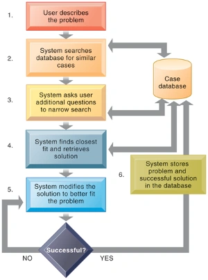

# 企业知识管理

## 准备：从数据到智慧

> 数据：原始的事实 raw facts and transactions
>
> 信息：经过组织过的有意义的、有用的数据 meaningful and useful data
>
> 知识：创建、评价和利用信息的一些概念、经验和洞察力 Concepts, experience, and insight
>
> 智慧：应用知识去解决问题的经验（集体或个人），知道何时、何地以及如何应用知识 knowing when, where, and how to apply
> knowledge

## ++知识的特性++{.wavy}

- 知识可以是显性的（explicit, documented）也可以是隐性的 （tacit，residing in minds)
- 知识可以表现为一种技术、手艺或技能 Know-how, craft, skill
- 如何按照遵守程序，按规则办事 How to follow procedure
- 知识是公司的一种资产（无形资产）
- 知识不像物质资产那样受收益递减法则的约束，而是共享的人越多其价值越大
- 知识是一个认知活动
- 知识可以是个体的，也可以是集体的。一个善于学习的组织可能生存得更久 Organizational Learning and Knowledge Management
- 知识具有粘性的（hard to move），可能沉浸于企业文化中，不具备普遍适用性，不可轻易被转移
- 知识具有情境性 situational and contextual，与应用场景有关。

## ++知识管理的过程++{.wavy}

知识管理的过程也就是价值增值的过程，也称为知识管理价值链模型。
知识管理每个阶段将原始数据和信息转换为可用的知识时，都增加了数据和信息的价值。
知识管理核心是将隐性知识转换为显性知识

### 知识获取 Knowledge Acquisition

* 把隐性知识和显性知识文档化。
* 把企业文件、报告、报表、规则进行整理归档。
* 把一些非结构化的文档 (文件夹、消息、备忘录、提案、电子邮件、图形、ppt演示稿，新闻推送、维基百科、微博、视频、员工个人画像)
  进行分类和归档。
* 建立标准操作流程SOP，业务流程/工作流程详解。
* 收集最佳商务实践。
* 在公司工程师的知识工作平台中，找到规则和模式，创建和发现新知识。
* 从公司的事务处理系统中的提取关键绩效指标（KPI）数据（例如：销售跟踪、付款、库存、客户和其他重要数据），以便挖掘其中的知识。
* 收集外部来源的数据，如新闻提要、行业报告、法律意见、科学研究和政府统计数据。
* 收集供应链和竞争对手的数据，例如网络爬虫方法
* 开发在线(线上)的专家网络交流问答平台，在公司里“找到知识专家”，在问答的过程中发现新的解决方案，创建新的知识 。

采用智能技术发现知识：

* 数据挖掘技术 Data mining
* 神经网络 Neural network
* 遗传算法 Genetic algorithms
* 知识工作站 Knowledge workstation

### 知识存储 Knowledge Storage

* 数据库：将结构化，文档化知识保存到知识库。
* 文档管理系统：用一个统一的架构把文档数字化、经过分类和标记，存储到一个超大的数据库中。企业80%的知识内容属于半结构化和非结构化知识。
* 专家系统：将知识整合到企业的业务流程和文化中去进行程序化存储。一些复杂的业务工作编码成专家系统，例如成本核算的专家系统。

### 知识传播与共享 Knowledge Dissemination

通过各类途径共享各类知识(SOP、规章制度、最佳商业实践、典型案例)。

### 知识应用 Knowledge Application

* 知识管理和知识管理系统的价值体现在知识的应用上。
* 知识必须为管理决策服务，并成为决策支持系统中的一部分。
* 新知识最终必须构建到企业的业务流程和关键应用系统中。

# ++智能技术 Intelligent techniques++{.wavy}

用于捕获个人和集体知识，并扩展知识库。

## 专家系统 Expert System

在非常具体和有限的专业领域中获取隐性知识。
只能解决结构化问题，规则库的维护比较复杂、专家知识发生变化时，专家系统也要重新修改，工作量比较大。

+++ 专家系统举例
Conway运输公司开发一个专家系统，以自动化并优化其全国货运货运业务的隔夜运输路线规划。
专家系统捕捉到调度人员在分配司机、卡车和拖车时遵守的业务规则，这些司机、卡车和拖车每天晚上要在25个州和加拿大运送5万批重货，然后规划它们的路线。
专家系统部署在Sun计算机平台上运行，使用存储在Oracle数据库中的数据，包括客户每天的发货请求、可用的司机、卡车、拖车空间和重量等。
该专家系统使用了数千条规则和10万行用c++编写的程序代码来处理这些数字，并为95%的日常货运制定最佳的路由计划。
Conway调度程序调整了专家系统提供的路由计划，并将最终的路由规范传递给负责为夜间运行打包拖车的现场人员。
Conway公司在两年内通过减少司机数量、增加每辆拖车的货运数量以及减少重新装卸造成的损失，收回了在该系统上的300万美元投资。该系统还减少了调度员夜间繁重的任务。
+++

## 基于案例的推理 Case-Based Reasoning

知识专家把过去的经验以案例形式存储在知识库中；
系统搜索与新问题特征相似的旧案例，提出额外问题，找到最匹配的案例，并将旧案例的解决方案经过必要修改后应用于新案例。
{width=400px}

## 模糊逻辑 Fuzzy Logic

人类倾向于不精确地对事物进行分类，用规则来做出可能有多种含义的决定。
模糊逻辑是一种基于规则的技术，它可以通过创建使用近似或主观值的规则来表示不精确问题。

机器学习 Machine Learning, 神经网络 Neutral Networks ...

