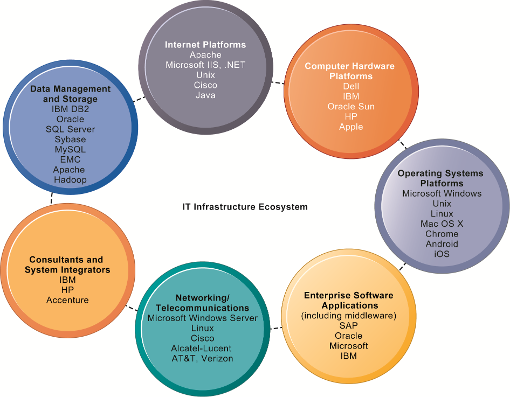

# IT基础设施
## 定义
硬件设备和软件

## 支持的企业服务
* 提供计算服务的计算平台
* 电信服务、远程通信服务
* 数据管理服务
* 应用软件服务
* 物流设备管理服务
* IT管理、教育和其他服务

## 演化过程
1. 通用大型机和小型机时代：1959 至今
2. 个人机 PC 时代: 1981 至今
3. Client/Server 客户机/服务器时代: 1983 至今
4. 企业计算时代：1992 至今
5. 云计算和移动计算：2000 至今

## 技术推动IT设施的演变
* 摩尔定律和微处理能力
  * 计算能力每18个月翻一番 Computing power doubles every 18 months 纳米技术：
  * 将晶体管的大小缩小到与病毒相当的大小
* 大规模数字存储的规律
  * 每年存储的数据量翻了一番 The amount of data being stored doubles each year
* 梅特卡夫定律与网络经济学
  * 一个网络的价值或力量随着网络成员的数量呈指数增长
  * 随着网络成员的增加，更多的人想使用它(对网络访问的需求增加)

## 七个主要组成部分
1. 计算机硬件平台
2. 操作系统平台
3. 企业软件应用
4. 数据管理与存储
5. 网络和远程通信
6. 互联网平台
7. 咨询与系统集成服务

# 互联网应用趋势
## 软件即服务 (++SaaS++{.wavy}, Software-as-a-Service) 
软件的交付模型，在这种模型中，您**按使用次数付费购买软件**，而不是直接购买软件。
* 使用服务提供商的任何设备做任何事情
* 支付一小笔费用并在网上存储文件
* 与普通计算机类似的方式访问这些文件
* 充分利用应用服务提供者 ASP: Application Service Provider

还有 IaaS: Infrastructure as a Service; PaaS: Platform as a Service
