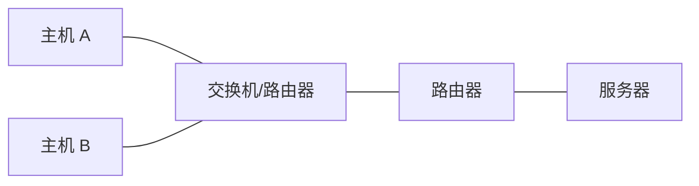

# 计算机网络的定义

计算机网络是把分散的、具有独立功能的计算机系统，通过通信线路和通信设备连接起来，在网络协议控制下实现数据通信和资源共享的系统。

关键词：

- **分散**：结点位于不同位置。
- **自治**：每台计算机有独立处理能力。
- **互连**：通过通信链路与网络设备连接。
- **协议控制**：通信双方遵守共同规则。
- **资源共享**：共享硬件、软件、数据和服务。



# 计算机网络的组成

从组成结构看，计算机网络可以分为硬件、软件和协议。

| 组成 | 内容 |
| - | - |
| 硬件 | 主机、服务器、路由器、交换机、通信链路、网卡 |
| 软件 | 网络操作系统、网络应用、管理软件 |
| 协议 | TCP/IP、HTTP、DNS、Ethernet 等通信规则 |

从功能角度看，可以分为：

| 部分 | 作用 |
| - | - |
| 资源子网 | 提供资源和服务，主要包括主机、服务器、应用程序 |
| 通信子网 | 完成数据传输，主要包括路由器、交换机、通信链路 |

:::info
资源子网强调“提供什么”，通信子网强调“怎么传过去”。考题常用这个角度区分主机与网络设备的作用。
:::

# 计算机网络的功能

主要功能：

1. 数据通信：在主机之间传递数据。
2. 资源共享：共享硬件、软件、数据和计算资源。
3. 分布式处理：多台计算机协同完成任务。
4. 提高可靠性：通过冗余链路和备份系统提高可用性。
5. 负载均衡：把请求分散到多个服务器或路径。

典型例子：

| 功能 | 示例 |
| - | - |
| 数据通信 | 即时消息、电子邮件 |
| 硬件共享 | 网络打印机 |
| 软件共享 | SaaS 在线服务 |
| 数据共享 | 数据库、文件服务器 |
| 分布式处理 | 分布式计算、云计算 |

# 计算机网络的分类

## 按覆盖范围分类

| 类型 | 英文 | 范围 | 示例 |
| - | - | - | - |
| 个域网 | PAN | 个人设备范围 | 蓝牙耳机、手机热点 |
| 局域网 | LAN | 房间、楼宇、校园 | 以太网、Wi-Fi |
| 城域网 | MAN | 城市范围 | 城域宽带网 |
| 广域网 | WAN | 国家、洲际、全球 | Internet 骨干网 |

## 按交换方式分类

| 类型 | 特点 |
| - | - |
| 电路交换 | 传输前建立专用通路，通信期间独占资源 |
| 报文交换 | 以完整报文为单位存储转发 |
| 分组交换 | 把报文拆成分组，逐跳存储转发 |

分组交换是现代计算机网络的核心。

## 按拓扑结构分类

| 拓扑 | 特点 |
| - | - |
| 总线形 | 所有结点共享一条总线，结构简单但冲突明显 |
| 星形 | 结点连接到中心设备，现代局域网常见 |
| 环形 | 结点形成闭环，令牌环曾使用 |
| 网状 | 多条冗余路径，可靠性高但成本高 |
| 树形 | 层次结构，便于扩展和管理 |

## 按传输技术分类

| 类型 | 含义 |
| - | - |
| 广播式网络 | 一个结点发送，其他结点都能收到，再按地址判断是否接收 |
| 点对点网络 | 由点到点链路组成，分组经中间结点逐跳转发 |

局域网常见广播式思想，广域网常见点对点转发思想。

# 标准化组织

常见组织：

| 组织 | 作用 |
| - | - |
| ISO | 制定 OSI 参考模型等国际标准 |
| ITU | 电信领域国际标准 |
| IEEE | 制定局域网标准，如 IEEE 802.3、802.11 |
| IETF | 制定 Internet 协议标准，以 RFC 形式发布 |

# 计算机网络性能指标

## 速率

速率指数据传输速率，也叫数据率或比特率，单位为 bit/s。

常见单位：

```text
1 kb/s = 10^3 bit/s
1 Mb/s = 10^6 bit/s
1 Gb/s = 10^9 bit/s
```

注意：网络速率中的 `M` 通常按 $10^6$，存储容量中的 `MB` 通常按字节计。

## 带宽

带宽有两种含义：

| 场景 | 含义 | 单位 |
| - | - | - |
| 通信领域 | 信道允许通过的频率范围 | Hz |
| 计算机网络 | 链路最高数据传输速率 | bit/s |

考研网络题中，带宽通常指后者。

## 吞吐量

吞吐量是单位时间内通过某个网络或接口的实际数据量。

带宽是理论上限，吞吐量是实际表现。吞吐量会受到协议开销、拥塞、设备性能和链路质量影响。

## 时延

总时延通常由四部分组成：

$$
总时延 = 发送时延 + 传播时延 + 处理时延 + 排队时延
$$

| 类型 | 含义 | 公式或影响因素 |
| - | - | - |
| 发送时延 | 把分组全部推入链路所需时间 | 分组长度 / 发送速率 |
| 传播时延 | 信号在链路上传播所需时间 | 链路长度 / 信号传播速率 |
| 处理时延 | 结点检查首部、差错、路由等处理时间 | 设备性能 |
| 排队时延 | 分组在队列中等待转发时间 | 拥塞程度 |

:::warning
发送时延取决于分组长度和发送速率；传播时延取决于距离和信号传播速度。二者不是一回事。
:::

## 时延带宽积

时延带宽积表示一条链路中“正在路上”的比特数。

$$
时延带宽积 = 传播时延 \times 带宽
$$

它可以理解为链路这根“管道”最多容纳多少比特。

## 往返时间 RTT

RTT（Round-Trip Time）指从发送方发送数据开始，到收到接收方确认所经历的时间。

RTT 常用于：

- TCP 超时重传估计。
- ping 测量网络连通性。
- 停止-等待协议的利用率计算。

## 利用率

利用率表示某资源被使用的比例。

常见类型：

- 信道利用率：信道有百分之多少时间在传输数据。
- 网络利用率：全网资源被使用的程度。

利用率不是越高越好。接近 100% 时，排队时延会急剧增加。

# 本节考点

1. 计算机网络的核心是自治计算机互连、协议控制、资源共享。
2. 资源子网提供资源，通信子网负责传输。
3. 分类重点掌握 LAN、MAN、WAN，广播式与点对点，电路/报文/分组交换。
4. 带宽是理论最大速率，吞吐量是实际速率。
5. 时延四部分：发送、传播、处理、排队。
6. 发送时延和传播时延必须区分。
7. 时延带宽积表示链路中可容纳的比特数。

