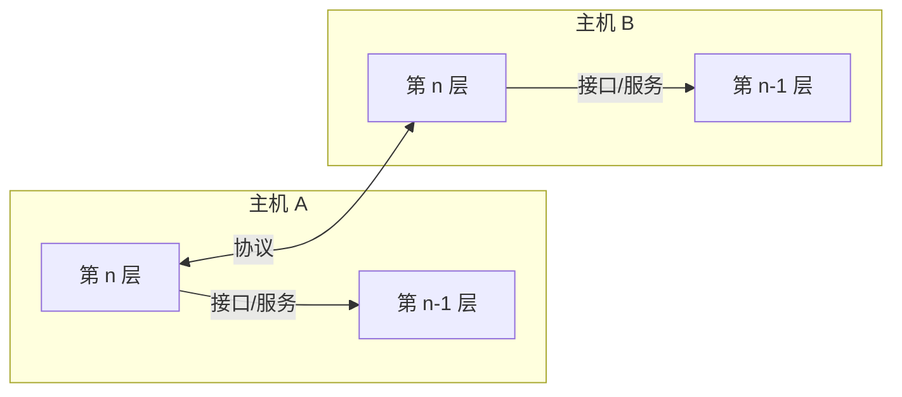
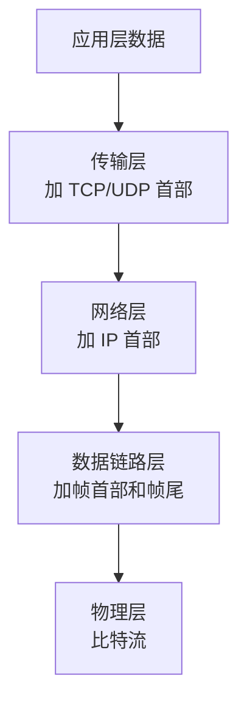
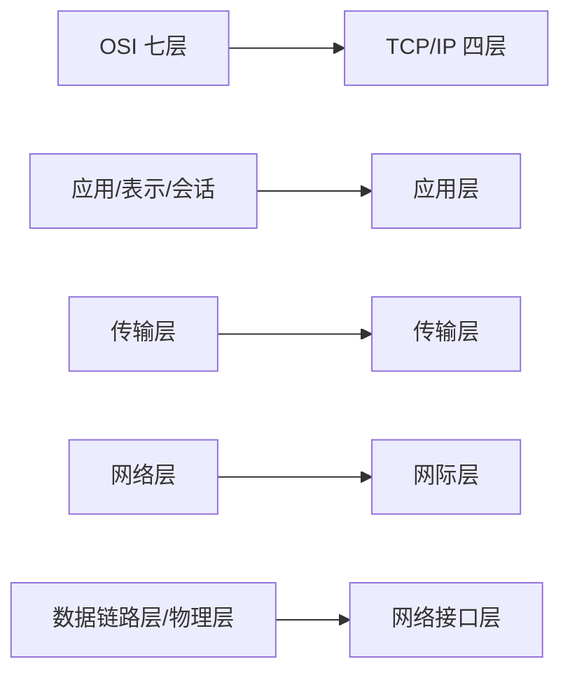
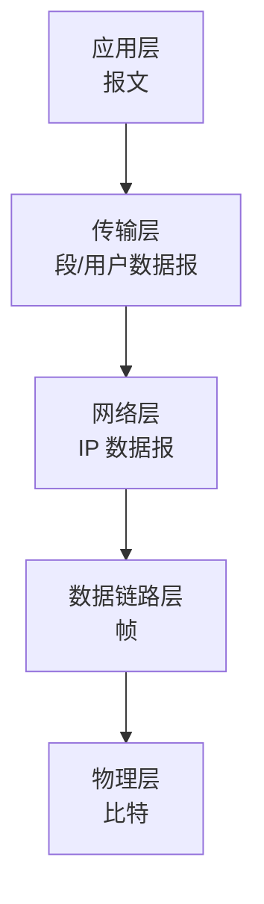

# 为什么需要分层

计算机网络非常复杂，涉及应用、端到端传输、路由、链路传输和物理信号。分层的目的就是把复杂问题拆开：每一层只关注本层任务，并向上层提供服务。

分层优点：

- 降低复杂度。
- 各层职责清晰。
- 便于标准化。
- 便于不同厂商设备互通。
- 某层实现变化时尽量不影响其他层。

分层缺点：

- 层间封装带来额外开销。
- 有些功能可能在多层重复出现，例如差错控制、流量控制。
- 严格分层有时会降低整体优化空间。

# 协议、接口与服务

这三个概念是体系结构章节的核心。

| 概念 | 含义 | 关注方向 |
| - | - | - |
| 协议 | 同层实体之间通信的规则 | 水平方向 |
| 接口 | 相邻层之间交互的边界 | 垂直方向 |
| 服务 | 下层通过接口向上层提供的功能 | 垂直方向 |

## 协议三要素

网络协议规定通信双方交换信息的规则，包含三要素：

| 要素 | 含义 | 示例 |
| - | - | - |
| 语法 | 数据与控制信息的格式 | 首部字段、报文格式 |
| 语义 | 控制信息的含义 | SYN 表示请求建立连接 |
| 时序 | 事件顺序和速度匹配 | 先请求后响应、超时重传 |

:::info
协议是“同层之间”的规则，服务是“下层给上层”的能力。选择题常在这里设陷阱。
:::

# 封装与解封装

发送数据时，每一层把上层数据作为本层载荷，并加上本层首部或尾部；接收时反向拆除。

常见数据单位：

| 层次 | 数据单位 |
| - | - |
| 应用层 | 报文 |
| 传输层 | 段 TCP / 用户数据报 UDP |
| 网络层 | 分组、IP 数据报 |
| 数据链路层 | 帧 |
| 物理层 | 比特 |

# OSI 七层模型

OSI 参考模型从上到下分为七层。

| 层次 | 名称 | 主要功能 |
| - | - | - |
| 7 | 应用层 | 为用户应用提供网络服务 |
| 6 | 表示层 | 数据表示、加密、压缩、格式转换 |
| 5 | 会话层 | 会话建立、管理和释放 |
| 4 | 传输层 | 端到端通信、可靠传输、流量控制 |
| 3 | 网络层 | 路由选择、分组转发、逻辑寻址 |
| 2 | 数据链路层 | 组帧、差错控制、MAC、链路传输 |
| 1 | 物理层 | 比特传输、接口特性、物理介质 |

记忆方向：

- 上三层偏应用和数据表示。
- 中间传输层负责端到端。
- 下三层负责网络传输过程。

# TCP/IP 模型

TCP/IP 模型更贴近实际互联网。

| TCP/IP 层次 | 对应 OSI | 典型协议 |
| - | - | - |
| 应用层 | 应用层、表示层、会话层 | HTTP、DNS、FTP、SMTP |
| 传输层 | 传输层 | TCP、UDP |
| 网际层 | 网络层 | IP、ICMP、ARP、RIP、OSPF |
| 网络接口层 | 数据链路层、物理层 | Ethernet、PPP、Wi-Fi |

# 五层参考模型

考研和教材中常使用五层模型，兼顾 OSI 的清晰性和 TCP/IP 的实用性。

| 层次 | 功能关键词 | 典型协议/技术 |
| - | - | - |
| 应用层 | 应用进程间通信 | HTTP、DNS、FTP、SMTP |
| 传输层 | 进程到进程 | TCP、UDP |
| 网络层 | 主机到主机、路由 | IP、ICMP、路由协议 |
| 数据链路层 | 相邻结点、帧 | Ethernet、PPP、HDLC |
| 物理层 | 比特流 | 双绞线、光纤、无线 |

# 服务类型

## 面向连接与无连接

| 类型 | 特点 | 示例 |
| - | - | - |
| 面向连接服务 | 通信前建立连接，通信后释放连接 | TCP、虚电路 |
| 无连接服务 | 不预先建立连接，每个分组独立处理 | IP、UDP、数据报 |

## 可靠与不可靠

| 类型 | 特点 | 示例 |
| - | - | - |
| 可靠服务 | 有确认、重传、排序等机制 | TCP |
| 不可靠服务 | 尽力而为，不保证到达 | IP、UDP |

:::warning
“面向连接”不等于“可靠”，“无连接”也不必然“不可靠”。它们是两个维度，只是常见协议组合容易让人混淆。
:::

# 各层典型设备

| 层次 | 设备 | 依据 |
| - | - | - |
| 物理层 | 中继器、集线器 | 比特、电信号 |
| 数据链路层 | 网桥、交换机 | MAC 地址 |
| 网络层 | 路由器 | IP 地址 |
| 应用层 | 网关、代理服务器 | 应用协议 |

设备层次判断方法：

1. 看它是否理解地址。
2. 看它依据什么地址转发。
3. 看它处理的数据单位。

# 协议栈总览

常见协议位置：

| 层次 | 协议 |
| - | - |
| 应用层 | HTTP、HTTPS、DNS、FTP、SMTP、POP3、DHCP |
| 传输层 | TCP、UDP |
| 网络层 | IP、ICMP、RIP、OSPF、BGP |
| 数据链路层 | Ethernet、PPP、HDLC、ARP |
| 物理层 | 物理介质和接口标准 |

说明：

- ARP 介于网络层和数据链路层之间，常作为网络层辅助协议掌握。
- DHCP 是应用层协议，使用 UDP。
- DNS 主要使用 UDP，区域传送或大报文可使用 TCP。

# 本节考点

1. 分层的核心价值是降低复杂度和实现标准化。
2. 协议是同层实体之间的规则；服务是下层向上层提供的功能；接口是相邻层交互边界。
3. 协议三要素：语法、语义、时序。
4. OSI 七层、TCP/IP 四层、五层模型要能对应。
5. 数据单位：报文、段/用户数据报、IP 数据报、帧、比特。
6. TCP 是面向连接可靠服务；IP 是无连接不可靠尽力而为服务。
7. 集线器物理层，交换机数据链路层，路由器网络层。

