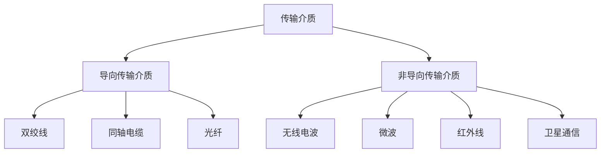

# 物理层接口特性

物理层负责在传输介质上传输比特流。它不关心帧、分组或报文含义，只关心信号如何表示 0 和 1，以及设备之间如何通过物理接口通信。

物理层接口通常包含四类特性：

| 特性 | 含义 | 示例 |
| - | - | - |
| 机械特性 | 接口外形、引脚数量、排列、连接器规格 | RJ45、USB、光纤接口 |
| 电气特性 | 电压范围、电流、阻抗、传输速率、距离 | 高低电平、电缆传输限制 |
| 功能特性 | 每条信号线的功能 | 发送、接收、地线、控制线 |
| 过程特性 | 信号发送和接收的时序流程 | 建立连接、同步、发送顺序 |

:::info
记忆顺序：机械看形状，电气看信号，功能看每根线干什么，过程看通信步骤。
:::

# 传输介质分类

传输介质是信号传输的物理通道，可分为导向传输介质和非导向传输介质。

# 双绞线

双绞线由两根带绝缘层的铜线按一定密度互相绞合而成。绞合可以减少电磁干扰。

类型：

| 类型 | 英文 | 特点 |
| - | - | - |
| 非屏蔽双绞线 | UTP | 成本低，常用于以太网 |
| 屏蔽双绞线 | STP | 抗干扰更强，成本更高 |

常见应用：

- 以太网接入。
- 电话线。
- 局域网布线。

特点：

- 成本低。
- 安装方便。
- 传输距离和抗干扰能力有限。
- 现代局域网主流介质。

# 同轴电缆

同轴电缆由中心导体、绝缘层、金属屏蔽层和外护套组成。

特点：

- 抗干扰能力比普通双绞线强。
- 传输距离较远。
- 成本和安装复杂度较高。

历史应用：

- 早期总线型以太网。
- 有线电视网络。
- 宽带接入。

常见以太网命名：

| 名称 | 介质 |
| - | - |
| 10BASE5 | 粗同轴电缆 |
| 10BASE2 | 细同轴电缆 |

# 光纤

光纤使用光信号传输数据，由纤芯、包层和保护层组成。

优点：

- 传输速率高。
- 传输距离远。
- 抗电磁干扰能力强。
- 保密性较好。
- 适合骨干网和高速链路。

缺点：

- 成本较高。
- 安装和维护技术要求高。
- 弯曲半径和接续质量会影响性能。

## 多模光纤与单模光纤

| 类型 | 特点 | 场景 |
| - | - | - |
| 多模光纤 | 允许多条光路径传播，距离较短，成本较低 | 楼宇、园区内部 |
| 单模光纤 | 只允许单一模式传播，距离远，性能好 | 城域网、骨干网、长距离通信 |

# 无线传输介质

无线传输通过电磁波在自由空间传播。

| 类型 | 特点 | 应用 |
| - | - | - |
| 无线电波 | 穿透能力强，覆盖范围大 | 广播、移动通信 |
| 微波 | 频率高，方向性强，常需视距传播 | 地面微波、蜂窝通信 |
| 红外线 | 距离短，不能穿透障碍物 | 遥控、短距离通信 |
| 卫星通信 | 覆盖范围广，传播时延大 | 远距离通信、广播 |

无线介质的主要问题：

- 容易受干扰。
- 安全性较差。
- 信道质量随环境变化。
- 共享介质竞争明显。

# 物理层设备

物理层设备处理的是比特和信号，不理解 MAC 地址和 IP 地址。

| 设备 | 功能 | 是否隔离冲突域 |
| - | - | - |
| 中继器 | 再生、放大信号，延长传输距离 | 否 |
| 集线器 | 多端口中继器，收到信号后广播到所有端口 | 否 |
| 网卡 | 主机连接网络的接口，完成信号转换 | 不是中间转发设备 |

# 中继器

中继器用于连接同类型网络的两个网段，对衰减或失真的信号进行再生和放大。

特点：

- 工作在物理层。
- 不检查帧格式。
- 不隔离冲突域。
- 不能连接速率、协议差异过大的网络。

中继器只是延长物理链路，不是“智能转发”。

# 集线器

集线器（Hub）可以看作多端口中继器。

工作方式：

1. 某端口收到比特信号。
2. 集线器把信号转发到其他所有端口。
3. 所有连接设备共享同一带宽和同一冲突域。

特点：

- 物理层设备。
- 广播式转发。
- 半双工。
- 不学习 MAC 地址。
- 不隔离冲突域，也不隔离广播域。

:::warning
集线器和交换机必须区分：集线器按比特广播，交换机按 MAC 地址转发帧。
:::

# 网络适配器

网络适配器也称网卡（NIC），用于主机接入网络。

主要功能：

- 完成主机与传输介质之间的信号转换。
- 处理数据链路层的部分功能。
- 拥有 MAC 地址。
- 支持以太网、Wi-Fi 等接入方式。

网卡同时涉及物理层和数据链路层：物理上负责信号收发，链路层上提供 MAC 地址和帧收发能力。

# 本节考点

1. 物理层接口特性：机械、电气、功能、过程。
2. 双绞线成本低、常用于局域网；绞合用于减少干扰。
3. 同轴电缆抗干扰较强，早期以太网和有线电视常用。
4. 光纤速率高、距离远、抗干扰强，适合骨干链路。
5. 无线传输易受干扰，安全性和介质访问控制更复杂。
6. 中继器和集线器都是物理层设备，不隔离冲突域。
7. 集线器是多端口中继器，收到信号后向所有端口转发。
8. 网卡具有 MAC 地址，连接主机与网络介质。

