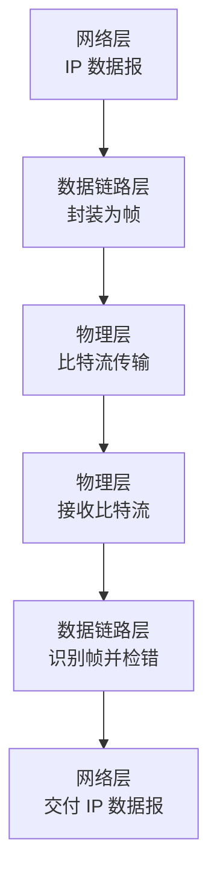

> 介绍数据链路层的定位、组帧方法、差错控制、可靠传输和 MAC 地址等核心概念。

# 数据链路层的定位

数据链路层位于物理层之上、网络层之下。物理层只负责把比特流送到链路另一端，但不关心这些比特如何分组、是否出错、谁可以发送。数据链路层要把原始比特流组织成 **帧**，并在相邻结点之间提供较可靠的数据传输。



:::info
考研语境中，数据链路层的服务范围一般是 **相邻结点之间的一条链路**，不是端到端。端到端可靠性主要由传输层 TCP 负责。
:::

## 数据链路层的主要功能

| 功能 | 解决的问题 |
| - | - |
| 组帧 | 比特流如何划分成一个个帧 |
| 透明传输 | 数据字段中出现定界符时如何避免误判 |
| 差错控制 | 如何发现或纠正传输错误 |
| 流量控制 | 发送方太快时如何避免接收方来不及处理 |
| 可靠传输 | 帧出错、丢失、确认丢失时如何重传 |
| 介质访问控制 | 多个结点共享信道时谁可以发送 |
| 链路管理 | 建立、维持和释放链路连接 |

# 帧与封装

数据链路层的数据单位是 **帧**（Frame）。网络层交给链路层的是 IP 数据报，链路层会加上帧首部和帧尾，形成可在链路上传输的帧。

```text
帧 = 帧首部 + 数据部分 + 帧尾部
```

常见字段：

- 帧首部：包含目的 MAC 地址、源 MAC 地址、类型/长度等信息。
- 数据部分：承载网络层数据报。
- 帧尾部：通常包含 FCS，用于差错检测。

数据链路层封装不是简单“加壳”。它还要解决一个关键问题：接收方如何知道一帧从哪里开始、到哪里结束。

# 组帧

**组帧** 是把网络层交付的数据报封装成帧，并让接收方能够从连续比特流中识别帧边界。

组帧的核心是 **帧定界**。


常见组帧方法有四种。

## 字符计数法

字符计数法在帧首部设置长度字段，表示本帧包含多少字符或字节。

```text
| 长度 | 数据字段 |
```

优点：

- 原理简单。
- 不需要特殊结束标志。

缺点：

- 如果长度字段出错，后续帧边界会连续错位。
- 抗错误能力弱。

:::warning
字符计数法的考点通常不是计算，而是理解：长度字段一旦出错，会影响后续帧的定界。
:::

## 首尾定界符法

首尾定界符法用特殊字符标识帧的开始和结束。

```text
FLAG | 数据字段 | FLAG
```

问题：如果数据字段中也出现 `FLAG`，接收方会误认为帧结束。

解决：使用字符填充，即在数据字段中的特殊字符前插入转义字符 `ESC`。

```text
原始数据: A FLAG B ESC C
发送数据: A ESC FLAG B ESC ESC C
```

接收方看到 `ESC` 后，会把下一个字符当作普通数据处理。

## 零比特填充法

零比特填充法常用于面向比特的协议。典型帧定界符为：

```text
01111110
```

发送方规则：

- 在数据字段中，只要连续出现 5 个 `1`，就自动插入一个 `0`。
- 这样数据字段不会出现 `01111110`，避免与帧边界混淆。

接收方规则：

- 看到连续 5 个 `1` 后跟 `0`，就删除该 `0`。
- 还原原始数据。

示例：

```text
原始数据: 01111110111110
填充后:   011111010111110
```

:::info
零比特填充的记忆点：**发送端五个 1 后插 0，接收端五个 1 后删 0**。
:::

## 违规编码法

违规编码法利用物理层编码中未使用的电平组合表示帧边界。

例如曼彻斯特编码中：

- 正常数据只使用“高到低”和“低到高”的跳变。
- 若出现“高高”或“低低”这类未用于正常数据的电平组合，就可以作为特殊定界信号。

优点：

- 不需要额外填充字符或比特。
- 定界效率高。

缺点：

- 依赖具体物理层编码方式。

# 透明传输

透明传输指的是：不管数据字段中出现什么比特组合，链路层都能正确传输，不会误把数据内容当作控制信息。

透明传输的核心手段：

| 定界方式 | 透明传输手段 |
| - | - |
| 字符定界 | 字符填充，插入 `ESC` |
| 比特定界 | 零比特填充 |
| 违规编码 | 使用正常数据不会出现的编码组合 |

考题中常把“组帧”和“透明传输”放在一起问：定界符用于识别边界，填充机制用于避免数据内容伪装成边界。

# 差错控制

链路层传输可能出现比特错误：

- 0 被传成 1。
- 1 被传成 0。
- 多个比特同时出错。

差错控制分为两类：

| 类型 | 目标 | 典型方法 |
| - | - | - |
| 检错编码 | 发现是否出错，但不一定能纠正 | 奇偶校验码、CRC |
| 纠错编码 | 发现并定位错误，从而纠正 | 海明码 |

# 奇偶校验码

奇偶校验码在数据后添加 1 位校验位，使整个码字中 `1` 的个数满足奇偶规则。

| 类型 | 规则 |
| - | - |
| 奇校验 | 数据位和校验位中 `1` 的总数为奇数 |
| 偶校验 | 数据位和校验位中 `1` 的总数为偶数 |

例：数据 `1011001` 中有 4 个 `1`。

- 偶校验：校验位为 `0`，总数仍为偶数。
- 奇校验：校验位为 `1`，总数变为奇数。

特点：

- 能发现奇数个比特错误。
- 不能发现偶数个比特错误。
- 不能定位错误位置。

# 循环冗余校验 CRC

CRC 是链路层最常见的检错方法。它把比特串看成多项式系数，用生成多项式进行模 2 除法，余数作为校验码。

## CRC 发送端流程

设原始数据为 $M$，生成多项式对应的二进制串长度为 $r+1$，则 CRC 校验码长度为 $r$。

1. 在 $M$ 后补 $r$ 个 0。
2. 用生成多项式做模 2 除法。
3. 得到 $r$ 位余数 $R$。
4. 发送 $M + R$。


## CRC 接收端流程

1. 接收方用同一个生成多项式除收到的比特串。
2. 若余数为 0，认为无差错。
3. 若余数非 0，认为有差错。

:::warning
CRC 只能检错，不能自动纠错。接收端发现错误后通常丢弃该帧，是否重传由可靠传输机制决定。
:::

## 模 2 除法

CRC 使用模 2 运算，没有借位和进位。加减法都等价于异或。

```text
1 xor 1 = 0
0 xor 0 = 0
1 xor 0 = 1
0 xor 1 = 1
```

做题时按“异或长除法”计算余数即可。

# 海明码

海明码是一种可以纠正单比特错误的纠错编码。它通过在数据位中插入若干校验位，让不同错误位置产生不同的校验结果。

## 校验位数量

若数据位数为 $m$，校验位数为 $r$，要能表示：

- 无错状态。
- $m+r$ 个单比特错误位置。

因此需要满足：

$$
2^r \ge m + r + 1
$$

## 校验位位置

海明码中校验位通常放在编号为 2 的幂次的位置：

```text
1, 2, 4, 8, ...
```

其他位置放数据位。

例如总长度为 7：

```text
位置: 1 2 3 4 5 6 7
内容: P P D P D D D
```

## 海明码纠错思想

接收端重新计算各校验位，得到一个综合校验结果，称为 syndrome。

- syndrome 为 0：未发现错误。
- syndrome 非 0：其二进制值指示出错位置。

例如 syndrome 为 `101`，即十进制 5，表示第 5 位出错，翻转第 5 位即可纠正。

## 海明距离

两个码字之间不同位的个数称为海明距离。一个编码集合的最小海明距离决定其检错和纠错能力。

若最小海明距离为 $d$：

- 能检测最多 $d-1$ 位错误。
- 能纠正最多 $\lfloor (d-1)/2 \rfloor$ 位错误。

:::info
海明码的常考点不是复杂推导，而是校验位数量公式、校验位位置、syndrome 定位错误位置。
:::

# 本节考点

1. 数据链路层的基本单位是帧，核心功能包括组帧、差错控制、流量控制、可靠传输、介质访问控制。
2. 组帧的关键是帧定界，透明传输的关键是避免数据字段被误认为控制字段。
3. 字符计数法怕长度字段出错。
4. 首尾定界符法依赖字符填充，特殊字符和转义字符都要转义。
5. 零比特填充法：发送端连续 5 个 `1` 后插 `0`，接收端删除该 `0`。
6. 奇偶校验能发现奇数位错误，不能定位错误。
7. CRC 用模 2 除法计算余数，主要用于检错。
8. 海明码校验位数满足 $2^r \ge m+r+1$，可用于单比特纠错。

