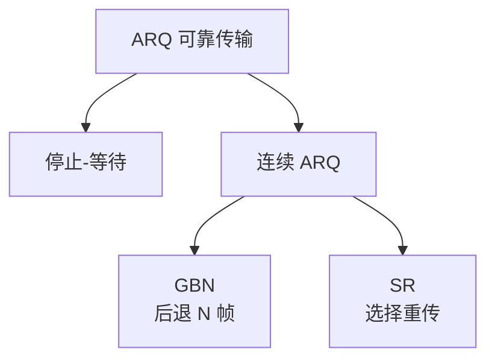
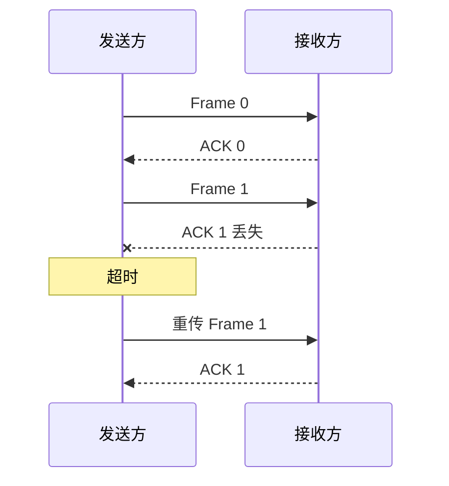
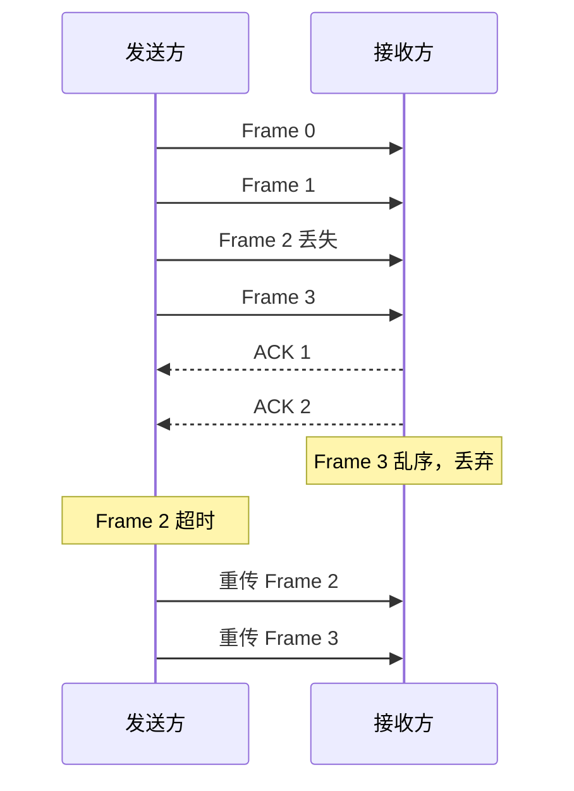
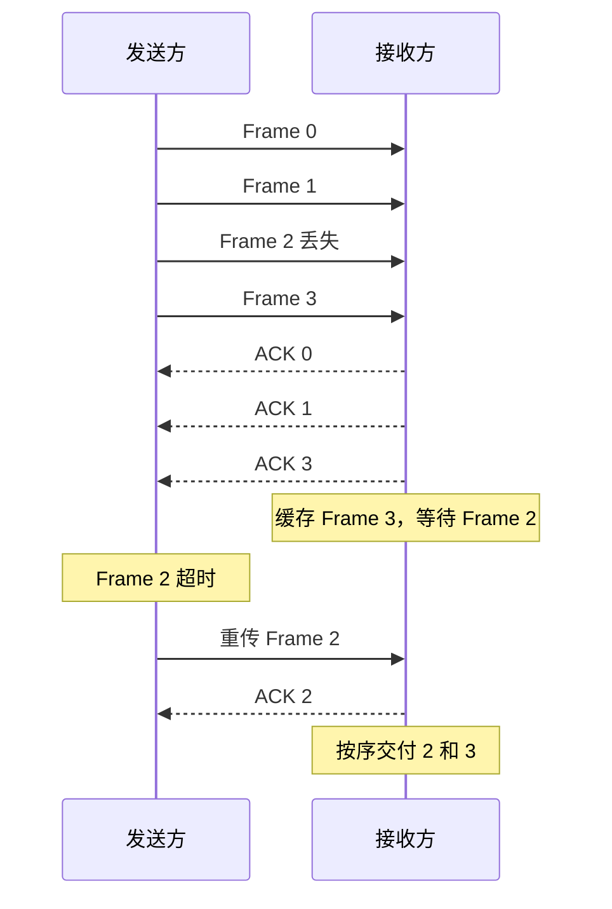

# 流量控制与可靠传输

数据链路层中的流量控制和可靠传输经常一起考。流量控制解决“发送方太快，接收方处理不过来”的问题；可靠传输解决“帧出错、丢失、确认丢失后如何恢复”的问题。

| 机制 | 目标 |
| - | - |
| 流量控制 | 控制发送速率，避免接收方缓冲区溢出 |
| 差错控制 | 检测或纠正比特错误 |
| 可靠传输 | 通过确认、超时和重传保证帧可靠到达 |

:::info
链路层可靠传输不是所有链路都需要。以太网通常只检错丢弃，不做重传；无线链路、卫星链路等误码率较高的场景更可能在链路层使用重传机制。
:::

# ARQ 协议

ARQ（Automatic Repeat reQuest，自动重传请求）是一类可靠传输协议。它的基本思想是：

1. 发送方发送数据帧。
2. 接收方正确收到后返回 ACK。
3. 发送方若超时未收到 ACK，就认为数据帧或确认帧丢失，需要重传。

ARQ 的三个典型协议：

- 停止-等待协议。
- 后退 N 帧协议（GBN）。
- 选择重传协议（SR）。



# 停止-等待协议

停止-等待协议每次只发送一个帧，收到确认后才发送下一个帧。



## 工作过程

1. 发送方发送一个数据帧，并启动计时器。
2. 接收方检错：
   - 正确接收：返回 ACK。
   - 检测出错：丢弃该帧，不返回 ACK。
3. 发送方收到 ACK 后发送下一帧。
4. 若计时器超时，则重传原帧。

## 序号问题

停止-等待协议至少需要 1 bit 序号，即 `0` 和 `1` 交替使用。

原因：确认帧可能丢失，导致发送方重传旧帧。接收方必须能区分“新帧”和“重复帧”。

```text
Frame 0 -> ACK 0 丢失 -> 重传 Frame 0
```

若没有序号，接收方可能把重传帧当作新数据交付。

## 特点

优点：

- 实现简单。
- 接收方不需要复杂缓存。
- 适合低速、短距离、简单链路。

缺点：

- 信道利用率低。
- 传播时延较大时，大量时间浪费在等待 ACK。

# 滑动窗口机制

滑动窗口允许发送方在未收到确认前连续发送多个帧，以提高信道利用率。

核心概念：

| 名称 | 含义 |
| - | - |
| 发送窗口 | 发送方允许连续发送但尚未确认的帧集合 |
| 接收窗口 | 接收方当前允许接收的帧集合 |
| 序号空间 | n 位序号能表示的编号集合，大小为 $2^n$ |

窗口会随着 ACK 到达向前滑动。

```text
发送窗口: [0 1 2 3] 4 5 6 7
收到 ACK0 后:
发送窗口: 0 [1 2 3 4] 5 6 7
```

# 后退 N 帧协议 GBN

GBN（Go-Back-N）允许发送方连续发送多个帧，但接收方只按序接收。

## GBN 规则

发送方：

- 发送窗口大小 $W_s > 1$。
- 可以连续发送窗口内的多个帧。
- 为最早未确认帧设置计时器。
- 若超时，从出错帧开始重传后续所有已发送但未确认帧。

接收方：

- 接收窗口大小 $W_r = 1$。
- 只接受当前期望序号的帧。
- 对乱序帧直接丢弃。
- 发送累积确认。

## 累积确认

ACK k 通常表示：接收方已经正确收到 k 之前的所有帧，下一次期望收到第 k 帧。

不同教材对 ACK 编号含义可能略有差异，做题时以题目说明为准。

## GBN 示例



## GBN 特点

优点：

- 发送方可以连续发送，效率高于停止-等待。
- 接收方简单，不需要缓存乱序帧。

缺点：

- 一个帧出错，后续已发送帧也要重传。
- 信道误码率高时浪费较大。

# 选择重传协议 SR

SR（Selective Repeat）允许接收方接收并缓存乱序帧，只重传出错或丢失的帧。

## SR 规则

发送方：

- 连续发送窗口内帧。
- 每个未确认帧通常有独立计时器。
- 哪个帧超时，只重传哪个帧。

接收方：

- 接收窗口大小 $W_r > 1$。
- 可以接收乱序帧并缓存。
- 对每个正确收到的帧分别确认。
- 当窗口前沿之前的帧都到齐后，按序交付给网络层。

## SR 示例



## SR 特点

优点：

- 只重传出错帧，信道利用率高。
- 适合长时延、高带宽或误码较高的链路。

缺点：

- 接收方需要缓存乱序帧。
- 发送方计时器和状态管理复杂。
- 对窗口大小有更严格限制。

# 三种协议对比

| 项目 | 停止-等待 | GBN | SR |
| - | - | - | - |
| 发送窗口 | 1 | 大于 1 | 大于 1 |
| 接收窗口 | 1 | 1 | 大于 1 |
| 是否连续发送 | 否 | 是 | 是 |
| 乱序帧处理 | 不涉及 | 丢弃 | 缓存 |
| 确认方式 | 单帧确认 | 累积确认 | 单独确认 |
| 重传策略 | 重传当前帧 | 从出错帧开始重传后续帧 | 只重传出错帧 |
| 实现复杂度 | 低 | 中 | 高 |
| 信道利用率 | 低 | 中 | 高 |

# 窗口大小限制

设序号字段有 $n$ 位，则序号空间大小为：

$$
2^n
$$

为了避免序号回绕造成新旧帧混淆，发送窗口 $W_s$ 与接收窗口 $W_r$ 需要满足：

$$
W_s + W_r \le 2^n
$$

## 停止-等待

$$
W_s = 1,\quad W_r = 1
$$

至少需要 1 bit 序号。

## GBN

GBN 中：

$$
W_r = 1
$$

因此：

$$
W_s + 1 \le 2^n
$$

所以：

$$
W_s \le 2^n - 1
$$

## SR

SR 中一般令：

$$
W_s = W_r
$$

由：

$$
W_s + W_r \le 2^n
$$

得到：

$$
W_s \le 2^{n-1},\quad W_r \le 2^{n-1}
$$

:::warning
常考结论：n 位序号时，GBN 发送窗口最大为 $2^n-1$；SR 发送窗口和接收窗口最大通常为 $2^{n-1}$。
:::

# 信道利用率

信道利用率表示信道用于传输有效数据的比例。

设：

- 数据帧发送时间为 $T_d$。
- ACK 发送时间为 $T_a$。
- 单程传播时延为 $T_p$。
- 往返传播时延 $RTT = 2T_p$。
- 发送窗口大小为 $N$。

停止-等待协议的近似信道利用率：

$$
U = \frac{T_d}{T_d + RTT + T_a}
$$

连续 ARQ 协议在不考虑出错重传时：

$$
U = \min\left(1,\frac{N \cdot T_d}{T_d + RTT + T_a}\right)
$$

如果 ACK 发送时间可忽略：

$$
U \approx \min\left(1,\frac{N}{1+2a}\right)
$$

其中：

$$
a = \frac{T_p}{T_d}
$$

:::info
做题时先判断是否给出 ACK 发送时间。如果题目说 ACK 很短或忽略确认帧发送时间，就可以去掉 $T_a$。
:::

# 本节考点

1. ARQ 的核心是 ACK、超时、重传。
2. 停止-等待一次只发一帧，至少需要 1 bit 序号。
3. GBN 发送窗口大于 1，接收窗口为 1，乱序帧丢弃，出错后回退重传。
4. SR 发送窗口和接收窗口都大于 1，接收方缓存乱序帧，只重传出错帧。
5. n 位序号：GBN 最大发送窗口 $2^n-1$，SR 最大窗口 $2^{n-1}$。
6. 信道利用率题目要区分发送时延、传播时延、ACK 发送时间和窗口大小。


ARQ 协议主要包括三种形式：**停止 - 等待**（Stop‑and‑Wait）、**回退 N 帧**（Go‑Back‑N, GBN）以及 **选择性重传**（Selective Repeat, SR）。
其中，回退 N 帧和选择性重传统称为 **连续 ARQ 协议**。
