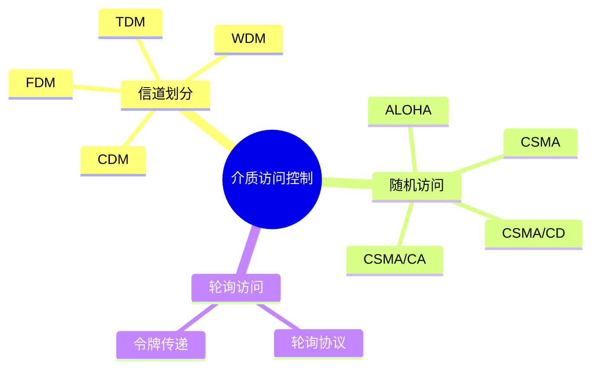
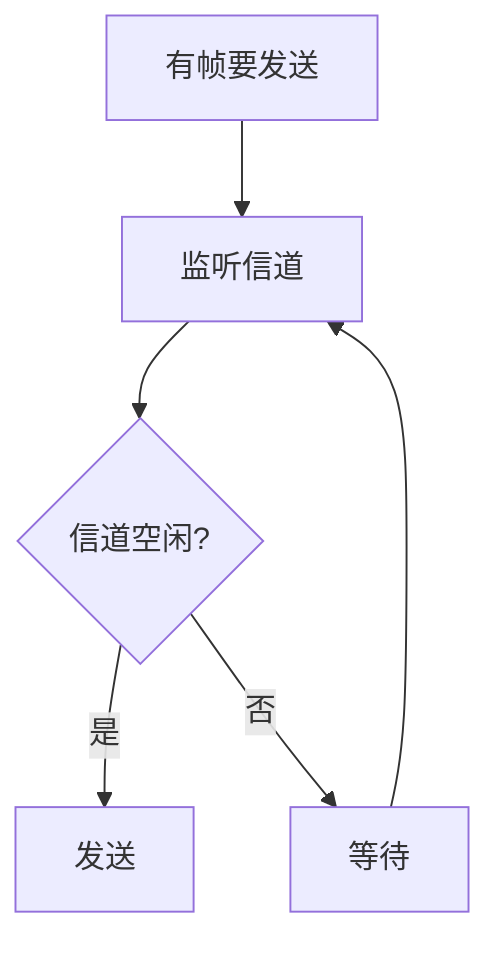
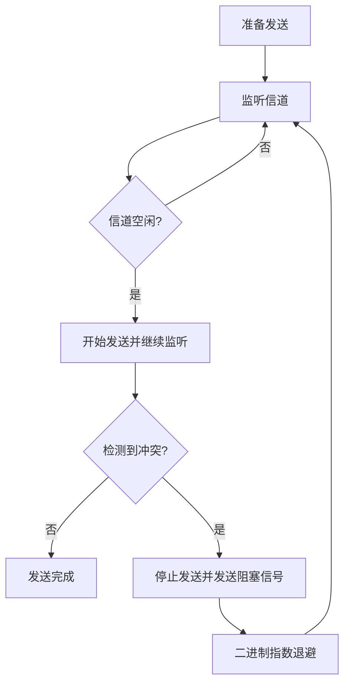
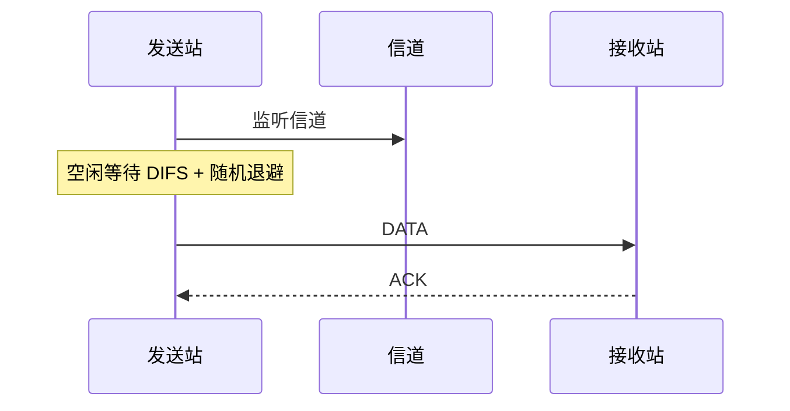

# 介质访问控制

介质访问控制（MAC, Media Access Control）解决共享信道上的发送权问题：多个结点都想发送数据时，谁先发、如何避免冲突、冲突后如何处理。



:::warning
看到 CSMA/CD、冲突、最小帧长、传播时延等关键词，要立即切换到“共享信道、广播传播、半双工”的早期以太网模型。
:::

# 信道划分介质访问控制

信道划分的思想是：把一条共享信道划分成多个互不干扰的子信道，让多个用户同时使用。

## FDM 频分多路复用

FDM（Frequency Division Multiplexing）把总频带划分成多个不重叠的频段，每个用户占用一个频段。

特点：

- 多路信号同时传输。
- 每路信号使用不同频率。
- 适合模拟通信和广播系统。

```text
频率轴: | 用户1 | 用户2 | 用户3 | 用户4 |
时间轴: 四个用户同时传输
```

## TDM 时分多路复用

TDM（Time Division Multiplexing）把时间划分成周期性时隙，每个用户轮流使用信道。

```text
时间轴: | A | B | C | D | A | B | C | D |
```

特点：

- 同一时刻只有一个用户发送。
- 用户按固定时隙轮流使用。
- 适合数字通信。

## WDM 波分多路复用

WDM（Wavelength Division Multiplexing）本质上是光纤中的 FDM。不同光信号使用不同波长，相当于不同“颜色”的光在同一根光纤中同时传输。

特点：

- 用于光纤通信。
- 能显著提升光纤容量。
- 每个波长承载一路信号。

## CDM 码分多路复用

CDM（Code Division Multiplexing）使用不同码片序列区分用户。所有用户可以同时使用同一频带和同一时间发送。

核心要求：不同站点的码片序列相互正交。

发送规则：

- 发送比特 1：发送自己的码片序列。
- 发送比特 0：发送码片序列的反码。

接收方通过与目标站点码片序列做内积，恢复该站点发送的比特。

# 随机访问介质访问控制

随机访问允许站点在需要发送时竞争信道。冲突发生后，通过检测、退避或避免机制处理。

# ALOHA 协议

ALOHA 是早期随机访问协议。它不监听信道，发送后依靠 ACK 判断是否成功。

## 纯 ALOHA

纯 ALOHA 中，站点可以在任意时刻发送帧。

过程：

1. 站点有数据就发送。
2. 若收到 ACK，说明成功。
3. 若超时未收到 ACK，认为发生冲突或丢失。
4. 等待随机时间后重发。

特点：

- 实现最简单。
- 冲突概率高。
- 信道利用率低。

纯 ALOHA 的最大吞吐量约为：

$$
S_{\max} = \frac{1}{2e} \approx 18.4\%
$$

## 时隙 ALOHA

时隙 ALOHA 把时间划分为等长时隙，站点只能在时隙开始发送。

特点：

- 需要全网时间同步。
- 冲突窗口比纯 ALOHA 小。
- 最大吞吐量约为纯 ALOHA 的两倍。

最大吞吐量：

$$
S_{\max} = \frac{1}{e} \approx 36.8\%
$$

# CSMA 协议

CSMA（Carrier Sense Multiple Access，载波监听多路访问）的思想是：发送前先监听信道。

基本流程：



CSMA 只能减少冲突，不能完全避免冲突。原因是传播时延存在：某站点听到信道空闲时，远处站点的信号可能还没传播过来。

## 三种 CSMA

| 类型 | 信道空闲时 | 信道忙时 | 特点 |
| - | - | - | - |
| 1-坚持 CSMA | 立即发送 | 持续监听 | 延迟小，冲突概率高 |
| 非坚持 CSMA | 立即发送 | 等随机时间后再监听 | 冲突概率低，平均延迟较大 |
| p-坚持 CSMA | 以概率 p 发送，以概率 1-p 推迟 | 持续监听 | 折中方案，适合时隙信道 |

# CSMA/CD

CSMA/CD（Carrier Sense Multiple Access with Collision Detection）即载波监听多路访问/碰撞检测，典型用于传统共享式有线以太网。

## 核心思想

1. 发送前监听信道。
2. 信道空闲则发送。
3. 发送过程中继续监听。
4. 若检测到冲突，立即停止发送。
5. 发送阻塞信号。
6. 按二进制指数退避算法等待后重传。



## 为什么有最小帧长

CSMA/CD 要求发送方在发送完帧之前能够检测到最远端可能产生的冲突。

设：

- 单程传播时延为 $\tau$。
- 争用期为 $2\tau$。
- 数据发送速率为 $R$。

最小帧长应满足：

$$
L_{\min} \ge 2\tau R
$$

以太网规定最小帧长为 64B，即 512 bit。

:::warning
CSMA/CD 的最小帧长是高频考点。它不是随便规定的，而是为了保证“发送方还在发送时能检测到冲突”。
:::

## 二进制指数退避

发生第 $k$ 次冲突后，站点从：

$$
\{0,1,\dots,2^k-1\}
$$

中随机选一个数 $r$，等待 $r$ 个争用期后重传。

实际以太网中，$k$ 通常有上限，例如取到 10 后不再扩大范围；冲突次数过多则放弃发送并报告错误。

# CSMA/CA

CSMA/CA（Carrier Sense Multiple Access with Collision Avoidance）即载波监听多路访问/碰撞避免，典型用于 IEEE 802.11 无线局域网。

无线网络难以使用 CSMA/CD：

- 无线设备发送时很难同时检测接收信号。
- 隐蔽站问题会导致发送方听不到潜在冲突者。
- 信号强度随距离衰减，碰撞检测不可靠。

## 基本流程

1. 发送前监听信道。
2. 若信道空闲，等待 DIFS。
3. 随机退避。
4. 退避计数到 0 后发送。
5. 接收方正确收到后返回 ACK。
6. 若未收到 ACK，认为失败并重传。



## RTS/CTS

为缓解隐蔽站问题，802.11 可使用 RTS/CTS：

1. 发送方先发送 RTS，请求发送。
2. 接收方返回 CTS，允许发送。
3. 其他站点听到 RTS 或 CTS 后设置 NAV，暂时不发送。
4. 发送方发送数据帧。
5. 接收方返回 ACK。

RTS/CTS 会增加开销，但可减少长数据帧冲突带来的浪费。

# 轮询访问与令牌传递

轮询访问通过某种集中或轮转机制分配发送权，避免随机竞争。

## 轮询协议

主结点依次询问各从结点是否有数据要发送。

优点：

- 不会冲突。
- 控制简单。

缺点：

- 主结点故障会影响全网。
- 轮询开销较大。

## 令牌传递协议

网络中传递一个特殊控制帧，称为令牌。只有持有令牌的站点可以发送数据。

优点：

- 无冲突。
- 访问公平。
- 可预测最大等待时间。

缺点：

- 令牌丢失或损坏需要恢复机制。
- 低负载时也要传递令牌，有额外开销。

# 本节考点

1. MAC 解决共享信道中谁可以发送的问题。
2. FDM 分频率，TDM 分时间，WDM 分波长，CDM 分码片。
3. 纯 ALOHA 任意时刻发送，时隙 ALOHA 只能在时隙开始发送。
4. CSMA 发送前监听，但不能完全避免冲突。
5. CSMA/CD 用于传统有线以太网，核心是边发边听、冲突检测、退避重传。
6. 最小帧长满足 $L_{\min} \ge 2\tau R$，以太网最小帧长为 64B。
7. CSMA/CA 用于无线局域网，核心是冲突避免和 ACK 确认。
8. 轮询和令牌传递不会产生随机冲突，但有控制开销。

