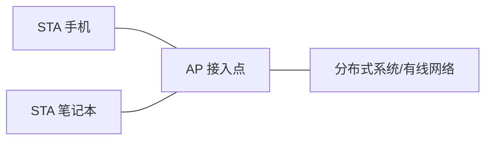
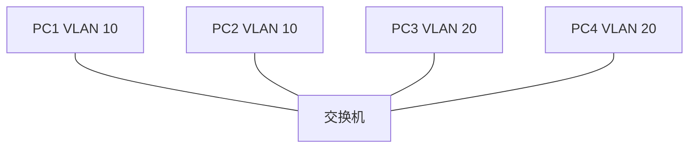

# 局域网

局域网（LAN, Local Area Network）是在较小地理范围内互连计算机和设备的网络，例如实验室、办公室、校园楼宇。

局域网的主要特征由三个因素决定：

| 因素 | 含义 |
| - | - |
| 拓扑结构 | 设备如何连接 |
| 传输介质 | 使用双绞线、同轴电缆、光纤还是无线 |
| 介质访问控制 | 多个站点如何共享信道 |

其中，介质访问控制方式对局域网技术特征影响最大。

## 常见拓扑

| 拓扑 | 特点 |
| - | - |
| 总线形 | 所有站点共享同一总线，早期以太网常见 |
| 星形 | 所有站点连接到中心设备，现代以太网常见 |
| 环形 | 站点连接成环，令牌环/FDDI 常见 |
| 复合型 | 多种拓扑组合 |

现代以太网常见现象：

- 物理拓扑：星形，设备连到交换机。
- 逻辑拓扑：交换式网络中不再是传统共享总线。

# 以太网与 IEEE 802.3

以太网是使用最广泛的局域网技术。传统以太网使用 CSMA/CD；现代交换式全双工以太网通常不再发生冲突，也不再使用 CSMA/CD 进行介质争用。

:::warning
考题若讨论 CSMA/CD、冲突检测、最小帧长，通常默认传统共享式半双工以太网模型；若讨论交换机和全双工链路，则通常没有冲突。
:::

## 以太网命名

常见格式：

```text
速率 + BASE + 介质
```

例如：

| 名称 | 含义 |
| - | - |
| 10BASE5 | 10 Mb/s，基带传输，粗同轴电缆 |
| 10BASE2 | 10 Mb/s，基带传输，细同轴电缆 |
| 10BASE-T | 10 Mb/s，基带传输，双绞线 |
| 10BASE-FL | 10 Mb/s，基带传输，光纤 |
| 100BASE-TX | 100 Mb/s，双绞线快速以太网 |
| 1000BASE-T | 1 Gb/s，双绞线千兆以太网 |

记忆：

- `BASE` 表示基带传输。
- `T` 表示 twisted pair，即双绞线。
- `F` 通常与 fiber，即光纤有关。

# 以太网 MAC 帧

以太网 MAC 帧主要字段如下：

```text
目的 MAC | 源 MAC | 类型/长度 | 数据 | FCS
  6B    |  6B   |   2B    |46~1500B|4B
```

物理层还会在帧前发送：

```text
前导码 7B + 帧开始定界符 1B
```

但它们属于物理层同步信息，不计入以太网 MAC 帧长度。

## 字段说明

| 字段 | 长度 | 作用 |
| - | - | - |
| 目的 MAC 地址 | 6B | 标识接收方 |
| 源 MAC 地址 | 6B | 标识发送方 |
| 类型/长度 | 2B | 标识上层协议或数据字段长度 |
| 数据字段 | 46~1500B | 承载上层数据，不足 46B 需填充 |
| FCS | 4B | CRC 检错 |

## 最小帧长与最大帧长

以太网 MAC 帧：

- 最小长度：64B。
- 最大长度：1518B。
- 数据字段：46B 到 1500B。

为什么数据字段最小为 46B？

```text
最小帧 64B = 目的地址 6B + 源地址 6B + 类型 2B + 数据 46B + FCS 4B
```

最大数据字段 1500B 也称 MTU。

# MAC 地址

MAC 地址是数据链路层地址，长度为 48 bit，即 6B，通常用十六进制表示。

示例：

```text
00:1A:2B:3C:4D:5E
```

MAC 地址用于同一链路或局域网内部的数据帧转发。跨网络传输时，IP 地址通常保持端到端意义，而 MAC 地址会在每一跳链路上改变。

# IEEE 802.11 无线局域网

IEEE 802.11 是无线局域网标准族，也就是常说的 Wi-Fi。

无线局域网常见组成：

- 无线站点 STA。
- 接入点 AP。
- 基本服务集 BSS。
- 扩展服务集 ESS。



## 无线局域网为什么用 CSMA/CA

无线环境不适合 CSMA/CD：

- 发送时难以同时检测碰撞。
- 隐蔽站会让发送方无法听到所有竞争者。
- 无线信号强弱受距离和障碍影响。

因此 802.11 使用 CSMA/CA，即尽量避免冲突，并用 ACK 确认成功接收。

## 802.11 帧地址

802.11 数据帧可能含有多个地址字段，常考前三个地址。

基本记忆：

| 地址 | 含义 |
| - | - |
| 地址 1 | 接收该无线帧的设备 |
| 地址 2 | 发送该无线帧的设备 |
| 地址 3 | 真实源或真实目的，由 To DS / From DS 决定 |

常见基础结构网络：

| To AP | From AP | 地址 1 | 地址 2 | 地址 3 |
| - | - | - | - | - |
| 1 | 0 | AP 地址 | 源站地址 | 最终目的地址 |
| 0 | 1 | 目的站地址 | AP 地址 | 原始源地址 |

# VLAN

VLAN（Virtual LAN，虚拟局域网）是在交换机上通过逻辑划分，把一个物理局域网划分成多个广播域。

作用：

- 隔离广播域。
- 按部门、业务或安全策略划分网络。
- 提高管理灵活性。



同一 VLAN 内可以二层通信；不同 VLAN 之间通常需要路由器或三层交换机转发。

## 802.1Q 标签

802.1Q 在以太网帧中插入 4B VLAN 标签：

```text
目的 MAC | 源 MAC | VLAN Tag | 类型 | 数据 | FCS
  6B    |  6B   |   4B     | 2B  | ... | 4B
```

VLAN ID 为 12 bit，理论上可表示 4096 个编号。

# 广域网

广域网（WAN, Wide Area Network）覆盖较大地理范围，用于连接远距离网络。

与局域网相比：

| 项目 | 局域网 | 广域网 |
| - | - | - |
| 范围 | 小 | 大 |
| 所有权 | 通常由单位自建 | 常依赖运营商 |
| 速率 | 通常较高 | 受链路和服务影响 |
| 延迟 | 较低 | 较高 |
| 典型技术 | 以太网、Wi-Fi | PPP、HDLC、MPLS 等 |

# PPP 协议

PPP（Point-to-Point Protocol）是点对点链路上的数据链路层协议，常用于拨号、串行链路、DSL 等场景。

PPP 的特点：

- 面向字节。
- 支持多种网络层协议。
- 提供差错检测。
- 不提供可靠传输。
- 不使用序号和确认机制。
- 支持身份认证，如 PAP、CHAP。

## PPP 帧格式

典型 PPP 帧：

```text
Flag | Address | Control | Protocol | Information | FCS | Flag
 1B  |   1B    |   1B    |   2B     |    可变     |2/4B | 1B
```

字段说明：

| 字段 | 作用 |
| - | - |
| Flag | 帧定界符，通常为 `01111110` |
| Address | 固定为 `11111111` |
| Control | 固定为 `00000011` |
| Protocol | 标识信息字段承载的协议 |
| Information | 上层数据 |
| FCS | 帧校验序列 |

PPP 使用字节填充或零比特填充处理透明传输，具体取决于链路类型。

## PPP 的三个组成部分

| 组成 | 作用 |
| - | - |
| 封装方法 | 把网络层数据报封装到串行链路 |
| LCP | 建立、配置、测试和释放数据链路 |
| NCP | 为不同网络层协议建立和配置连接 |

# HDLC 协议

HDLC（High-Level Data Link Control）是高级数据链路控制协议。

特点：

- 面向比特。
- 使用零比特填充法。
- 可用于点对点或点对多点链路。
- 能提供可靠传输。

在 408 考研中，PPP 通常比 HDLC 更常考；HDLC 重点记住“面向比特”和“零比特填充”。

# 本节考点

1. 局域网三要素：拓扑结构、传输介质、介质访问控制。
2. 以太网命名中 `BASE` 表示基带，`T` 表示双绞线，`F` 表示光纤。
3. 以太网 MAC 帧最小 64B，最大 1518B；数据字段 46~1500B。
4. 前导码和 SFD 属于物理层同步信息，不计入 MAC 帧长度。
5. 现代交换式全双工以太网一般不发生冲突，不使用 CSMA/CD。
6. 802.11 使用 CSMA/CA，不使用 CSMA/CD。
7. VLAN 划分广播域，802.1Q 标签为 4B，VID 为 12 bit。
8. PPP 是点对点链路协议，支持 LCP 和 NCP，不提供可靠传输。

