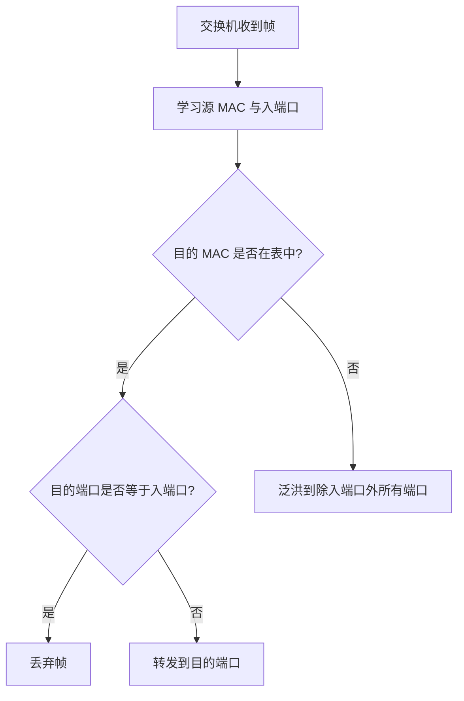

> 讲解网桥、交换机等数据链路层设备的转发原理、MAC 地址表学习过程和冲突域划分。

# 数据链路层设备

数据链路层设备主要根据 MAC 地址转发帧。考研中重点掌握交换机的 MAC 地址表、学习过程、转发流程、冲突域与广播域。

常见设备：

| 设备 | 层次 | 主要依据 | 典型作用 |
| - | - | - | - |
| 网桥 | 数据链路层 | MAC 地址 | 连接局域网网段 |
| 交换机 | 数据链路层 | MAC 地址表 | 多端口高速帧转发 |

:::info
集线器是物理层设备，路由器是网络层设备。交换机默认是二层设备，但三层交换机具备网络层转发能力。
:::

# 交换机

交换机（Switch）是现代局域网的核心设备。它接收以太网帧，读取目的 MAC 地址，根据 MAC 地址表决定从哪个端口转发。

与集线器相比：

- 集线器收到比特后向所有端口转发，属于物理层广播。
- 交换机根据 MAC 地址有选择地转发，属于数据链路层设备。

# MAC 地址表

MAC 地址表也称交换表、转发表，记录 MAC 地址与交换机端口的映射关系。

典型表项：

| MAC 地址 | 端口 | VLAN | 老化时间 |
| - | - | - | - |
| AA-AA-AA-AA-AA-AA | 1 | 10 | 300s |
| BB-BB-BB-BB-BB-BB | 2 | 10 | 300s |

交换机转发时主要查目的 MAC 地址；学习时主要看源 MAC 地址。

# 自学习

交换机使用自学习机制建立 MAC 地址表。

当交换机从某端口收到帧：

1. 读取源 MAC 地址。
2. 把“源 MAC 地址 -> 入端口”写入或更新 MAC 地址表。
3. 以后发往该 MAC 地址的帧，就可以从对应端口转发。


:::warning
交换机学习的是 **源 MAC 地址**，转发查询的是 **目的 MAC 地址**。这是选择题常见陷阱。
:::

# 转发流程

交换机收到一个帧后，根据目的 MAC 地址分情况处理。



## 三种处理结果

| 情况 | 行为 |
| - | - |
| 目的 MAC 已知且端口不同 | 单播转发到对应端口 |
| 目的 MAC 已知但端口等于入端口 | 丢弃，不再转发 |
| 目的 MAC 未知 | 泛洪到除入端口外的所有端口 |

泛洪不是 ARP 本身。ARP 请求是主机发出的广播帧；泛洪是交换机面对未知目的 MAC 时的转发行为。

# 冲突域与广播域

## 冲突域

冲突域是可能发生碰撞的一组设备范围。

| 设备 | 对冲突域的影响 |
| - | - |
| 集线器 | 不隔离冲突域，所有端口同属一个冲突域 |
| 交换机 | 每个端口是独立冲突域 |
| 路由器 | 每个接口隔离冲突域 |

现代交换式全双工以太网中，基本不再发生传统意义上的碰撞。

## 广播域

广播域是二层广播帧能到达的范围。

| 设备 | 对广播域的影响 |
| - | - |
| 集线器 | 不隔离广播域 |
| 交换机 | 默认不隔离广播域 |
| VLAN | 可在交换机上划分广播域 |
| 路由器 | 隔离广播域 |

交换机会转发广播帧到同一 VLAN 内除入端口外的所有端口。

# 交换方式

交换机常见三种交换方式。

| 方式 | 工作方式 | 优点 | 缺点 |
| - | - | - | - |
| 直通交换 | 读取目的 MAC 后立即转发 | 时延低 | 不能提前检错，可能转发错误帧 |
| 存储转发 | 收完整帧并校验 FCS 后转发 | 可丢弃错误帧，可靠性高 | 时延较大 |
| 碎片隔离 | 接收前 64B 后再转发 | 折中，能过滤过短碎片 | 仍不能完整校验全部帧 |

## 为什么碎片隔离检查 64B

以太网最小帧长为 64B。小于 64B 的帧通常是冲突产生的残帧。碎片隔离先等到 64B，能过滤明显无效的冲突碎片。

# 网桥

网桥（Bridge）也是数据链路层设备，用于连接两个或多个局域网网段，并根据 MAC 地址转发帧。

网桥与交换机的本质功能相似：

- 都工作在数据链路层。
- 都根据 MAC 地址转发。
- 都维护转发表。
- 都可隔离冲突域。

区别：

| 项目 | 网桥 | 交换机 |
| - | - | - |
| 端口数量 | 少 | 多 |
| 转发方式 | 早期多为软件转发 | 多为硬件高速转发 |
| 性能 | 较低 | 较高 |
| 功能 | 较简单 | 支持 VLAN、链路聚合、端口镜像等 |
| 地位 | 早期设备 | 现代局域网核心设备 |

# 交换机与路由器对比

| 项目 | 交换机 | 路由器 |
| - | - | - |
| 工作层次 | 数据链路层 | 网络层 |
| 转发单位 | 帧 | 分组/IP 数据报 |
| 地址依据 | MAC 地址 | IP 地址 |
| 主要表项 | MAC 地址表 | 路由表 |
| 广播域 | 默认不隔离，同 VLAN 内广播 | 隔离广播域 |
| 典型作用 | 构建局域网 | 连接不同网络 |

# 交换机自学习例题思路

题目常给出交换机端口连接关系和一系列通信过程，要求填写 MAC 地址表或判断转发端口。

解题步骤：

1. 每收到一帧，先根据源 MAC 更新表项。
2. 再查目的 MAC：
   - 已知：转发到对应端口。
   - 未知：除入端口外泛洪。
   - 目的端口等于入端口：丢弃。
3. 广播地址一定泛洪到同 VLAN 其他端口。
4. 注意表项可能有老化时间，但多数考题默认不老化，除非题目说明。

示例：

```text
交换机端口:
1 - A
2 - B
3 - C

A 向 B 发送:
学习 A -> 1
不知道 B 在哪，向 2、3 泛洪

B 回复 A:
学习 B -> 2
查到 A -> 1，单播转发到 1
```

# 本节考点

1. 交换机是数据链路层设备，根据 MAC 地址转发帧。
2. 交换机学习源 MAC，查询目的 MAC。
3. 目的 MAC 未知时泛洪，不是直接丢弃。
4. 目的端口等于入端口时丢弃。
5. 交换机每个端口隔离冲突域，但默认不隔离广播域。
6. VLAN 可划分广播域，路由器也隔离广播域。
7. 存储转发能进行 CRC 校验，直通交换时延低但可能转发错误帧。
8. 网桥和交换机功能类似，交换机可视为多端口高速网桥。

