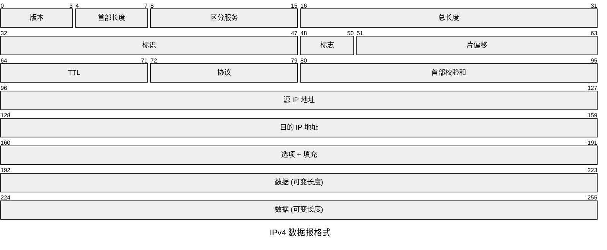

# 网络层的定位

网络层位于传输层之下、数据链路层之上，核心任务是在不同网络之间转发分组，让源主机的数据能够跨越多个链路到达目的主机。


数据链路层只负责相邻结点之间传帧；网络层负责跨网络、跨路由器的分组转发。

## 网络层主要功能

| 功能 | 含义 |
| - | - |
| 异构网络互联 | 把不同类型网络通过路由器连接起来 |
| 路由选择 | 根据目的地址选择传输路径 |
| 分组转发 | 根据路由表把分组从输入端口转到输出端口 |
| 拥塞控制 | 控制网络中分组过多导致性能下降 |
| SDN 支持 | 将控制平面和数据平面分离 |

# 转发与路由

网络层有两个容易混淆的概念：转发和路由。

| 概念 | 含义 | 时间尺度 |
| - | - | - |
| 转发 | 路由器收到分组后查表并从某端口发出 | 单个分组级别，速度快 |
| 路由 | 计算和维护路由表，决定路径 | 控制级别，速度较慢 |

一句话：

- 路由决定“路怎么走”。
- 转发执行“下一跳发到哪”。

# 数据报服务与虚电路服务

网络层可以提供两类服务。

| 服务 | 特点 | 典型代表 |
| - | - | - |
| 数据报服务 | 无连接，每个分组独立选路，可能乱序 | IP |
| 虚电路服务 | 面向连接，传输前建立逻辑连接，分组沿同一路径 | X.25、帧中继、ATM |

IP 网络采用数据报服务，因此 IP 是无连接、尽力而为、不可靠的协议。

:::warning
IP 的“不可靠”不是说经常出错，而是说它不承诺可靠性：不保证交付、不保证顺序、不保证无重复。
:::

# 拥塞控制

拥塞指网络中进入的分组过多，超过路由器、链路和缓冲区处理能力，导致排队时延增大、丢包增多、吞吐量下降。

拥塞控制与流量控制不同：

| 概念 | 控制对象 | 目标 |
| - | - | - |
| 流量控制 | 发送方与接收方之间 | 防止接收方来不及接收 |
| 拥塞控制 | 整个网络 | 防止网络内部过载 |

常见拥塞控制思路：

- 开环控制：提前设计，预防拥塞，如流量整形、资源预留。
- 闭环控制：监测拥塞后反馈调整，如丢包、延迟、显式拥塞通知。

# IPv4 地址

IPv4 地址长度为 32 bit，通常写成点分十进制。

```text
二进制: 11000000.10101000.00000001.00000001
十进制: 192.168.1.1
```

IPv4 地址由网络号和主机号组成：

```text
IP 地址 = 网络号 + 主机号
```

网络号标识主机所在网络，主机号标识该网络中的具体主机。

# IPv4 分类地址

传统分类编址把 IPv4 地址分为 A、B、C、D、E 五类。

| 类别 | 前缀 | 首字节范围 | 默认网络号位数 | 用途 |
| - | - | - | - | - |
| A | 0 | 1~126 | 8 | 大型网络 |
| B | 10 | 128~191 | 16 | 中型网络 |
| C | 110 | 192~223 | 24 | 小型网络 |
| D | 1110 | 224~239 | - | 组播 |
| E | 1111 | 240~255 | - | 保留 |

特殊范围：

- `0.0.0.0`：本网络、本主机或默认路由中的特殊地址。
- `127.0.0.0/8`：环回地址，常用 `127.0.0.1`。
- 主机号全 0：网络地址。
- 主机号全 1：该网络的广播地址。

# 私有地址

私有地址不能直接在公网路由，通常通过 NAT 访问公网。

| 地址块 | 范围 |
| - | - |
| 10.0.0.0/8 | 10.0.0.0 ~ 10.255.255.255 |
| 172.16.0.0/12 | 172.16.0.0 ~ 172.31.255.255 |
| 192.168.0.0/16 | 192.168.0.0 ~ 192.168.255.255 |

# IPv4 数据报格式

IPv4 首部最小 20B，最大 60B。



重要字段：

| 字段 | 作用 |
| - | - |
| 版本 | IPv4 为 4 |
| 首部长度 | 以 4B 为单位，最小值 5 |
| 总长度 | 首部 + 数据，最大 65535B |
| 标识 | 同一原始数据报分片使用相同标识 |
| 标志 | DF 表示不分片，MF 表示后面还有分片 |
| 片偏移 | 当前分片在原数据报中的位置，以 8B 为单位 |
| TTL | 每经过一个路由器减 1，防止分组无限循环 |
| 协议 | 指明上层协议，如 TCP=6，UDP=17，ICMP=1 |
| 首部校验和 | 只校验 IP 首部 |

:::info
IPv4 首部校验和只校验首部，不校验数据部分；每跳 TTL 会改变，所以路由器转发时需要重新计算首部校验和。
:::

# IPv4 分片

当 IP 数据报长度超过下一条链路的 MTU，且 DF 未置位时，路由器可以对其分片。

相关字段：

| 字段 | 作用 |
| - | - |
| 标识 Identification | 判断哪些分片属于同一个原始数据报 |
| MF | More Fragment，1 表示后续还有分片 |
| DF | Don't Fragment，1 表示不允许分片 |
| 片偏移 | 分片数据部分在原始数据中的偏移，以 8B 为单位 |

## 分片计算

若 MTU 为 1500B，IP 首部为 20B，则每个分片最多携带：

```text
1500 - 20 = 1480B
```

除最后一个分片外，数据长度必须是 8B 的整数倍，因为片偏移以 8B 为单位。

## 分片重组

IP 分片只在目的主机重组，中间路由器不重组。

原因：

- 中间路由器重组会增加负担。
- 后续链路可能还需要再次分片。
- 数据报的不同分片可能走不同路径。

# 本节考点

1. 网络层负责异构网络互联、路由选择、分组转发和拥塞控制。
2. 转发是查表发分组，路由是计算和维护路径。
3. IP 提供无连接、不可靠、尽力而为的数据报服务。
4. IPv4 地址 32 bit，点分十进制表示。
5. A/B/C 类默认网络号分别为 8/16/24 bit；D 类用于组播。
6. IPv4 首部最小 20B，最大 60B。
7. TTL 每过一个路由器减 1；协议字段标识上层协议。
8. IP 分片偏移单位是 8B，分片只在目的主机重组。

