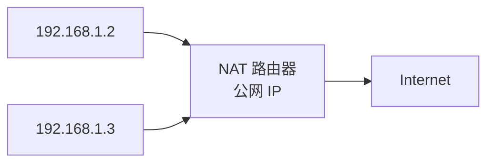
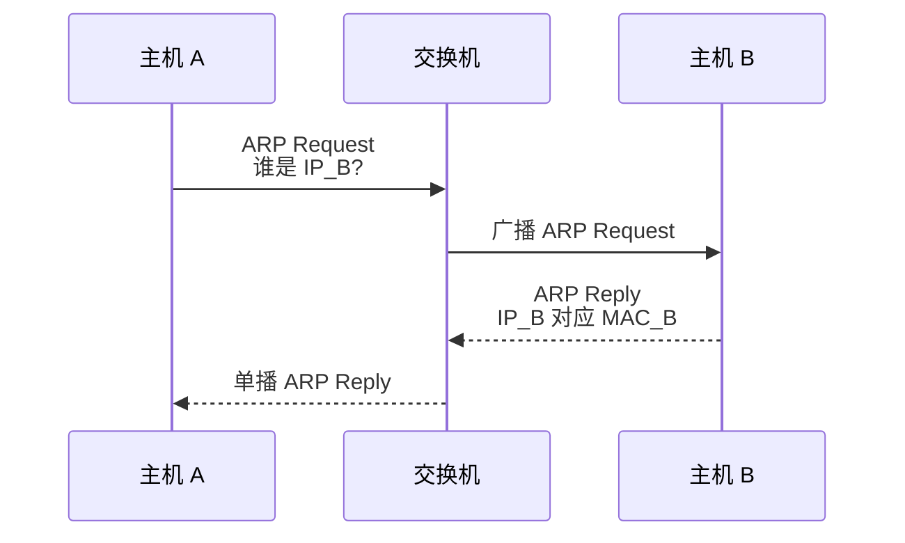
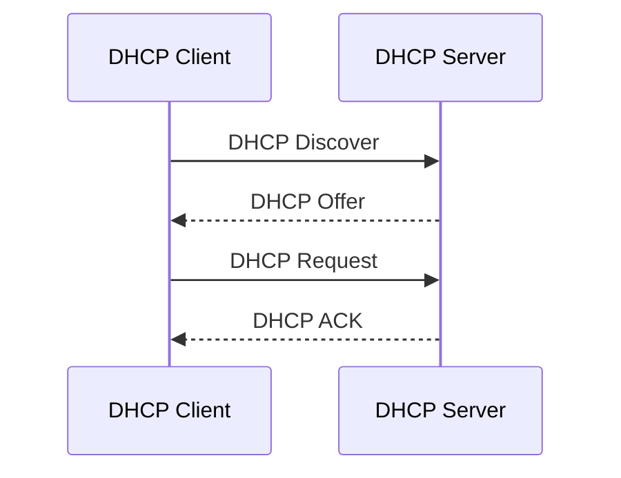

> 讲解子网划分、CIDR、NAT、ARP、DHCP 与 ICMP 的工作原理及地址计算方法。

# 子网划分

子网划分是在原有网络号和主机号结构中，借用部分主机号作为子网号，把一个大网络划分成多个小网络。

```text
IP 地址 = 网络号 + 子网号 + 主机号
```

目的：

- 提高地址利用率。
- 减少广播范围。
- 便于网络管理。
- 支持层次化路由。

# 子网掩码

子网掩码用连续的 `1` 表示网络部分，用连续的 `0` 表示主机部分。

例如：

```text
IP:      192.168.1.130
Mask:    255.255.255.192
CIDR:    192.168.1.130/26
```

`/26` 表示前 26 bit 是网络部分，剩余 6 bit 是主机部分。

可用主机数：

$$
2^h - 2
$$

其中 $h$ 为主机号位数，减去网络地址和广播地址。

# CIDR

CIDR（Classless Inter-Domain Routing，无分类域间路由）不再固定使用 A/B/C 类默认边界，而是使用斜线记法：

```text
IP 地址/前缀长度
```

例如：

```text
192.168.10.0/24
10.0.0.0/8
172.16.0.0/12
```

CIDR 优点：

- 地址分配更灵活。
- 减少地址浪费。
- 支持路由聚合。

# 路由聚合

路由聚合把多个连续网络合并成一个较短前缀的路由项。

例：

```text
192.168.0.0/24
192.168.1.0/24
192.168.2.0/24
192.168.3.0/24
```

可以聚合为：

```text
192.168.0.0/22
```

前提：

- 网络地址连续。
- 前缀可以找到共同前缀。
- 聚合后不能包含不该到达的网络，除非题目允许。

:::warning
最长前缀匹配优先。路由表中若多条路由都匹配目的地址，选择前缀最长的一条。
:::

# NAT

NAT（Network Address Translation，网络地址转换）在私有地址和公网地址之间转换。

常见家庭网络：



## NAT 的作用

- 缓解 IPv4 地址不足。
- 允许私有网络访问公网。
- 隐藏内部网络结构。

## NAPT

实际常用的是 NAPT，即同时转换 IP 地址和端口号。

| 内部地址 | 内部端口 | 公网地址 | 公网端口 |
| - | - | - | - |
| 192.168.1.2 | 50001 | 203.0.113.8 | 40001 |
| 192.168.1.3 | 50001 | 203.0.113.8 | 40002 |

NAT 路由器通过转换表把返回报文映射回内部主机。

# ARP

ARP（Address Resolution Protocol，地址解析协议）用于根据 IPv4 地址获得同一链路上的 MAC 地址。



## ARP 流程

1. 主机 A 查询 ARP 缓存。
2. 若没有目标 IP 对应 MAC，则广播 ARP 请求。
3. 同一局域网内所有主机收到请求。
4. 目标 IP 对应主机返回 ARP 响应。
5. 主机 A 更新 ARP 缓存。
6. 主机 A 使用目标 MAC 封装以太网帧。

## 跨网络时解析谁的 MAC

若目的 IP 与源主机不在同一子网：

- 主机不会解析最终目的主机的 MAC。
- 主机会解析默认网关的 MAC。
- 帧发给网关，IP 数据报目的地址仍然是最终目的 IP。

:::info
ARP 解析的是“下一跳”的 MAC 地址，不一定是最终目的主机的 MAC 地址。
:::

# DHCP

DHCP（Dynamic Host Configuration Protocol，动态主机配置协议）用于自动分配网络配置。

可分配内容：

- IP 地址。
- 子网掩码。
- 默认网关。
- DNS 服务器。
- 租约时间。

DHCP 使用 UDP：

- 服务器端口 67。
- 客户端端口 68。

## DHCP 四步



记忆：DORA

| 步骤 | 含义 |
| - | - |
| Discover | 客户端广播寻找 DHCP 服务器 |
| Offer | 服务器提供可用配置 |
| Request | 客户端请求使用某个配置 |
| ACK | 服务器确认分配 |

# ICMP

ICMP（Internet Control Message Protocol）用于在 IP 主机和路由器之间传递差错报告和控制信息。

ICMP 封装在 IP 数据报中，但它属于网络层控制协议。

## ICMP 报文类型

两大类：

| 类型 | 用途 |
| - | - |
| 差错报告报文 | 报告 IP 数据报传输中的问题 |
| 查询报文 | 网络诊断和信息查询 |

常见差错报文：

- 终点不可达。
- 源点抑制。
- 时间超过。
- 参数问题。
- 路由重定向。

常见查询报文：

- Echo Request。
- Echo Reply。
- Timestamp Request/Reply。

## ping

`ping` 使用 ICMP Echo Request 和 Echo Reply 测试目的主机是否可达，并估算 RTT。

## traceroute

`traceroute` 利用 TTL 逐步递增和 ICMP Time Exceeded 报文发现路径上的路由器。

基本思想：

1. 发送 TTL=1 的分组，第一个路由器丢弃并返回 ICMP 超时报文。
2. 发送 TTL=2 的分组，第二个路由器返回超时报文。
3. 逐步增加 TTL，直到到达目的主机。

# 本节考点

1. 子网划分借主机号作为子网号。
2. CIDR 使用斜线前缀，支持灵活分配和路由聚合。
3. 路由选择使用最长前缀匹配。
4. NAT/NAPT 通过地址和端口转换缓解 IPv4 地址不足。
5. ARP 用 IP 找 MAC，解析的是下一跳 MAC。
6. DHCP 使用 UDP 67/68，四步为 Discover、Offer、Request、ACK。
7. ICMP 用于差错报告和网络诊断，ping 和 traceroute 都依赖 ICMP 机制。
