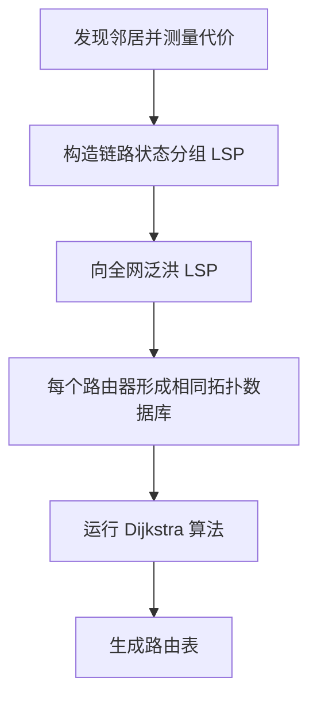

# 路由选择

路由选择的任务是为分组从源网络到目的网络选择路径，并生成路由表。

路由表项通常包含：

| 字段 | 含义 |
| - | - |
| 目的网络 | 要到达的网络前缀 |
| 子网掩码/前缀长度 | 判断匹配范围 |
| 下一跳 | 下一个路由器地址 |
| 出接口 | 从哪个接口发出 |
| 度量值 | 路由代价 |

转发时使用最长前缀匹配。

# 静态路由与动态路由

| 类型 | 特点 | 适用场景 |
| - | - | - |
| 静态路由 | 人工配置，简单、稳定、不自动适应变化 | 小网络、默认路由、固定路径 |
| 动态路由 | 路由器运行协议自动学习和更新 | 中大型网络、拓扑变化频繁 |

静态路由优点是可控、开销小；缺点是不适应故障和拓扑变化。

动态路由优点是自动适应变化；缺点是协议复杂、有控制开销，可能出现收敛问题。

# 路由算法分类

| 算法 | 信息来源 | 典型协议 |
| - | - | - |
| 距离-向量算法 | 与邻居交换到各目的网络的距离向量 | RIP |
| 链路状态算法 | 全网泛洪链路状态，计算最短路径 | OSPF |
| 路径向量算法 | 通告到目的网络经过的 AS 路径 | BGP |

# 距离-向量路由算法

距离-向量算法中，每个路由器维护自己到各目的网络的距离，并把这张表发送给邻居。

基本思想来自 Bellman-Ford：

$$
D_x(y)=\min_v\{c(x,v)+D_v(y)\}
$$

含义：

- $D_x(y)$：路由器 x 到目的 y 的最小代价。
- $c(x,v)$：x 到邻居 v 的代价。
- $D_v(y)$：邻居 v 到目的 y 的代价。

## 工作过程

1. 路由器只知道到直接邻居的距离。
2. 周期性向邻居发送自己的距离向量。
3. 收到邻居信息后更新路由表。
4. 若发现更短路径，则修改下一跳。

优点：

- 实现简单。
- 控制信息量较小。

缺点：

- 收敛慢。
- 容易产生路由环路。
- 存在坏消息传播慢问题。

## 坏消息传播慢

当某条链路失效后，错误路由信息可能在相邻路由器之间反复传播，导致代价逐步增大。

缓解方法：

- 毒性逆转。
- 水平分割。
- 触发更新。
- 最大跳数限制。

# 链路状态路由算法

链路状态算法中，每个路由器掌握全网拓扑，再用 Dijkstra 算法计算到各目的网络的最短路径。

## 工作过程

优点：

- 收敛快。
- 不容易形成长期环路。
- 每个路由器掌握完整拓扑。

缺点：

- 存储和计算开销较大。
- 泛洪链路状态需要控制开销。
- 实现复杂。

# 层次路由

互联网规模太大，不可能让所有路由器维护全球完整路由细节，因此需要层次路由。

核心概念：自治系统 AS（Autonomous System）。

AS 是由同一管理机构控制、使用统一路由策略的一组网络和路由器。

路由协议分为：

| 类型 | 范围 | 典型协议 |
| - | - | - |
| IGP | 自治系统内部 | RIP、OSPF |
| EGP | 自治系统之间 | BGP |

# RIP

RIP（Routing Information Protocol）是基于距离-向量算法的内部网关协议。

特点：

- 度量值为跳数。
- 最大有效跳数为 15。
- 16 表示不可达。
- 周期性与邻居交换整个路由表。
- 使用 UDP。

优点：

- 简单。
- 适合小型网络。

缺点：

- 最大规模受 15 跳限制。
- 收敛慢。
- 容易受坏消息传播慢影响。

# OSPF

OSPF（Open Shortest Path First）是基于链路状态算法的内部网关协议。

特点：

- 使用链路状态泛洪。
- 每个路由器建立链路状态数据库。
- 使用 Dijkstra 算法计算最短路径树。
- 支持层次化区域划分。
- 直接封装在 IP 中，不使用 TCP 或 UDP。

OSPF 优点：

- 收敛快。
- 支持大规模网络。
- 支持多种代价度量。
- 支持区域化管理。

## OSPF 区域

OSPF 可把自治系统划分为多个区域，所有区域必须连接到骨干区域 Area 0。

区域化的作用：

- 减少链路状态数据库规模。
- 限制泛洪范围。
- 提高可扩展性。

# BGP

BGP（Border Gateway Protocol）是自治系统之间的路由协议，属于外部网关协议。

特点：

- 基于路径向量。
- 关注可达性和策略，而不只是最短路径。
- 使用 TCP 建立连接。
- 通告到某网络经过的 AS_PATH。

BGP 适合互联网级路由，因为不同 AS 之间存在商业关系、策略约束和安全考虑，不能简单用最短路径决定。

# 三种协议对比

| 项目 | RIP | OSPF | BGP |
| - | - | - | - |
| 类型 | IGP | IGP | EGP |
| 算法 | 距离-向量 | 链路状态 | 路径向量 |
| 度量 | 跳数 | 代价 | 策略、AS_PATH 等 |
| 传输 | UDP | IP | TCP |
| 适用范围 | 小型 AS 内部 | 大中型 AS 内部 | AS 之间 |
| 收敛 | 慢 | 快 | 较慢但重策略 |

# 本节考点

1. 静态路由人工配置，动态路由自动学习。
2. 距离-向量算法只和邻居交换距离向量，典型协议 RIP。
3. 链路状态算法泛洪链路状态，用 Dijkstra 算法，典型协议 OSPF。
4. RIP 以跳数为度量，16 表示不可达。
5. OSPF 支持区域，骨干区域为 Area 0。
6. BGP 是 AS 间协议，使用路径向量和 TCP，重视策略。
7. IGP 运行在 AS 内部，EGP 运行在 AS 之间。
