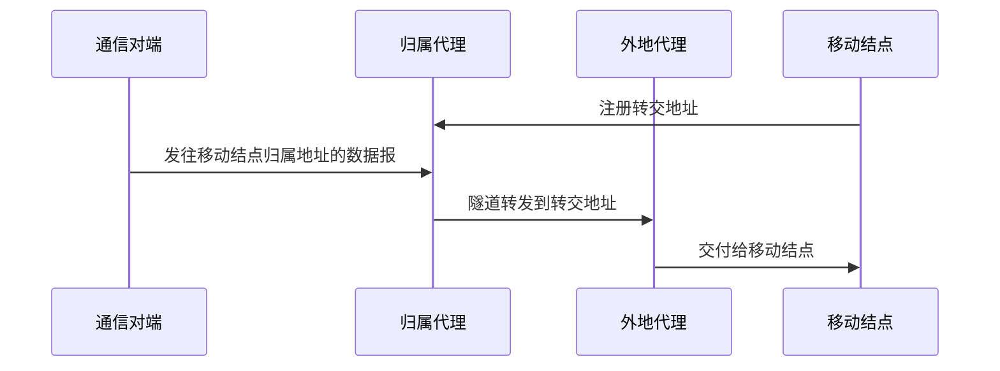
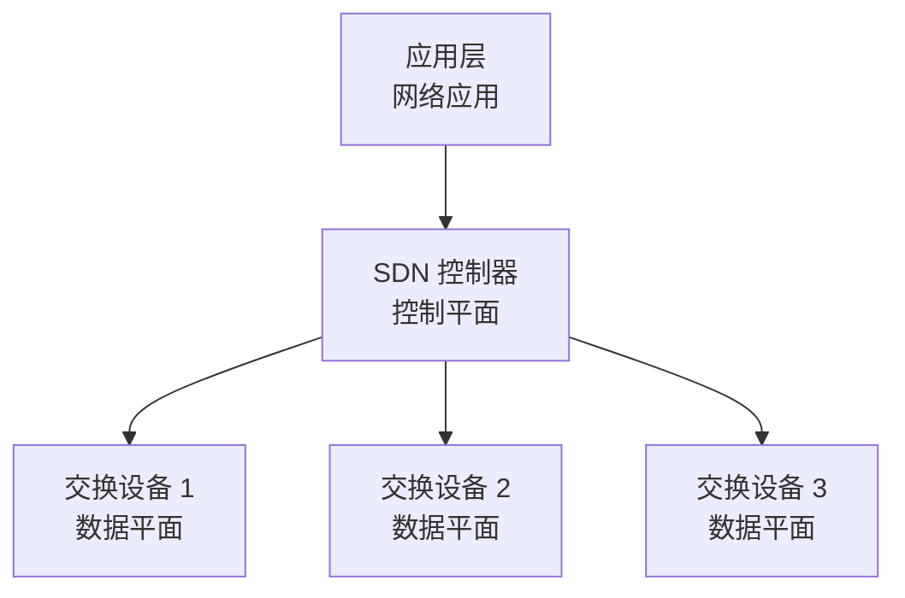
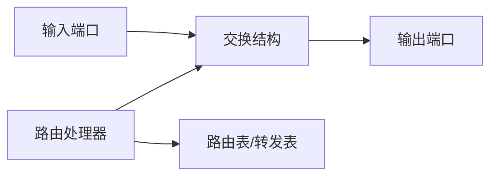

> 介绍 IPv6、组播、移动 IP、SDN 和网络层设备，说明其寻址、转发与控制平面的关键机制。

# IPv6

IPv6 是为解决 IPv4 地址空间不足等问题设计的新一代 IP 协议。

IPv6 地址长度为 128 bit，通常用冒号十六进制表示。

示例：

```text
2001:0db8:0000:0000:0000:ff00:0042:8329
```

可压缩为：

```text
2001:db8::ff00:42:8329
```

## IPv6 主要特点

| 特点 | 含义 |
| - | - |
| 地址空间大 | 128 bit 地址，远大于 IPv4 |
| 首部固定 | 基本首部固定 40B |
| 简化首部 | 移除 IPv4 中部分复杂字段 |
| 支持扩展首部 | 可按需添加选项 |
| 不在路由器分片 | 分片由源主机处理 |
| 支持自动配置 | 便于主机自动获取地址 |
| 更好支持移动性和安全性 | 设计上更适合新网络需求 |

# IPv6 地址表示

## 零压缩

规则：

- 每组前导 0 可以省略。
- 连续多个 0 组可以用 `::` 压缩。
- `::` 在一个地址中只能出现一次。

示例：

```text
原始: 2001:0db8:0000:0000:0000:0000:0000:0001
压缩: 2001:db8::1
```

## 常见地址类型

| 类型 | 含义 |
| - | - |
| 单播地址 | 标识单个接口 |
| 组播地址 | 标识一组接口 |
| 任播地址 | 标识一组接口中距离最近的一个 |

IPv6 不再使用广播地址，广播功能由组播实现。

# IPv4 到 IPv6 过渡

常见过渡技术：

| 技术 | 思想 |
| - | - |
| 双协议栈 | 主机同时运行 IPv4 和 IPv6 |
| 隧道技术 | 把 IPv6 分组封装在 IPv4 分组中穿越 IPv4 网络 |
| 协议转换 | 在 IPv4 和 IPv6 之间转换报文格式 |

# IP 组播

组播是一种一对多通信方式：发送方只发送一份数据，网络负责把数据复制给组播组成员。

与单播、广播对比：

| 类型 | 接收者 |
| - | - |
| 单播 | 一个指定主机 |
| 广播 | 同一广播域内所有主机 |
| 组播 | 加入某组播组的主机 |

IPv4 组播地址使用 D 类地址：

```text
224.0.0.0 ~ 239.255.255.255
```

组播适合：

- 视频会议。
- 在线直播。
- 路由协议组播通告。
- 多接收者实时数据分发。

# 移动 IP

移动 IP 允许主机在移动到外地网络后，仍然保持原有 IP 地址进行通信。

核心角色：

| 角色 | 含义 |
| - | - |
| 移动结点 | 会移动的主机 |
| 归属网络 | 移动结点原本所属网络 |
| 归属代理 | 归属网络中负责转交数据的路由器 |
| 外地网络 | 移动结点当前所在网络 |
| 外地代理 | 外地网络中协助移动结点通信的设备 |
| 转交地址 | 移动结点在外地网络中的临时地址 |

## 通信过程



基本思想：

1. 移动结点进入外地网络，获得转交地址。
2. 移动结点向归属代理注册当前位置。
3. 通信对端仍向移动结点的归属地址发送数据。
4. 归属代理把数据通过隧道转发到转交地址。
5. 外地代理或移动结点接收后交付。

# SDN

SDN（Software Defined Networking，软件定义网络）把网络设备的控制平面和数据平面分离。

传统路由器：

- 控制平面和数据平面都在设备内部。
- 每台设备独立运行路由协议并转发。

SDN：

- 控制平面集中到控制器。
- 交换设备主要负责按流表转发。
- 控制器通过南向接口下发规则。



## SDN 优点

- 集中控制，便于统一管理。
- 网络可编程。
- 策略调整灵活。
- 有利于自动化运维。

## SDN 风险

- 控制器可能成为性能瓶颈。
- 控制器故障影响范围大。
- 安全要求更高。

# 路由器

路由器是网络层设备，用于连接不同网络，并根据 IP 地址转发分组。

主要功能：

- 路由选择。
- 分组转发。
- 分片处理。
- 隔离广播域。
- 连接异构网络。

# 路由器组成



| 部分 | 功能 |
| - | - |
| 输入端口 | 接收分组，查找转发表，排队 |
| 交换结构 | 把分组从输入端口送到输出端口 |
| 输出端口 | 排队、封装、发送分组 |
| 路由处理器 | 运行路由协议，维护路由表 |

# 路由表与转发表

| 表 | 作用 |
| - | - |
| 路由表 | 由路由算法和协议生成，包含路由信息 |
| 转发表 | 从路由表提取，用于高速查表转发 |

教材中有时不严格区分二者。理解上可以认为：路由表偏控制平面，转发表偏数据平面。

# 分组转发过程

路由器收到 IP 数据报后：

1. 检查 IP 首部。
2. TTL 减 1，若为 0 则丢弃并发送 ICMP 超时。
3. 重新计算首部校验和。
4. 根据目的 IP 查转发表。
5. 使用最长前缀匹配选择路由。
6. 确定下一跳和输出接口。
7. 交给数据链路层重新封装成帧。

:::warning
每经过一个路由器，数据链路层帧首部会改变；IP 数据报的源 IP 和目的 IP 通常不变，但 TTL 和首部校验和会变。
:::

# 本节考点

1. IPv6 地址 128 bit，基本首部固定 40B。
2. IPv6 不使用广播，使用组播实现类似功能。
3. IPv6 地址压缩中 `::` 只能出现一次。
4. IPv4 组播使用 D 类地址。
5. 移动 IP 的关键是归属地址、转交地址、归属代理和隧道转发。
6. SDN 的核心是控制平面和数据平面分离。
7. 路由器工作在网络层，根据 IP 地址转发分组并隔离广播域。
8. 路由器每跳会修改 TTL 并重新计算 IP 首部校验和。
