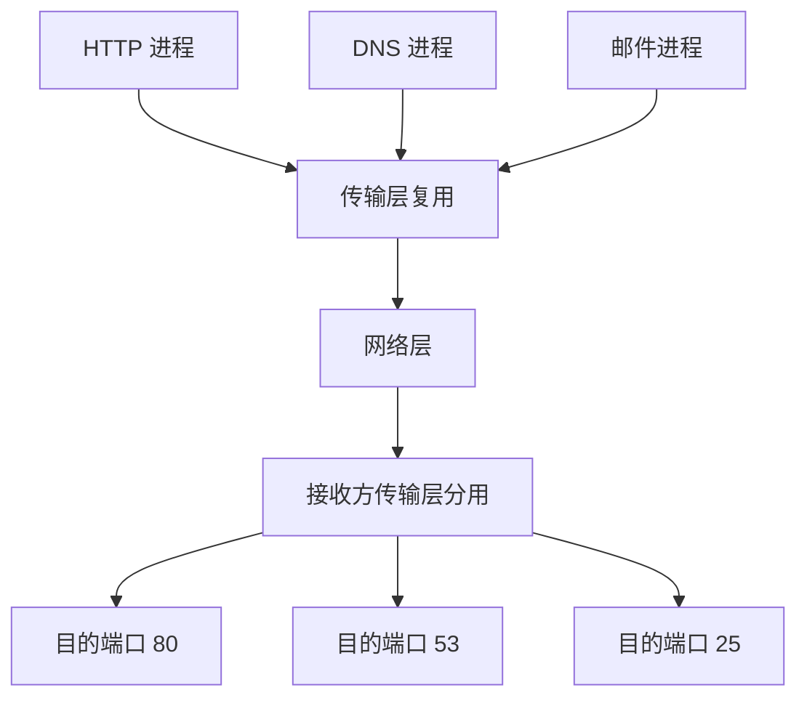

# 传输层的定位

传输层位于应用层和网络层之间。网络层提供主机到主机的通信，传输层在此基础上提供 **进程到进程** 的通信。

传输层的核心任务：

- 为应用进程提供端到端通信。
- 使用端口号区分不同应用进程。
- 提供复用与分用。
- 根据协议提供可靠或不可靠传输。
- 可提供流量控制、拥塞控制等机制。

:::info
网络层靠 IP 地址找到主机，传输层靠端口号找到主机上的具体进程。
:::

# 传输层寻址与端口

端口号用于标识主机上的应用进程，长度为 16 bit，范围为：

$$
0 \sim 65535
$$

常见分类：

| 范围 | 名称 | 用途 |
| - | - | - |
| 0~1023 | 熟知端口 | 常见服务器应用 |
| 1024~49151 | 登记端口 | 注册应用使用 |
| 49152~65535 | 动态/临时端口 | 客户端临时使用 |

常见端口：

| 协议 | 端口 | 传输层协议 |
| - | - | - |
| HTTP | 80 | TCP |
| HTTPS | 443 | TCP |
| FTP 控制连接 | 21 | TCP |
| SMTP | 25 | TCP |
| POP3 | 110 | TCP |
| DNS | 53 | UDP/TCP |
| DHCP Server | 67 | UDP |
| DHCP Client | 68 | UDP |

# 复用与分用

## 复用

发送方多个应用进程的数据都交给传输层，传输层为其添加首部后交给网络层。

## 分用

接收方传输层收到报文段后，根据目的端口号把数据交给对应应用进程。

# 无连接服务与面向连接服务

| 服务 | 特点 | 典型协议 |
| - | - | - |
| 无连接服务 | 发送前不建立连接，报文独立发送 | UDP |
| 面向连接服务 | 通信前建立连接，结束后释放连接 | TCP |

二者对比：

| 项目 | UDP | TCP |
| - | - | - |
| 连接 | 无连接 | 面向连接 |
| 可靠性 | 不保证可靠 | 可靠交付 |
| 数据单位 | 用户数据报 | 字节流 / 报文段 |
| 首部开销 | 小，8B | 较大，最小 20B |
| 顺序保证 | 不保证 | 保证按序 |
| 拥塞控制 | 无 | 有 |
| 典型应用 | DNS、DHCP、实时音视频 | HTTP、FTP、SMTP |

# UDP 协议

UDP（User Datagram Protocol，用户数据报协议）是无连接、不可靠、面向报文的传输层协议。

## UDP 特点

- 无连接：发送前不需要建立连接。
- 尽最大努力交付：不保证到达、不保证顺序、不保证不重复。
- 面向报文：应用层交下来的报文，UDP 保留其边界。
- 首部开销小：UDP 首部只有 8B。
- 支持一对一、一对多、多对一、多对多通信。
- 无拥塞控制：适合实时应用，但可能加重网络拥塞。

:::warning
UDP “不可靠”不等于“不能用于可靠应用”。应用层可以自己实现确认、重传、排序等机制。
:::

# UDP 用户数据报格式

UDP 首部固定 8B。

字段：

| 字段 | 长度 | 含义 |
| - | - | - |
| 源端口 | 16 bit | 发送进程端口，可选 |
| 目的端口 | 16 bit | 接收进程端口 |
| 长度 | 16 bit | UDP 首部 + 数据总长度 |
| 校验和 | 16 bit | 检测 UDP 首部和数据是否出错 |

UDP 长度字段最小值为 8，因为只有首部时就是 8B。

# UDP 校验

UDP 校验和用于检测传输过程中是否出错，校验范围包括：

- UDP 首部。
- UDP 数据。
- 伪首部。

伪首部不是 UDP 真正发送的首部，只参与校验计算。

IPv4 UDP 伪首部包含：

| 字段 | 作用 |
| - | - |
| 源 IP 地址 | 防止送错源 |
| 目的 IP 地址 | 防止送错目的主机 |
| 协议号 | 标识 UDP |
| UDP 长度 | 辅助校验 |

:::info
UDP 校验和把 IP 地址也纳入计算，是为了检查“是否交付给了正确主机和正确协议”。
:::

# UDP 适用场景

UDP 适合：

- 对实时性要求高、允许少量丢失的应用。
- 请求/响应很短、建立连接开销不划算的应用。
- 广播或组播应用。
- 应用层自己控制可靠性的协议。

典型例子：

| 应用 | 原因 |
| - | - |
| DNS | 查询短小，通常一次请求一次响应 |
| DHCP | 初始阶段主机还没有 IP，需要广播 |
| 实时音视频 | 更重视低延迟，少量丢包可容忍 |
| 在线游戏 | 延迟敏感，应用层可处理状态同步 |

# 本节考点

1. 传输层提供进程到进程通信，网络层提供主机到主机通信。
2. 端口号长度 16 bit，范围 0~65535。
3. 复用是多个应用交给传输层，分用是传输层按端口交给应用。
4. UDP 无连接、不可靠、面向报文，首部固定 8B。
5. UDP 校验和覆盖 UDP 首部、数据和伪首部。
6. DNS 常用 UDP 53，DHCP 使用 UDP 67/68。
7. UDP 适合实时、短报文、广播/组播或应用层自定义可靠性的场景。

