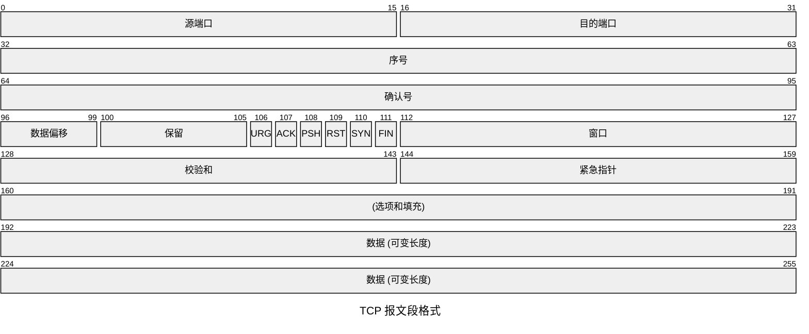
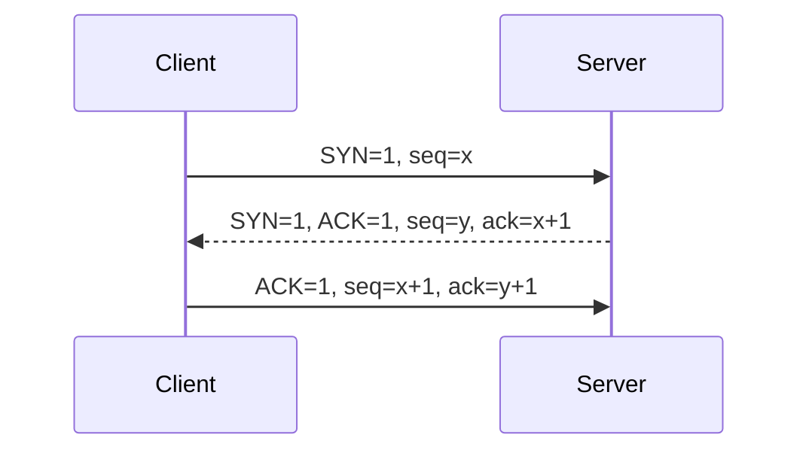
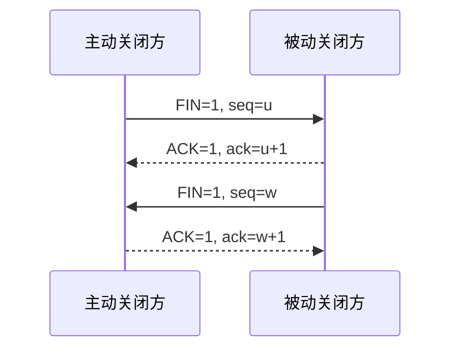

> 系统梳理 TCP 报文段、三次握手和四次挥手、可靠传输、重传与流量控制机制。

# TCP 特点

TCP（Transmission Control Protocol，传输控制协议）是面向连接、可靠、面向字节流的传输层协议。

主要特点：

- 面向连接：传输前建立连接，传输后释放连接。
- 可靠交付：保证无差错、不丢失、不重复、按序到达。
- 面向字节流：应用数据被看作连续字节流。
- 全双工通信：连接双方可以同时发送和接收。
- 点对点：每条 TCP 连接只有两个端点。
- 有流量控制和拥塞控制。

# TCP 报文段格式

TCP 首部最小 20B，最大 60B。



重要字段：

| 字段 | 含义 |
| - | - |
| 源端口、目的端口 | 标识发送和接收进程 |
| 序号 seq | 本报文段数据部分第一个字节的序号 |
| 确认号 ack | 期望收到的下一个字节序号 |
| 数据偏移 | TCP 首部长度，以 4B 为单位 |
| 窗口 | 接收方还能接收的字节数，用于流量控制 |
| 校验和 | 校验 TCP 首部、数据和伪首部 |
| 紧急指针 | URG 有效时指出紧急数据结束位置 |
| 选项 | MSS、窗口扩大、时间戳等 |

## 控制位

| 标志 | 含义 |
| - | - |
| SYN | 建立连接，同步序号 |
| ACK | 确认号字段有效 |
| FIN | 释放连接 |
| RST | 复位连接 |
| PSH | 尽快交付应用层 |
| URG | 紧急指针有效 |

# TCP 连接

一条 TCP 连接由四元组唯一标识：

```text
源 IP, 源端口, 目的 IP, 目的端口
```

同一台服务器可以同时维护大量连接，因为不同客户端的 IP 或端口不同。

# 三次握手

TCP 通过三次握手建立连接。



过程：

1. 客户端发送 SYN，选择初始序号 `x`，进入 `SYN-SENT`。
2. 服务器收到后返回 SYN+ACK，选择初始序号 `y`，确认 `x+1`，进入 `SYN-RECEIVED`。
3. 客户端返回 ACK，确认 `y+1`，连接建立。

三次握手目的：

- 双方确认对方发送能力和接收能力正常。
- 同步双方初始序号。
- 避免旧连接请求报文造成错误连接。

:::warning
SYN 和 FIN 都会消耗一个序号，即使它们不携带应用数据。
:::

# 四次挥手

TCP 是全双工协议，两个方向的数据流需要分别关闭，因此通常需要四次挥手。



状态理解：

- 主动关闭方发送 FIN 后进入 `FIN-WAIT-1`。
- 收到 ACK 后进入 `FIN-WAIT-2`。
- 收到对方 FIN 后发送 ACK，进入 `TIME-WAIT`。
- 等待 $2MSL$ 后关闭。

## 为什么要 TIME-WAIT

主动关闭方等待 $2MSL$ 的原因：

1. 确保最后一个 ACK 能到达对方；若 ACK 丢失，对方重发 FIN，主动关闭方还能再次 ACK。
2. 让旧连接中的残留报文在网络中消失，避免影响后续新连接。

## 为什么挥手通常是四次

收到 FIN 只表示对方不再发送数据，但本端可能还有数据没发送完。因此 ACK 和本端 FIN 通常分开发送。

# TCP 可靠传输

TCP 可靠传输依靠多种机制共同完成：

| 机制 | 作用 |
| - | - |
| 序号 | 标识字节流位置，支持按序交付 |
| 确认号 | 表示期望收到的下一个字节 |
| 校验和 | 检测报文段错误 |
| 超时重传 | 报文段或 ACK 丢失时重传 |
| 快速重传 | 收到重复 ACK 后提前重传 |
| 滑动窗口 | 提高效率并进行流量控制 |

# 序号与确认号

TCP 是面向字节流的，序号按字节编号，而不是按报文段编号。

若某报文段：

```text
seq = 100
数据长度 = 500B
```

则该报文段携带字节：

```text
100 ~ 599
```

接收方正确收到后，返回：

```text
ack = 600
```

表示“下一个期望收到 600 号字节”。

# 累积确认

TCP 使用累积确认。若接收方返回 `ack = 1000`，表示 1000 之前的所有字节都已正确收到。

若中间缺失某段，即使后续字节到达，接收方通常仍确认缺失位置。

例：

```text
收到 0~499
收到 1000~1499
缺少 500~999
```

接收方仍返回：

```text
ack = 500
```

# 超时重传

发送方为已发送但未确认的数据设置重传计时器。若超时未收到确认，就重传。

关键问题：超时时间 RTO 如何设置？

- 太短：可能误判网络延迟，导致不必要重传。
- 太长：真正丢包时恢复太慢。

TCP 根据 RTT 动态估算 RTO。

# 滑动窗口与流量控制

TCP 使用滑动窗口机制允许连续发送多个字节，而不必每发一个报文段就等待确认。

接收方通过 TCP 首部中的窗口字段告诉发送方：自己还能接收多少字节。

```text
可发送数据量 = min(接收窗口 rwnd, 拥塞窗口 cwnd)
```

其中：

- `rwnd` 由接收方缓存空间决定，用于流量控制。
- `cwnd` 由网络拥塞程度决定，用于拥塞控制。

## 零窗口

如果接收方窗口为 0，发送方不能继续发送普通数据。

为避免死锁，发送方会发送零窗口探测报文，询问接收窗口是否恢复。

# 本节考点

1. TCP 面向连接、可靠、面向字节流、全双工。
2. TCP 首部最小 20B，数据偏移字段以 4B 为单位。
3. seq 表示本段第一个数据字节序号，ack 表示期望收到的下一个字节。
4. SYN 和 FIN 各消耗一个序号。
5. 三次握手用于确认双向通信能力并同步初始序号。
6. 四次挥手源于 TCP 全双工，两个方向需要分别关闭。
7. TIME-WAIT 等待 $2MSL$ 是为了可靠关闭和清除旧报文。
8. TCP 可靠传输依靠序号、确认、校验和、重传和滑动窗口等机制。

