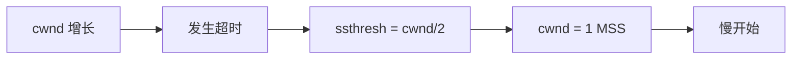
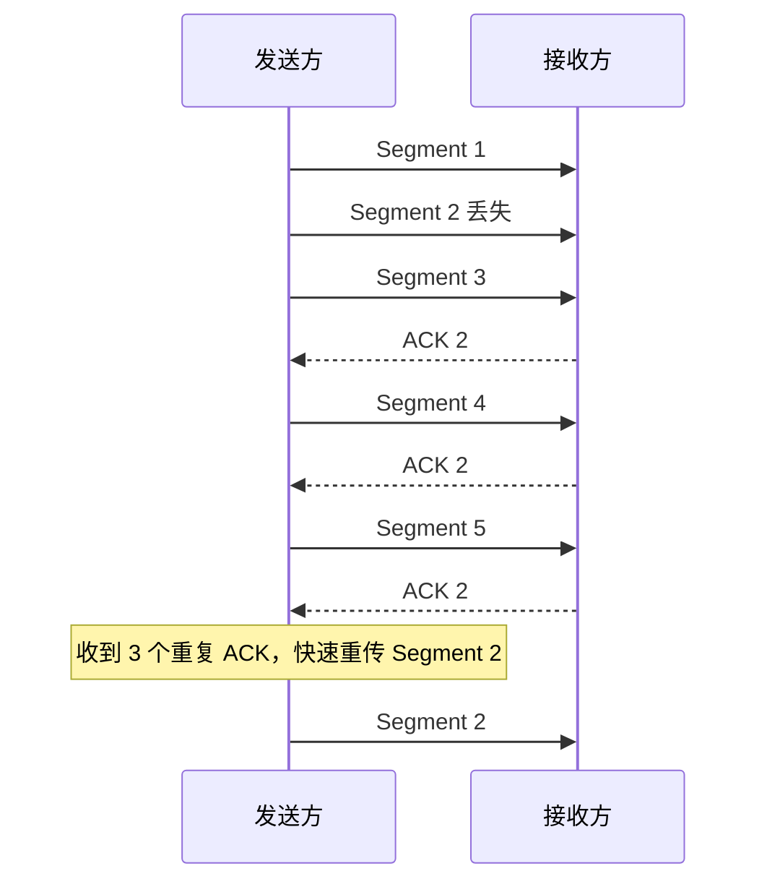

# 拥塞控制

拥塞是指网络中注入的分组过多，超过网络处理能力，导致排队时延增大、丢包增加、吞吐量下降。

TCP 拥塞控制解决的是 **不要把网络压垮**；流量控制解决的是 **不要把接收方压垮**。

| 控制 | 控制对象 | 依据 |
| - | - | - |
| 流量控制 | 接收方缓存 | 接收窗口 `rwnd` |
| 拥塞控制 | 网络承载能力 | 拥塞窗口 `cwnd` |

发送方实际可发送窗口：

$$
W = \min(rwnd, cwnd)
$$

# 拥塞窗口与慢开始门限

TCP 拥塞控制主要使用两个变量：

| 变量 | 含义 |
| - | - |
| `cwnd` | 拥塞窗口，发送方根据网络状况维护 |
| `ssthresh` | 慢开始门限，用于区分慢开始和拥塞避免阶段 |

MSS（Maximum Segment Size）表示一个 TCP 报文段中数据部分的最大长度。拥塞窗口常以 MSS 为单位描述。

# 慢开始

慢开始并不是真的慢，而是从小窗口开始指数增长。

规则：

- 初始 `cwnd` 较小。
- 每收到一个 ACK，`cwnd` 增加。
- 每经过一个 RTT，`cwnd` 大约翻倍。
- 当 `cwnd >= ssthresh` 时，进入拥塞避免。

```mermaid
xychart-beta
    title "慢开始：拥塞窗口指数增长"
    x-axis "RTT" [1, 2, 3, 4]
    y-axis "cwnd(MSS)" 0 --> 16
    line [1, 2, 4, 8]
```

记忆：

```text
慢开始：1, 2, 4, 8, ...
```

# 拥塞避免

拥塞避免阶段采用线性增长，避免窗口继续指数膨胀。

规则：

- 每经过一个 RTT，`cwnd` 大约增加 1 MSS。
- 增长方式从指数变为线性。

```text
拥塞避免：8, 9, 10, 11, ...
```

:::info
慢开始是指数增长，拥塞避免是线性增长。选择题常用增长曲线考查两者区别。
:::

# 拥塞判断

TCP 通常把丢包视为网络拥塞信号。

两种典型情况：

| 信号 | 含义 |
| - | - |
| 超时 | 拥塞较严重，可能分组或 ACK 丢失 |
| 三个重复 ACK | 某个报文段丢失，但后续报文段仍到达，拥塞相对较轻 |

# 超时后的处理

发生超时后，TCP 认为拥塞较严重。

典型处理：

1. `ssthresh = cwnd / 2`。
2. `cwnd = 1 MSS`。
3. 重新进入慢开始。



# 快速重传

快速重传利用重复 ACK 发现丢包，而不必等待超时。

过程：

1. 接收方收到乱序报文段时，重复确认缺失报文段的下一个期望序号。
2. 发送方连续收到 3 个重复 ACK。
3. 发送方立即重传缺失报文段。



# 快速恢复

快速恢复通常与快速重传配合。收到 3 个重复 ACK 时，TCP 认为网络仍能传递后续报文段，因此不必像超时那样把 `cwnd` 降到 1。

典型处理：

1. `ssthresh = cwnd / 2`。
2. `cwnd = ssthresh` 或按具体算法临时调整。
3. 进入拥塞避免。

考研中常用简化版本：

- 超时：`cwnd` 回到 1，慢开始。
- 三个重复 ACK：`ssthresh` 减半，快速重传，进入拥塞避免。

# TCP Tahoe 与 Reno

教材或题目可能涉及两种经典算法：

| 算法 | 遇到 3 个重复 ACK 后 |
| - | - |
| Tahoe | `ssthresh = cwnd/2`，`cwnd = 1`，慢开始 |
| Reno | `ssthresh = cwnd/2`，快速重传，快速恢复 |

若题目未特别说明，通常按教材给定规则作答。

# 拥塞控制曲线题

解题步骤：

1. 找指数增长段：慢开始。
2. 找线性增长段：拥塞避免。
3. 窗口突然降到 1：多半是超时。
4. 窗口降为约一半：多半是 3 个重复 ACK。
5. `ssthresh` 通常设为拥塞发生时窗口的一半。

示例：

```text
cwnd: 1, 2, 4, 8, 16, 17, 18, 19, timeout
```

若超时时 `cwnd = 19`，则：

```text
ssthresh = 19 / 2
cwnd = 1
```

实际做题通常取整数，按题目要求取上整、下整或直接写一半。

# 本节考点

1. 流量控制看接收方，拥塞控制看网络。
2. 实际发送窗口为 $\min(rwnd, cwnd)$。
3. 慢开始指数增长，拥塞避免线性增长。
4. 超时表示拥塞较严重，通常令 `ssthresh = cwnd/2`，`cwnd = 1`。
5. 三个重复 ACK 触发快速重传，通常不必等超时。
6. 快速恢复避免把窗口直接降到 1。
7. 拥塞控制图像题要根据窗口增长和下降方式判断事件类型。

