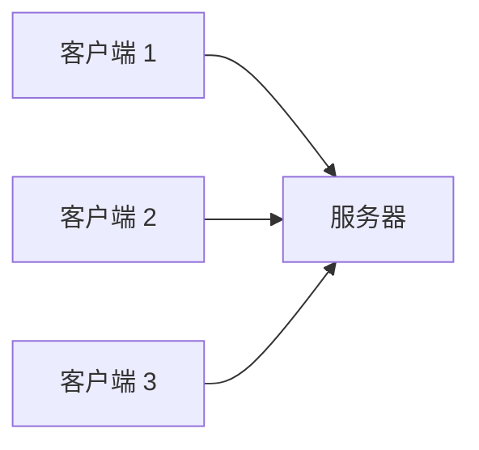
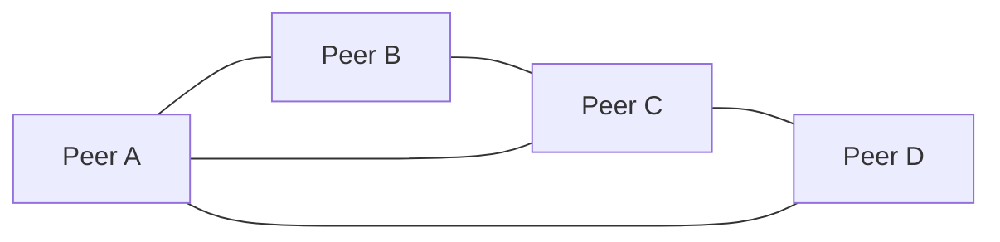
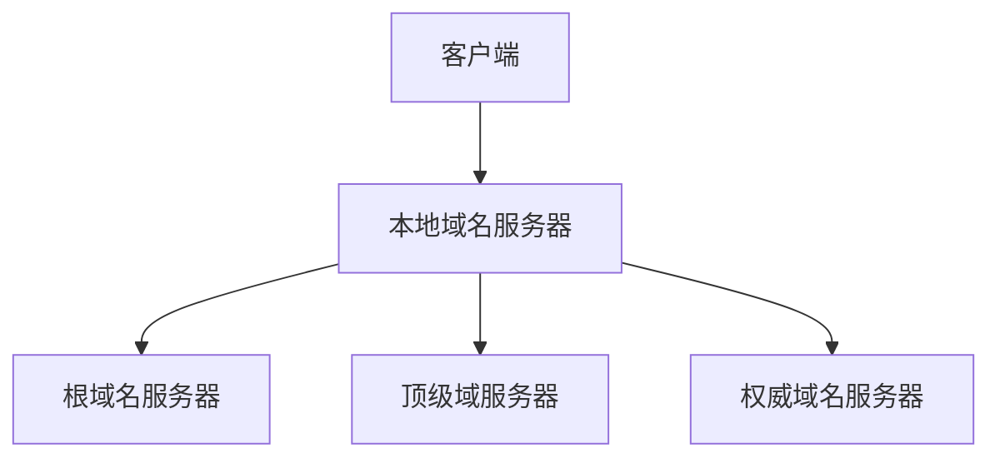
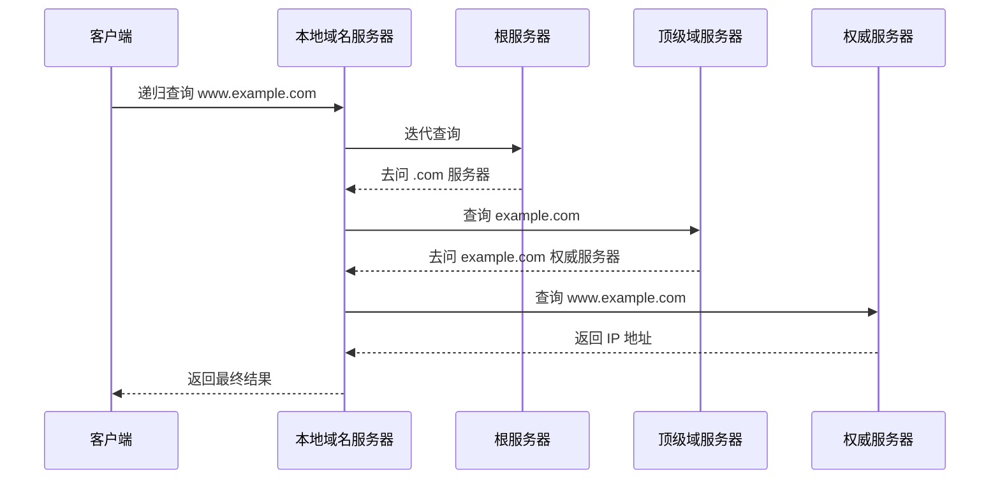

# 应用层的定位

应用层是计算机网络体系结构中最接近用户的一层，负责为具体网络应用提供通信规则。

应用层协议定义：

- 应用进程交换什么报文。
- 报文格式是什么。
- 报文各字段含义是什么。
- 何时发送报文、如何响应。

常见应用层协议：

| 协议 | 作用 | 传输层 |
| - | - | - |
| HTTP/HTTPS | Web 访问 | TCP |
| DNS | 域名解析 | UDP/TCP |
| FTP | 文件传输 | TCP |
| SMTP | 邮件发送 | TCP |
| POP3 | 邮件读取 | TCP |
| DHCP | 自动配置 IP | UDP |

# 网络应用模型

## C/S 模型

C/S（Client/Server，客户/服务器）模型中，服务器长期运行并提供服务，客户端主动发起请求。

特点：

- 服务器固定提供服务。
- 客户端主动请求。
- 资源集中管理。
- 服务器压力较大，可能成为瓶颈。

典型应用：

- Web 浏览。
- 邮件服务。
- DNS 查询。
- 文件服务器。



## P2P 模型

P2P（Peer-to-Peer，对等）模型中，每个结点既可以请求服务，也可以提供服务。

特点：

- 结点地位对等。
- 资源分散在各结点。
- 可扩展性好。
- 管理和安全控制更复杂。

典型应用：

- BitTorrent。
- 区块链网络。
- 部分实时通信系统。



# DNS 的作用

DNS（Domain Name System，域名系统）用于把域名解析为 IP 地址。

人更容易记住：

```text
www.example.com
```

主机通信需要：

```text
93.184.216.34
```

DNS 提供的是分布式、层次化命名系统。

# 域名层次结构

域名从右向左层次逐渐降低：

```text
www.cs.example.com
```

含义：

| 部分 | 层次 |
| - | - |
| `.` | 根域 |
| `com` | 顶级域 |
| `example` | 二级域 |
| `cs` | 子域 |
| `www` | 主机名 |

完整域名也称 FQDN（Fully Qualified Domain Name）。

# DNS 服务器层次

DNS 服务器主要分为：

| 类型 | 作用 |
| - | - |
| 根域名服务器 | 指向顶级域服务器 |
| 顶级域名服务器 | 管理 `.com`、`.cn` 等顶级域 |
| 权威域名服务器 | 保存某个域的权威解析记录 |
| 本地域名服务器 | 接收客户端查询，并代替客户端递归查询 |



# DNS 解析过程

DNS 查询可分为递归查询和迭代查询。

## 递归查询

递归查询要求被查询服务器给出最终结果。

客户端通常向本地域名服务器发起递归查询：

```text
客户端：请告诉我 www.example.com 的 IP
本地域名服务器：我查完后直接告诉你最终 IP
```

## 迭代查询

迭代查询中，被查询服务器不一定给最终答案，但会告诉查询方下一步该问谁。

本地域名服务器向根、顶级域、权威服务器查询时通常使用迭代查询。



# DNS 缓存

DNS 查询结果会被缓存，以减少查询延迟和服务器负载。

缓存位置：

- 浏览器。
- 操作系统。
- 本地域名服务器。
- 中间 DNS 解析器。

缓存记录有 TTL（Time To Live），超过 TTL 后需要重新查询。

# DNS 资源记录

常见资源记录：

| 类型 | 含义 |
| - | - |
| A | 域名到 IPv4 地址 |
| AAAA | 域名到 IPv6 地址 |
| CNAME | 别名到规范域名 |
| MX | 邮件交换服务器 |
| NS | 域名服务器 |
| PTR | IP 地址到域名，反向解析 |

# DNS 使用 UDP 还是 TCP

DNS 通常使用 UDP 53，因为查询短小、开销低。

DNS 也会使用 TCP 53，例如：

- 区域传送。
- 响应报文过大。
- 某些安全或可靠性要求较高的场景。

# 本节考点

1. 应用层协议定义应用进程之间的报文格式、语义和交互规则。
2. C/S 模型中心化，客户端请求服务器响应；P2P 模型结点对等。
3. DNS 用于域名到 IP 地址的解析。
4. DNS 是分布式、层次化系统，包括根、顶级域、权威、本地域名服务器。
5. 客户端到本地域名服务器常用递归查询，本地域名服务器向外常用迭代查询。
6. DNS 通常使用 UDP 53，区域传送或大响应可用 TCP 53。
7. A 记录对应 IPv4，AAAA 对应 IPv6，MX 对应邮件服务器。

