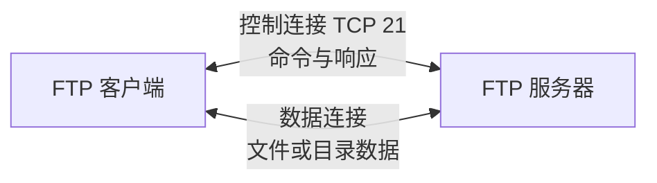
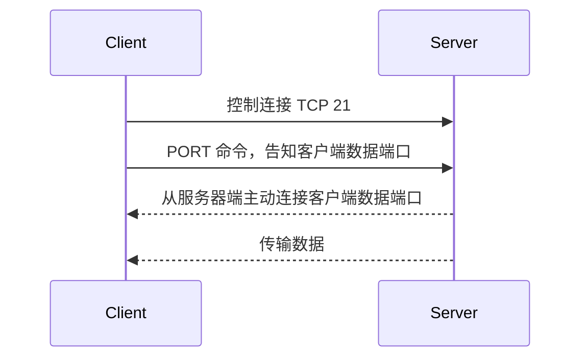
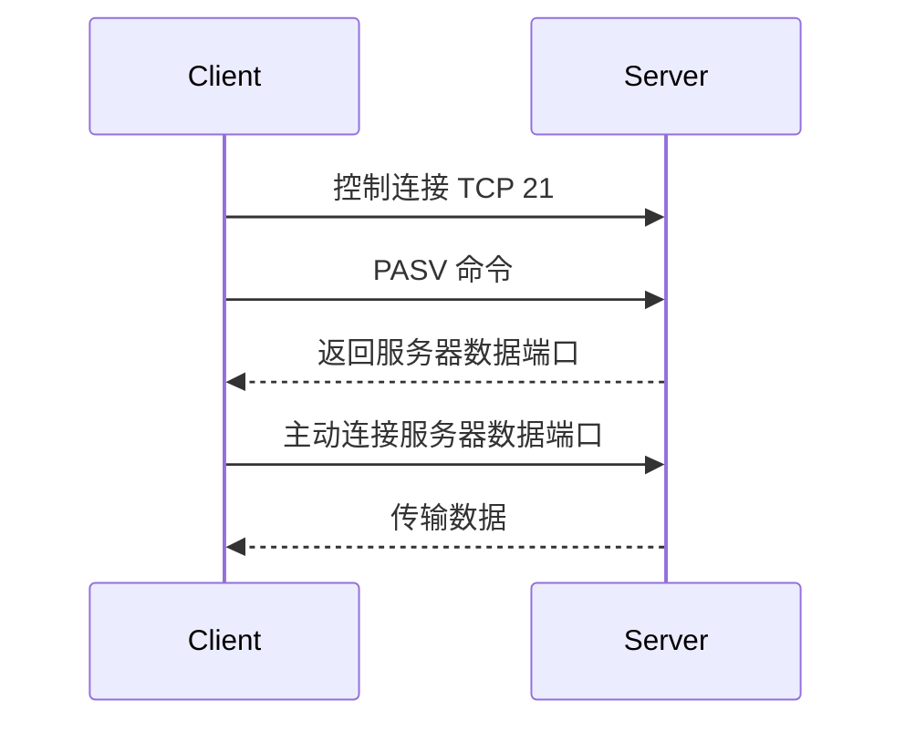
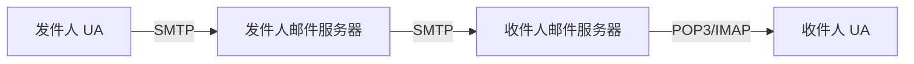

> 介绍 FTP 的控制与数据连接，以及电子邮件系统的组成、SMTP、POP3 和 IMAP 协议。

# FTP

FTP（File Transfer Protocol，文件传输协议）用于在客户端和服务器之间传输文件。

FTP 基于 TCP，特点是使用两条连接：

- 控制连接。
- 数据连接。



## 控制连接

控制连接用于传输 FTP 命令和服务器响应。

特点：

- 使用 TCP 端口 21。
- 在整个 FTP 会话期间保持打开。
- 传输控制命令，如登录、切换目录、上传、下载、退出。
- 传输状态码和响应信息。

常见命令：

| 命令 | 含义 |
| - | - |
| USER | 用户名 |
| PASS | 密码 |
| LIST | 列出目录 |
| RETR | 下载文件 |
| STOR | 上传文件 |
| CWD | 切换目录 |
| QUIT | 退出 |

## 数据连接

数据连接用于传输文件内容或目录列表。

特点：

- 按需建立，传输结束后关闭。
- 与控制连接分离。
- 可以采用主动模式或被动模式。

### 主动模式

主动模式中，客户端告诉服务器自己开放的端口，服务器主动连接客户端。



### 被动模式

被动模式中，服务器开放一个数据端口，客户端主动连接服务器。



被动模式更适合客户端位于 NAT 或防火墙后的场景。

# 电子邮件系统

电子邮件系统主要由三部分组成：

| 组成 | 作用 |
| - | - |
| 用户代理 UA | 用户写信、读信、管理邮箱的软件 |
| 邮件服务器 | 存储、转发邮件 |
| 邮件协议 | SMTP、POP3、IMAP、MIME 等 |



## SMTP

SMTP（Simple Mail Transfer Protocol，简单邮件传输协议）用于发送邮件。

使用场景：

- 用户代理把邮件发送到发件人邮件服务器。
- 发件人邮件服务器把邮件发送到收件人邮件服务器。

特点：

- 使用 TCP。
- 常用端口 25。
- 使用推送方式。
- 只能发送邮件，不负责用户读取邮件。
- 传输的是 ASCII 文本，非 ASCII 内容需要 MIME 扩展。

## POP3

POP3（Post Office Protocol Version 3）用于用户从邮件服务器读取邮件。

特点：

- 使用 TCP。
- 常用端口 110。
- 使用拉取方式。
- 通常把邮件下载到本地。
- 可配置下载后是否删除服务器副本。

SMTP 与 POP3 对比：

| 协议 | 方向 | 方式 | 用途 |
| - | - | - | - |
| SMTP | UA 到服务器、服务器到服务器 | 推送 | 发送邮件 |
| POP3 | 服务器到 UA | 拉取 | 读取邮件 |

## IMAP

IMAP 不是考纲重点，但和 POP3 常一起出现。

IMAP 特点：

- 邮件主要保存在服务器。
- 支持多设备同步。
- 可在服务器上管理文件夹和邮件状态。
- 比 POP3 更适合现代邮箱使用。

## 电子邮件格式

电子邮件由信封和内容组成。

内容包括：

- 首部。
- 空行。
- 主体。

示例：

```text
From: alice@example.com
To: bob@example.com
Subject: Meeting

See you tomorrow.
```

常见首部字段：

| 字段 | 含义 |
| - | - |
| From | 发件人 |
| To | 收件人 |
| Subject | 主题 |
| Date | 日期 |
| Cc | 抄送 |

## MIME

MIME（Multipurpose Internet Mail Extensions，多用途互联网邮件扩展）用于扩展电子邮件，使其支持：

- 非 ASCII 文本。
- 图片。
- 音频。
- 视频。
- 附件。
- 多部分消息。

MIME 的本质：在邮件首部中增加描述内容类型和编码方式的字段，让邮件系统可以传输复杂内容。

常见字段：

| 字段 | 含义 |
| - | - |
| MIME-Version | MIME 版本 |
| Content-Type | 内容类型 |
| Content-Transfer-Encoding | 传输编码 |

# 本节考点

1. FTP 使用控制连接和数据连接两条 TCP 连接。
2. FTP 控制连接使用 TCP 21，贯穿整个会话。
3. FTP 数据连接按需建立，主动模式服务器连客户端，被动模式客户端连服务器。
4. 电子邮件系统由用户代理、邮件服务器和邮件协议组成。
5. SMTP 用于发送邮件，是推送协议，常用 TCP 25。
6. POP3 用于读取邮件，是拉取协议，常用 TCP 110。
7. MIME 让电子邮件支持非 ASCII 文本和多媒体附件。

