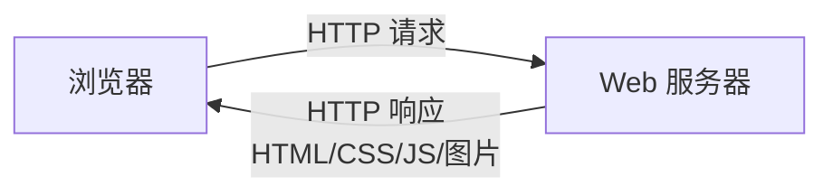
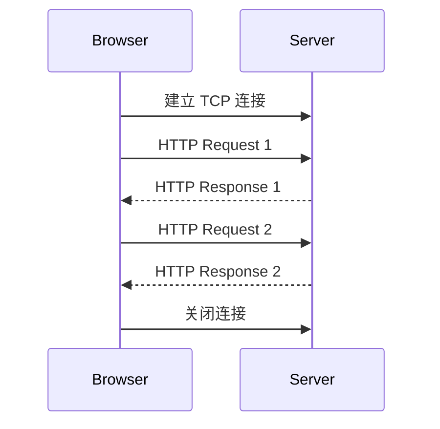

# WWW

WWW（World Wide Web，万维网）是运行在 Internet 上的分布式超媒体系统。它通过 URL 标识资源，通过 HTTP 传输资源，通过 HTML 展示超文本内容。

WWW 的三个核心：

| 组成 | 作用 |
| - | - |
| URL | 统一资源定位符，标识资源位置 |
| HTTP | 超文本传输协议，负责浏览器与服务器通信 |
| HTML | 超文本标记语言，描述页面结构 |



# URL

URL（Uniform Resource Locator）用于定位网络资源。

基本格式：

```text
协议://主机:端口/路径?查询参数
```

示例：

```text
https://www.example.com:443/index.html?id=1
```

字段：

| 部分 | 示例 | 含义 |
| - | - | - |
| 协议 | `https` | 使用的应用层协议 |
| 主机 | `www.example.com` | 服务器域名或 IP |
| 端口 | `443` | 服务端口，省略时使用默认端口 |
| 路径 | `/index.html` | 资源路径 |
| 查询参数 | `id=1` | 附加参数 |

# HTTP 基本特点

HTTP（HyperText Transfer Protocol，超文本传输协议）是 Web 的核心应用层协议。

特点：

- 基于 C/S 模型。
- 使用请求-响应方式。
- 默认使用 TCP。
- HTTP 本身无状态。
- 报文为文本格式，便于阅读和调试。

常见端口：

| 协议 | 端口 |
| - | - |
| HTTP | 80 |
| HTTPS | 443 |

HTTPS = HTTP + TLS/SSL，用于加密传输。

# HTTP 报文

HTTP 报文分为请求报文和响应报文。

## 请求报文

格式：

```text
请求行
首部行

实体主体
```

请求行：

```text
方法 URL 版本
```

示例：

```http
GET /index.html HTTP/1.1
Host: www.example.com
User-Agent: browser
```

常见方法：

| 方法 | 含义 |
| - | - |
| GET | 获取资源 |
| POST | 提交数据 |
| HEAD | 只获取响应首部 |
| PUT | 上传或替换资源 |
| DELETE | 删除资源 |

## 响应报文

格式：

```text
状态行
首部行

实体主体
```

状态行：

```text
版本 状态码 短语
```

示例：

```http
HTTP/1.1 200 OK
Content-Type: text/html
Content-Length: 1234
```

# HTTP 状态码

| 范围 | 含义 | 示例 |
| - | - | - |
| 1xx | 信息响应 | 100 Continue |
| 2xx | 成功 | 200 OK |
| 3xx | 重定向 | 301 Moved Permanently |
| 4xx | 客户端错误 | 404 Not Found |
| 5xx | 服务器错误 | 500 Internal Server Error |

常见状态码：

| 状态码 | 含义 |
| - | - |
| 200 | 请求成功 |
| 301 | 永久重定向 |
| 302 | 临时重定向 |
| 304 | 使用缓存 |
| 400 | 请求语法错误 |
| 403 | 禁止访问 |
| 404 | 资源不存在 |
| 500 | 服务器内部错误 |

# HTTP 连接方式

## 非持久连接

HTTP/1.0 默认非持久连接：每请求一个对象就建立一个 TCP 连接，传完后关闭。

缺点：

- TCP 建立和释放开销大。
- 页面包含多个对象时效率低。

## 持久连接

HTTP/1.1 默认持久连接：多个请求/响应可以复用同一条 TCP 连接。

优点：

- 减少 TCP 握手和挥手开销。
- 降低时延。
- 提高传输效率。



# HTTP 无状态与 Cookie

HTTP 无状态：服务器默认不记住两次请求是否来自同一用户。

Cookie 用于在客户端保存状态信息，帮助服务器识别用户会话。

过程：

1. 服务器在响应中发送 `Set-Cookie`。
2. 浏览器保存 Cookie。
3. 后续请求自动携带 Cookie。
4. 服务器根据 Cookie 识别用户状态。

```http
Set-Cookie: session_id=abc123
Cookie: session_id=abc123
```

# Web 缓存

Web 缓存可以减少访问延迟和服务器负载。

缓存位置：

- 浏览器缓存。
- 代理缓存。
- CDN。

常见机制：

- `Cache-Control` 控制缓存策略。
- `Expires` 指定过期时间。
- `ETag` 标识资源版本。
- `Last-Modified` 标识最后修改时间。

缓存命中时，可以直接使用本地副本或返回 `304 Not Modified`。

# 代理服务器

代理服务器位于客户端和服务器之间。

作用：

- 缓存资源。
- 访问控制。
- 匿名访问。
- 内容过滤。
- 负载均衡或反向代理。

正向代理代理客户端，反向代理代理服务器。

# 本节考点

1. WWW 核心由 URL、HTTP、HTML 构成。
2. HTTP 基于请求-响应模型，默认使用 TCP。
3. HTTP 默认端口 80，HTTPS 默认端口 443。
4. HTTP 请求报文包含请求行、首部行和实体主体。
5. HTTP 响应报文包含状态行、首部行和实体主体。
6. HTTP/1.1 默认持久连接，可复用 TCP 连接。
7. HTTP 是无状态协议，Cookie 可用于维持会话状态。
8. 常见状态码：200、301、302、304、403、404、500。

