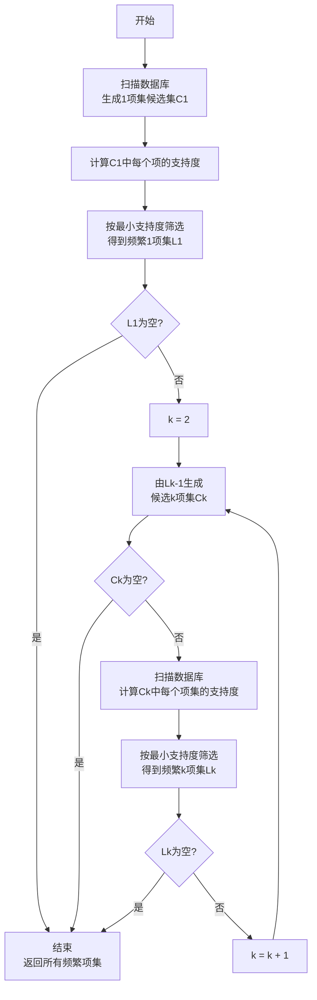

场景: 购物篮分析。"啤酒与尿布"。
形式: $X \rightarrow Y$ (买了x的人也会买Y)

# 三个核心指标

## 支持度（Support）

$$ \begin {aligned}
\text{support}(A \rightarrow B) &= P(A \cup B) \\
&= \frac{|{t: A \subseteq t \ \text{且}\ B \subseteq t}|}{N} 
\end {aligned}$$ 
其中 $N$ 是事务总数，分子 $t$ 是同时包含 A 和 B 的事务数（即 $A \cap B$ 的计数）。

**支持度**衡量++项集或规则在整个事务数据库中出现的频率++。

对于规则 $A \rightarrow B$，常用的定义是 A 和 B 同时出现的事务占总事务数的比例。

支持度反映规则的 ==“重要性”== 或“普遍性”。支持度过低的规则通常被认为不重要并会被剪掉（Apriori 中用于剪枝）。

## 置信度（Confidence）

$$\begin {aligned}
\text{confidence}(A \rightarrow B) &= P(B\mid A) \\
&= \frac{\text{support}(A \cup B)}{\text{support}(A)} \\
&= \frac{|{t: A \cap B \subseteq t}|/N}{|{t: A \subseteq t}|/N} \\
&= \frac{|{t: A \cap B \subseteq t}|}{|{t: A \subseteq t}|}
\end {aligned}$$

**置信度**衡量++在包含 A 的事务中同时也包含 B 的条件概率++，即 $P(B \mid A)$。

解释：置信度反映规则的 ==“可靠性”== ——在已知 A 发生的前提下，B 发生的概率。置信度高表示规则有较强的条件关联性，但不区分偶然相关或由基线支持度导致的高概率。

## 提升度（Lift）

$$\begin {aligned}
\text{lift}(A \rightarrow B) &= \frac{\text{confidence}(A \rightarrow B)}{\text{support}(B)} \\ 
&= \frac{P(B\mid A)}{P(B)} \\ 
&= \frac{P(A\cap B)}{P(A)P(B)}
\end {aligned}$$

**提升度**定义为++规则置信度与 B 的总体支持度之比++，等价于联合概率与边缘概率乘积之比。

用于衡量 A 和 B 之间关联是否超过随机独立情况下的期望水平 (即==相关性==)。

解释：
- lift > 1：A 的出现能增加 B 出现的可能性（正相关）。
- lift = 1：A 与 B 独立（无关联）。
- lift < 1：A 的出现减少 B 出现的可能性（负相关）。

# `Apriori` 算法


