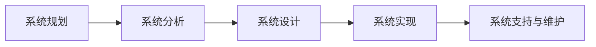
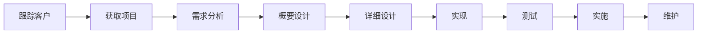

> 概述信息系统分析、设计与实现课程的定位、目标、内容模块、系统开发生命周期和常见 IT 岗位分工。

# 课程定位

《信息系统分析、设计与实现》研究的是**如何系统地构建一个信息系统**。课程不等同于单纯编程，而是强调开发前的规划与设计、开发过程中的工程化方法，以及开发后的测试、实施和维护。

在计算机专业中，与本课程高度相近的课程通常称为**软件工程**。

## 核心定位

- **专业定位**：信息管理与信息系统专业的核心专业课。
- **工程视角**：从经验驱动的软件开发转向规范驱动、过程可控的软件工程。
- **学术视角**：为系统开发类毕业论文提供需求分析、系统设计、建模和文档写作基础。
- **前置基础**：默认学生已具备一定编程能力，课程重点不在语法，而在方法、过程和模型。

# 课程目标

| 维度 | 目标 |
| - | - |
| 知识层面 | 掌握系统分析与设计的基本原理、方法和技术 |
| 能力层面 | 能完成需求分析、系统设计文档撰写和原型开发 |
| 素养层面 | 形成工程化思维、团队协作意识和职业伦理意识 |

# 课程内容主线

课程内容可以概括为五个关键词：

- **原理**：理解信息系统开发的基本概念和规律。
- **方法**：掌握结构化方法、面向对象方法、敏捷开发等开发方法学。
- **技术**：理解需求建模、系统设计、测试实施等关键技术。
- **工具**：掌握 UML、原型工具、文档工具等辅助表达手段。
- **应用**：能将方法和工具用于实际信息系统开发场景。

## 两大核心内容

| 核心内容 | 重点 |
| - | - |
| 软件工程基本概念与理论 | 信息系统开发原理、开发环境、开发方法学、项目启动等 |
| UML 统一建模语言 | 用图形化方式表达系统需求、结构和行为，是团队沟通的通用建模语言 |

:::warning
考试中常见的理解误区：课程不是“学写代码”，而是学习从需求到设计、实现、测试、维护的一整套系统开发过程。
:::

# 四个教学模块

| 模块 | 主要内容 | 需要回答的问题 |
| - | - | - |
| 基本概念与原理 | 系统开发环境、开发方法学、项目启动 | 如何理解开发过程？如何选择开发方法？ |
| 系统分析 | 需求获取、需求建模、可行性分析、系统方案建议 | 系统要做什么？ |
| 系统设计 | 应用架构设计、数据库设计、软件设计、输入输出与界面设计 | 系统具体怎么做？ |
| 实施与支持 | 系统实施、测试、运行维护、系统支持 | 如何把设计变为可运行系统并持续优化？ |

# 软件开发过程

信息系统开发通常遵循生命周期思想。课程将围绕软件开发过程展开，强调每个阶段的任务、方法和产出。

## 常用五阶段模型

## 更细的开发过程

## 阶段理解重点

- **系统规划**：确定是否值得做、做什么方向、资源是否可行。
- **系统分析**：明确用户需求和业务问题，回答“做什么”。
- **系统设计**：给出技术方案和系统结构，回答“怎么做”。
- **系统实现**：编码、配置、集成，将设计变为可运行软件。
- **系统支持与维护**：上线后运行、修复、优化和持续改进。

# IT 企业组织与岗位

IT 企业通常不只有开发岗位，还包括市场、销售、研发、质量、售后、财务、人事、运维等部门。理解组织结构有助于认识信息系统开发中的角色协作。

## 职业发展双通道

- **P 序列**：专业技术通道，强调专业能力和技术影响力。
- **M 序列**：管理通道，强调团队管理、资源协调和组织目标达成。

## 主要岗位

| 岗位 | 核心职责 | 复习关键词 |
| - | - | - |
| 后端开发工程师 | 实现业务逻辑、服务接口、数据交互和性能优化 | 后端框架、数据库、接口 |
| 前端开发工程师 | 实现用户界面和交互体验 | HTML、CSS、JavaScript、React、Vue |
| 移动端开发工程师 | 开发移动 App、小程序或跨平台应用 | iOS、Android、Flutter、React Native |
| 算法工程师 | 用机器学习、深度学习解决智能化问题 | 数学、模型、训练、部署 |
| 数据工程师 | 建设数据采集、清洗、存储和计算链路 | SQL、ETL、Hadoop、Spark |
| 数据分析师 | 用数据解释业务现象并支持决策 | BI、统计、业务理解 |
| 架构师 | 设计系统整体结构和技术路线 | 架构、技术选型、非功能需求 |
| 产品经理 | 定义产品功能、规划路线图、撰写需求和原型 | 用户需求、PRD、原型 |
| 项目经理 | 管理计划、进度、资源、风险和交付 | WBS、甘特图、里程碑、验收 |
| 软件测试工程师 | 设计并执行测试，发现缺陷，保障软件质量 | 测试用例、缺陷管理、质量保障 |
| 系统分析师 | 调研业务、分析需求、建模并撰写文档 | 需求、建模、文档、沟通 |
| 售前工程师 | 面向客户做方案、预算、标书和技术交流 | 方案、报价、招投标 |

# 产品经理与项目经理辨析

| 对比项 | 产品经理 | 项目经理 |
| - | - | - |
| 关注对象 | 产品是否满足用户和商业需求 | 项目是否按时、按质、按预算交付 |
| 核心问题 | 做什么、为什么做、给谁用 | 谁来做、何时做、如何交付 |
| 主要产出 | 产品需求文档、原型、路线图 | 项目计划、进度表、风险清单、验收材料 |
| 关键能力 | 用户洞察、需求分析、产品设计、业务理解 | 计划管理、资源协调、沟通推进、风险控制 |

# 本专题考点提炼

1. **课程本质**：学习信息系统从规划、分析、设计到实现和维护的工程化方法。
2. **课程重点**：软件工程基本理论和 UML 建模。
3. **生命周期主线**：系统规划、系统分析、系统设计、系统实现、系统支持与维护。
4. **分析与设计区别**：分析回答“做什么”，设计回答“怎么做”。
5. **UML 作用**：用统一图形语言表达需求、结构和行为，提高沟通效率。
6. **岗位分工**：开发、测试、运维、产品、项目、售前等岗位共同完成系统建设。
7. **产品经理与项目经理区别**：产品经理关注需求和产品价值，项目经理关注计划、资源和交付。

# 快速自测

- 为什么说本课程类似于软件工程，而不是单纯的编程课？
- 系统开发生命周期的五个阶段分别是什么？
- 系统分析和系统设计分别回答什么问题？
- UML 在系统分析与设计中有什么作用？
- 产品经理和项目经理的职责差异是什么？
- 系统分析师在 IT 企业中的主要工作是什么？
