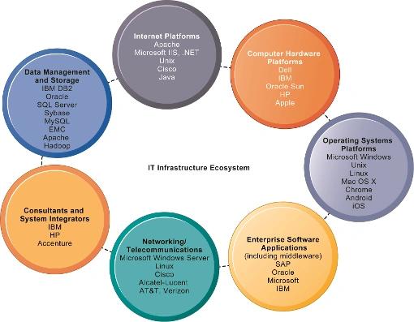

> 梳理 IT 基础设施的演进、主要组成、平台服务和新兴技术对企业信息系统的影响。

# IT基础设施

## 演化过程

1. 通用大型机和小型机：1959
2. 个人机 PC: 1981
3. Client/Server 客户机/服务器: 1983
4. 企业计算：1992
5. 云计算和移动计算：2000

## 七个主要组成部分

1. 计算机硬件平台 _Computer Hardware Platforms_
2. 操作系统平台 _Operating Systems Platforms_
3. 企业软件应用 _Enterprise Software Applications_
4. 数据管理与存储 _Data Management and Storage_
5. 网络和远程通信 _Networking / Telecommunications_
6. 互联网平台 _Internet Platforms_
7. 咨询与系统集成服务 _Consultants and System Integrators_

## 支持的企业服务

* 提供计算服务的计算平台
* 电信服务、远程通信服务
* 数据管理服务
* 应用软件服务
* 物流设备管理服务
* IT管理、教育和其他服务

## 技术推动IT设施的演变

* 摩尔定律和微处理能力
    * 计算能力每18个月翻一番 _Computing power doubles every 18 months_ 纳米技术：
    * 将晶体管的大小缩小到与病毒相当的大小
* 大规模数字存储的规律
    * 每年存储的数据量翻了一番 _The amount of data being stored doubles each year_
* 梅特卡夫定律与网络经济学
    * 一个网络的价值或力量随着网络成员的数量呈指数增长
    * 随着网络成员的增加，更多的人想使用它(对网络访问的需求增加)

# 互联网应用趋势

## 云计算

云计算的特点：

1. 超大规模
   “云计算管理系统”具有相当的规模，Google云计算已经拥有100多万台服务器，
   Amazon、IBM、微软、Yahoo等的“云”均拥有几十万台服务器。企业私有云一般拥有数百上千台服务器。“云”能赋予用户前所未有的计算能力。
2. 虚拟化
   云计算支持用户在任意位置、使用各种终端获取应用服务。所请求的资源来自“云”，而不是固定的有形的实体。应用在“云”中某处运行，但实际上用户无需了解、也不用担心应用运行的具体位置。只需要一台笔记本或者一个手机，就可以通过网络服务来实现我们需要的一切，甚至包括超级计算这样的任务。
3. 高可靠性
   “云”使用了数据多副本容错、计算节点同构可互换等措施来保障服务的高可靠性，使用云计算比使用本地计算机可靠。
4. 通用性
   云计算不针对特定的应用，在“云”的支撑下可以构造出千变万化的应用，同一个“云”可以同时支撑不同的应用运行。
5. 高可扩展性
   “云”的规模可以动态伸缩，满足应用和用户规模增长的需要。
6. 按需服务
   “云”是一个庞大的资源池，你按需购买；云可以像自来水，电，煤气那样计费。
7. 极其廉价
   由于“云”的特殊容错措施可以采用极其廉价的节点来构成云，“云”的自动化集中式管理使大量企业无需负担日益高昂的数据中心管理成本，“云”的通用性使资源的利用率较之传统系统大幅提升，因此用户可以充分享受“云”的低成本优势，经常只要花费几百美元、几天时间就能完成以前需要数万美元、数月时间才能完成的任务。
   云计算可以彻底改变人们未来的生活，但同时也要重视环境问题，这样才能真正为人类进步做贡献,而不是简单的技术提升。

## 软件即服务 (==SaaS==, Software-as-a-Service)

软件的交付模型，在这种模型中，您**按使用次数付费购买软件**，而不是直接购买软件。

* 使用服务提供商的任何设备做任何事情
* 支付一小笔费用并在网上存储文件
* 与普通计算机类似的方式访问这些文件
* 充分利用应用服务提供者 (ASP: Application Service Provider)

还有 IaaS: Infrastructure as a Service; PaaS: Platform as a Service
