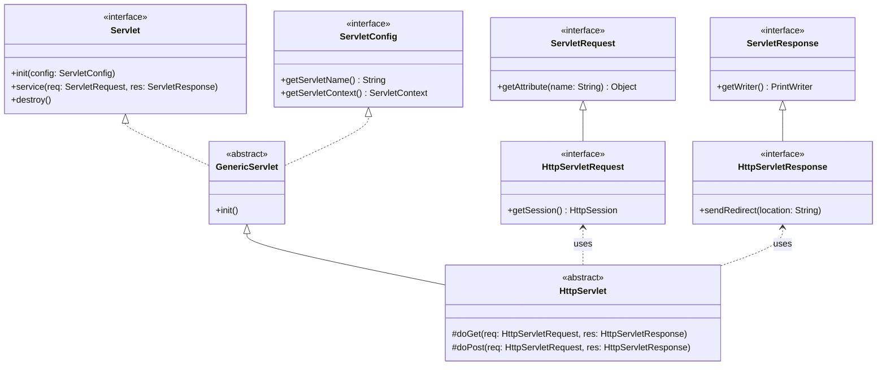
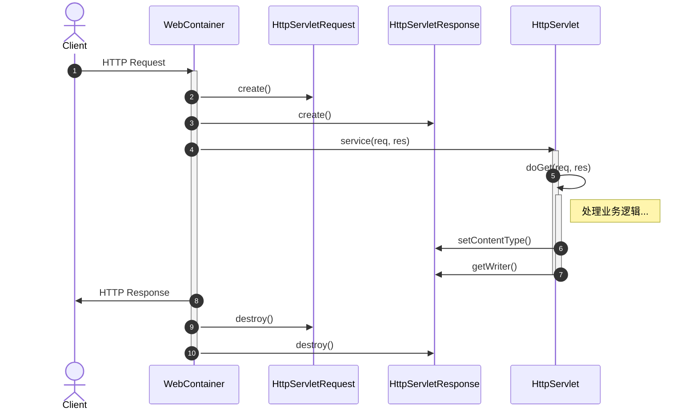

# 期末考试

## 题型

1. **选择题**: 1分 * 10题 = 10分
2. **填空题**: 1分 * 15题 = 15分
3. **名词解释**: 3分 * 4题 = 12分
4. **问答题**: 5分 * 3题 = 15分
5. **代码题**: 共 48分
    - 分值分布：3 + 5 + 5 + 5 + (4 + 10 + 6 + 10)

# 复习笔记

## Web 基础架构

### 网络编程模式

- **C/S (Client/Server)**: 客户端/服务器模式。
    - 优点：交互性强、响应速度快、减轻服务器压力。
    - 缺点：需要安装特定的客户端软件，维护和升级成本高。
- **B/S (Browser/Server)**: 浏览器/服务器模式。
    - 优点：零安装（有浏览器即可），维护方便，跨平台性好。
    - 缺点：响应速度受网络限制，功能受浏览器限制。

### 基础概念

- **WWW**: World Wide Web（万维网）。
- **CGI**: Common Gateway Interface（通用网关接口），早期的动态网页技术，每个请求启动一个进程，性能较低。
- **PHP**: 典型的脚本语言，常用于快速开发动态网站。
- **Java 后端框架**: Spring, Spring Boot, Spring MVC, Struts2 (老旧), Hibernate/MyBatis (ORM) 等。

### MVC 架构模式

- **M (Model)**: 模型。处理业务逻辑和数据状态（通常由 JavaBean / Service / DAO 充当）。
- **V (View)**: 视图。负责数据展示（JSP / HTML）。
- **C (Controller)**: 控制器。接收请求，调用模型处理，选择视图响应（Servlet）。

## Servlet 核心技术

### 基础与生命周期

**JSP 与 Servlet 的关系**:
JSP 本质上就是 Servlet。JSP 页面在第一次被访问时，会被服务器翻译成 Servlet 源码（`.java`），然后编译成字节码（`.class`）执行。JSP
侧重于视图展示，Servlet 侧重于逻辑控制。

**Servlet 继承树**:

- `Servlet` (接口)
    - `GenericServlet` (抽象类，通用协议)
        - `HttpServlet` (抽象类，HTTP 协议)
            - 用户自定义 Servlet (如 `MyServlet`)

**生命周期方法**:

1. **`init(ServletConfig config)`**: 初始化。Servlet 实例创建后调用，只执行一次。
2. **`service(req, resp)`**: 服务。每次请求都会调用，分发给 `doGet`/`doPost`。
3. **`destroy()`**: 销毁。服务器关闭或移除应用时调用，只执行一次。

**Servlet 核心类图**:



### 常用注解与程序框架

在 Servlet 3.0 之后，我们主要使用注解来配置请求映射，而不再依赖繁琐的 `web.xml` 配置文件喵。

**`@WebServlet` 常用属性**:
- `name`: Servlet 名称。
- `value` / `urlPatterns`: 映射的 URL 路径（可以是数组）。
- `loadOnStartup`: 启动时加载的优先级（正数表示容器启动时即初始化）。
- `initParams`: 初始化参数。

**实现一个 Servlet 的标准框架**:

```java
import javax.servlet.ServletException;
import javax.servlet.annotation.WebServlet;
import javax.servlet.annotation.WebInitParam;
import javax.servlet.http.HttpServlet;
import javax.servlet.http.HttpServletRequest;
import javax.servlet.http.HttpServletResponse;
import java.io.IOException;
import java.io.PrintWriter;

/**
 * 实现一个 Servlet 需要继承 HttpServlet 并重写相关方法喵
 */
@WebServlet(
    name = "DemoServlet", 
    urlPatterns = {"/demo", "/test"},
    loadOnStartup = 1,
    initParams = {
        @WebInitParam(name = "author", value = "Cat-Girl")
    }
)
public class DemoServlet extends HttpServlet {

    /**
     * 初始化方法，可读取配置
     */
    @Override
    public void init() throws ServletException {
        String author = getInitParameter("author");
        System.out.println("Servlet initialized by " + author);
    }

    /**
     * 处理 GET 请求
     */
    @Override
    protected void doGet(HttpServletRequest req, HttpServletResponse resp) 
            throws ServletException, IOException {
        // 1. 处理请求编码（针对 URL 参数通常默认 UTF-8）
        // 2. 设置响应类型和编码
        resp.setContentType("text/html;charset=UTF-8");
        
        // 3. 获取输出对象
        PrintWriter out = resp.getWriter();
        out.println("<h1>Hello from DemoServlet喵!</h1>");
    }

    /**
     * 处理 POST 请求
     */
    @Override
    protected void doPost(HttpServletRequest req, HttpServletResponse resp) 
            throws ServletException, IOException {
        // 1. 处理请求体编码（重要喵！）
        req.setCharacterEncoding("UTF-8");
        
        // 2. 处理逻辑并复用 doGet
        doGet(req, resp);
    }
    
    @Override
    public void destroy() {
        System.out.println("Servlet is dying... nya...");
    }
}
```

**HTTP 请求处理时序图**:



### 请求对象 HttpServletRequest

**获取请求参数**:

- `String getParameter(String name)`: 获取单个参数值。
    - 有参数名有参数值 -> 返回 `String`
    - 有参数名无参数值 (如 `?id=`) -> 返回 `""` (空字符串)
    - 无参数名 -> 返回 `null`
- `String[] getParameterValues(String name)`: 获取多个值（如 Checkbox）。
- `Enumeration<String> getParameterNames()`: 获取所有参数名的枚举。

**获取请求头**:

- `String getHeader(String name)`
- `Enumeration<String> getHeaders(String name)`
- `Enumeration<String> getHeaderNames()`

**请求转发 (Forward) 与重定向 (Redirect)**:

| 特性              | 请求转发 (Forward)                                             | 重定向 (Redirect)                   |
|:----------------|:-----------------------------------------------------------|:---------------------------------|
| **调用方式**        | `request.getRequestDispatcher("path").forward(req, resp);` | `response.sendRedirect("path");` |
| **URL 地址栏**     | **不变**                                                     | **变化**                           |
| **请求次数**        | 1 次                                                        | 2 次                              |
| **Request 域共享** | **共享**                                                     | **不共享**                          |
| **发生位置**        | 服务器内部行为                                                    | 客户端行为                            |

**共享数据 (Attribute)**:

- `void setAttribute(String name, Object o)`
- `Object getAttribute(String name)`
- `void removeAttribute(String name)`

### 响应对象 HttpServletResponse

**常用功能**:

- **设置状态码**: `setStatus(int sc)` (如 200, 404, 500)
- **设置响应头**: `setHeader(String name, String value)`
- **设置内容类型**: `setContentType("text/html;charset=UTF-8")` (防止乱码的关键)
- **获取输出流**:
  ```java
  PrintWriter out = response.getWriter();
  out.println("<h1>Hello Cat!</h1>");
  ```

## 会话管理与作用域

### Cookie (客户端会话技术)

- 数据存储在**客户端**。
- 不安全，容量有限（通常 4KB）。
- **基本操作**:
  ```java
  // 发送 Cookie
  Cookie cookie = new Cookie("username", "yume");
  cookie.setMaxAge(60 * 60); // 设置有效期（秒）
  response.addCookie(cookie);

  // 读取 Cookie
  Cookie[] cookies = request.getCookies();
  if (cookies != null) {
      for (Cookie c : cookies) {
          if ("username".equals(c.getName())) { ... }
      }
  }
  ```

### Session (服务器端会话技术)

- 数据存储在**服务器端**。
- 依赖 Cookie 传输 `JSESSIONID` 来识别用户。
- **基本操作**:
  ```java
  HttpSession session = request.getSession(); // 获取或创建 Session
  session.setAttribute("user", userObj);
  session.invalidate(); // 强制销毁（注销登录）
  ```
- **配置会话超时**: `web.xml` 中配置 `<session-timeout>`。

### 四大作用域 (Scope)

对象的有效范围从大到小排列：

1. **ServletContext (应用域)**
    - 有效期：整个 Web 应用启动到停止。
    - 作用：全局共享数据。
2. **HttpSession (会话域)**
    - 有效期：一次会话（浏览器打开到关闭/超时）。
    - 作用：用户登录信息、购物车。
3. **HttpServletRequest (请求域)**
    - 有效期：一次请求（包含转发的过程）。
    - 作用：在 Servlet 和 JSP 之间传递数据。
4. **PageContext (页面域)**
    - 有效期：当前 JSP 页面。
    - 作用：局部变量（JSP 特有）。

## 高级特性

### 过滤器 (Filter)

- **概念**: 实现 AOP (面向切面编程) 思想，在请求到达 Servlet 之前或响应返回之后进行拦截处理。
- **用途**: 字符编码处理、登录权限验证、日志记录。
- **核心方法**:
  ```java
  public void doFilter(ServletRequest req, ServletResponse resp, FilterChain chain) {
      // 1. 请求拦截：处理乱码等
      req.setCharacterEncoding("UTF-8");
      
      // 2. 放行 (必须调用，否则请求中断)
      chain.doFilter(req, resp);
      
      // 3. 响应拦截 (回程)
  }
  ```
- **生命周期**: `init` (启动时) -> `doFilter` (请求时) -> `destroy` (关闭时)。

### 监听器 (Listener)

- **概念**: 监听 Web 应用中特定事件的发生（对象的创建/销毁、属性的变化）。
- **注解**: `@WebListener`
- **常见类型**:
    - `ServletContextListener`: 监听应用启动初始化 (如加载数据库连接池)。
    - `HttpSessionListener`: 监听 Session 创建销毁 (如**统计在线人数**)。

### ServletConfig与ServletContext

- **ServletConfig**: 单个 Servlet 的配置信息（只能当前 Servlet 用）。
- **ServletContext**: 代表整个 Web 应用的上下文环境（全局共享）。

## 补充

- **隐藏域**: `<input type="hidden" name="token" value="...">`，常用于防止表单重复提交或传递状态。
- **URL 重写**: 当浏览器禁用 Cookie 时，将会话 ID 附加在 URL 后 (`jksdf...;jsessionid=XXX`)。
