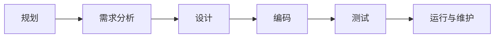
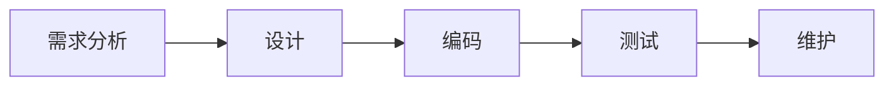
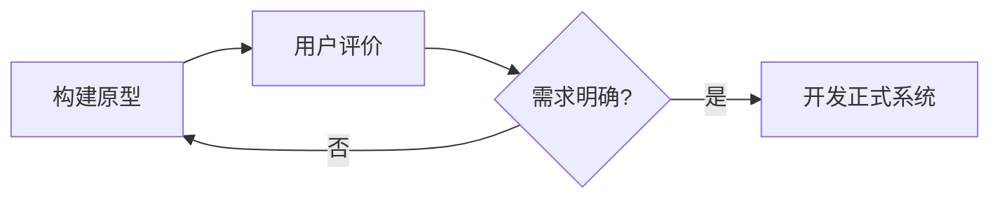
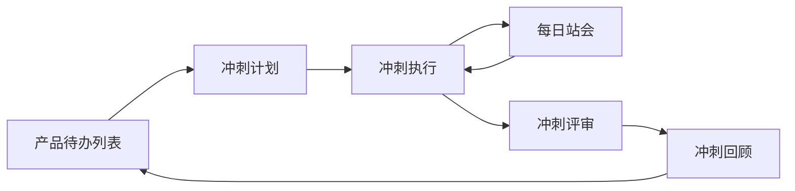
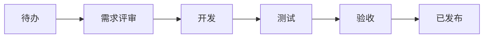

:::info
本篇整合“软件工程与软件开发方法”和“敏捷开发”。复习主线是：软件为什么需要工程化、生命周期如何组织、开发过程模型如何选择、敏捷为什么出现以及怎么落地。
:::

# 软件的定义与特点

软件不是单纯的代码，而是**程序、数据结构、文档**的集合。

| 要素 | 含义 |
| - | - |
| 程序 | 运行时提供预期功能和性能的指令序列 |
| 数据结构 | 支撑程序处理信息的数据组织方式 |
| 文档 | 描述设计、使用、维护和操作的资料 |

## 软件的典型特点

- **抽象性**：软件是逻辑实体，必须借助模型、文档、图表理解。
- **设计开发而非制造**：复制成本低，主要成本在设计、开发、验证和维护。
- **不会磨损但会退化**：环境变化、需求变化和维护修改会让软件逐渐难以适应。
- **复杂性高**：大型软件包含大量模块、接口、状态和并发逻辑。
- **维护困难**：修改影响难以评估，维护成本常高于初始开发成本。
- **依赖环境**：软件行为受硬件、操作系统、网络、数据库和外部系统影响。
- **持续演化**：业务和技术变化要求软件不断升级，否则会逐渐失效。

# 软件危机与软件工程

## 软件危机

软件危机指软件开发中普遍存在的超期、超预算、质量差、维护困难等问题。1968 年 NATO 软件工程会议正式提出“软件工程”概念。

主要表现：

- 项目进度和成本失控。
- 软件质量低，错误多，可靠性差。
- 维护困难，每次修改都可能引入新问题。
- 文档缺失，人员流动后项目难以继续。
- 可移植性差，依赖特定环境。

主要原因：

- 软件抽象且复杂，难以直观把控。
- 早期开发依赖个人技巧，缺乏工程化过程。
- 用户需求不明确且频繁变化。
- 缺乏有效的项目管理、质量管理和风险控制。

## 软件工程

IEEE 对软件工程的定义可概括为：

> 将系统化、规范化、可量化的方法应用于软件开发、运行和维护，并研究这些方法。

软件工程的目标是提高软件质量与生产率，控制成本，使软件开发从“手工作坊”转向可管理、可复用、可改进的工程活动。

:::warning
“没有银弹”的核心含义：不存在某一种技术或管理方法能单独解决软件开发的复杂性。真正有效的是持续改进过程、工具、设计和团队协作。
:::

# 软件生命周期

软件生命周期是软件从概念提出到停止使用的全过程。它为开发管理提供阶段划分、任务边界和交付物。

| 阶段 | 核心问题 | 主要产出 |
| - | - | - |
| 规划 | 值不值得做？范围是什么？ | 项目方案、可行性研究报告、项目计划 |
| 需求分析 | 系统必须做什么？ | 软件需求规格说明书、用户确认报告 |
| 设计 | 系统应该怎么做？ | 概要设计、详细设计、原型、数据库设计 |
| 编码 | 如何把设计变成程序？ | 源代码、可执行程序、单元测试报告 |
| 测试 | 软件是否满足需求？ | 测试计划、测试用例、测试报告、缺陷记录 |
| 运行维护 | 如何长期稳定运行？ | 维护记录、变更申请、版本更新、退役报告 |

# 主要开发过程模型

## 模型总览

| 模型 | 核心特征 | 优势 | 局限 | 适用场景 |
| - | - | - | - | - |
| 瀑布模型 | 顺序执行、文档驱动 | 结构清晰，易管理 | 难以应对需求变化 | 需求明确、变更少、合规要求高 |
| 原型模型 | 快速构建原型，获取反馈 | 帮助澄清需求 | 可能陷入反复修改 | 需求模糊、交互复杂 |
| 增量模型 | 分块开发，逐步交付 | 早期交付核心价值 | 依赖良好架构和增量划分 | 大型系统、产品线 |
| 螺旋模型 | 风险驱动、迭代演进 | 风险管理强 | 管理复杂、成本较高 | 大型、高风险、创新项目 |
| V 模型 | 开发阶段与测试阶段对应 | 强调验证与确认 | 灵活性不足 | 安全关键系统、医疗、汽车电子 | 
| RUP | 用例驱动、架构为中心、迭代增量 | 规范全面 | 框架庞大 | 大型企业级系统 |
| 敏捷开发 | 迭代、协作、响应变化 | 适应性强、交付快 | 依赖团队成熟度 | 互联网产品、需求变化频繁 |

## 典型模型理解

选择模型时要综合考虑：

- 需求是否稳定。
- 技术风险是否高。
- 项目规模是否大。
- 用户是否能持续参与。
- 团队是否有成熟工程实践。
- 是否存在强监管、强文档、强质量要求。

# 敏捷开发的产生

传统重型过程强调前期计划和文档，但在需求快速变化的互联网环境中容易出现响应慢、交付晚、用户参与不足等问题。敏捷开发由此产生。

2001 年，17 位软件工程专家发布《敏捷软件开发宣言》。

## 敏捷宣言四大价值

| 更重视 | 胜过 | 理解 |
| - | - | - |
| 个体和互动 | 过程和工具 | 沟通与协作比僵化流程更重要 |
| 可工作的软件 | 详尽的文档 | 能运行的软件是最直接的进度证明 |
| 客户合作 | 合同谈判 | 持续反馈比一次性约定更有效 |
| 响应变化 | 遵循计划 | 计划要服务于目标，而不是压制变化 |

右项仍有价值，但敏捷更重视左项。

## 敏捷十二原则的核心压缩

- 尽早并持续交付有价值的软件。
- 欢迎需求变化，即使在开发后期。
- 频繁交付可工作的软件。
- 业务人员与开发人员持续协作。
- 围绕有动力的个体构建团队，并信任他们。
- 面对面沟通效率最高。
- 可工作的软件是进度主要度量。
- 保持可持续开发节奏。
- 持续关注技术卓越和良好设计。
- 简单性很重要。
- 最好的架构、需求和设计来自自组织团队。
- 团队定期反思并调整行为。

# 主流敏捷方法

## Scrum

Scrum 是轻量级敏捷框架，强调固定周期迭代、自组织团队和持续交付。

| 类型 | 内容 |
| - | - |
| 角色 | 产品负责人、Scrum Master、开发团队 |
| 工件 | 产品待办列表、冲刺待办列表、增量 |
| 事件 | 冲刺、冲刺计划、每日站会、冲刺评审、冲刺回顾 |

核心流程：产品负责人维护产品待办列表，团队在冲刺计划中选择工作项，在固定冲刺内完成可工作的产品增量，并通过评审和回顾持续改进。

## 极限编程 XP

XP 更强调工程实践，用技术纪律保障快速变化下的软件质量。

常见实践：

- **测试驱动开发 TDD**：先写测试，再写实现。
- **结对编程**：两人协作开发，实时审查与共享知识。
- **持续集成**：频繁合并主干，自动构建和测试。
- **简单设计**：只实现当前需要的设计。
- **重构**：持续改善代码结构。
- **小型发布**：频繁交付可工作的版本。
- **集体代码所有权**：团队共同维护全部代码。
- **编码规范**：统一风格，降低协作成本。

## Kanban

Kanban 强调可视化工作流、限制在制品数量和持续流动。

核心要素：

- 可视化所有任务。
- 给每个阶段设置 WIP 限制。
- 完成当前任务后再拉取新任务。
- 通过周期时间、吞吐量等指标持续优化。

# 敏捷与传统开发对比

| 维度 | 瀑布模型 | 敏捷开发 |
| - | - | - |
| 需求 | 前期尽量完全确定 | 持续演进，欢迎变化 |
| 交付 | 一次性交付最终产品 | 频繁交付可工作的软件 |
| 用户参与 | 主要在需求和验收阶段 | 贯穿全过程 |
| 团队结构 | 按职能划分 | 跨职能自组织团队 |
| 文档 | 文档详尽 | 轻文档，重沟通 |
| 计划 | 前期详细计划 | 滚动式计划 |
| 质量保证 | 后期集中测试 | 全程测试、持续集成 |
| 成功度量 | 按计划完成 | 交付客户满意的软件 |

# 适用场景与挑战

## 适合敏捷的场景

- 需求不明确或变化频繁。
- 需要快速推向市场验证。
- 客户能深度参与。
- 团队具备较强自组织能力。
- 项目可拆成可持续交付的小增量。

## 敏捷的挑战

- 团队成熟度要求高。
- 文档不足可能影响长期维护。
- 客户参与不足会削弱反馈闭环。
- 大规模、多地点团队实施成本高。
- 传统层级组织和敏捷文化可能冲突。

# 本专题考点提炼

1. 软件由程序、数据结构、文档组成，不等于代码。
2. 软件危机推动软件工程产生，核心问题是复杂性、不可见性和管理失控。
3. 软件工程的目标是系统化、规范化、可量化地开发、运行和维护软件。
4. 生命周期典型阶段：规划、需求分析、设计、编码、测试、运行维护。
5. 开发模型没有绝对最优，必须按需求稳定性、风险、规模和团队能力选择。
6. 敏捷不是不要文档和计划，而是更重视可工作的软件、协作和响应变化。
7. Scrum 管过程，XP 管工程实践，Kanban 管工作流。

# 10. 快速自测

- 软件危机有哪些典型表现？
- 软件工程为什么强调“工程化”？
- 瀑布模型和敏捷开发的根本差异是什么？
- 原型模型适合什么场景？
- Scrum 的三类核心内容分别是什么？
- XP 中 TDD、结对编程、持续集成分别解决什么问题？
