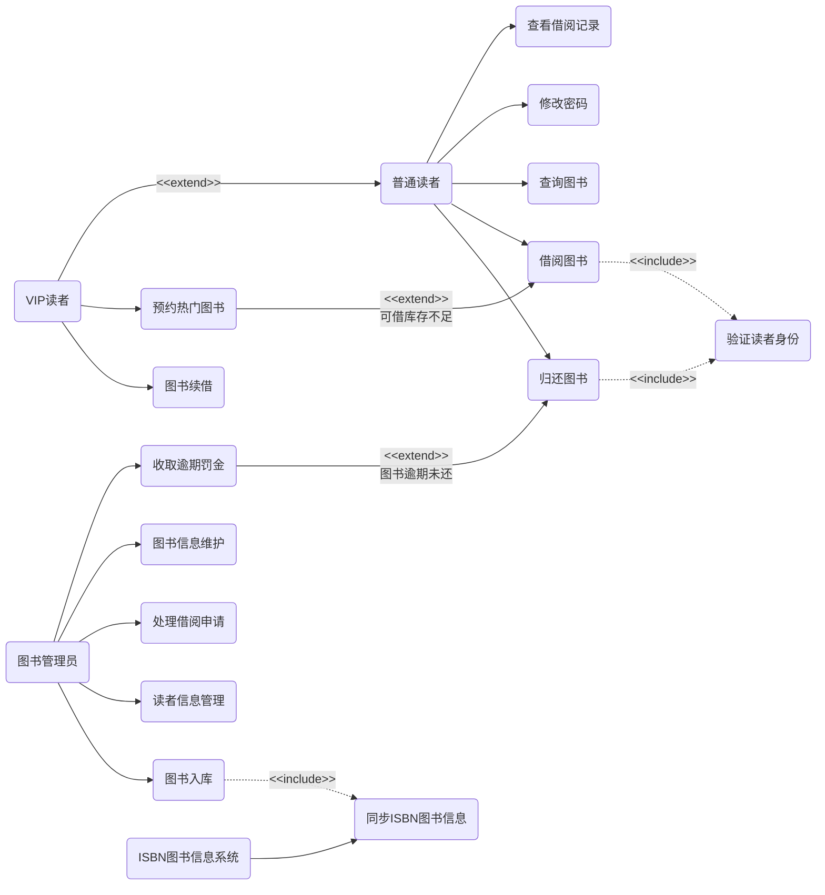
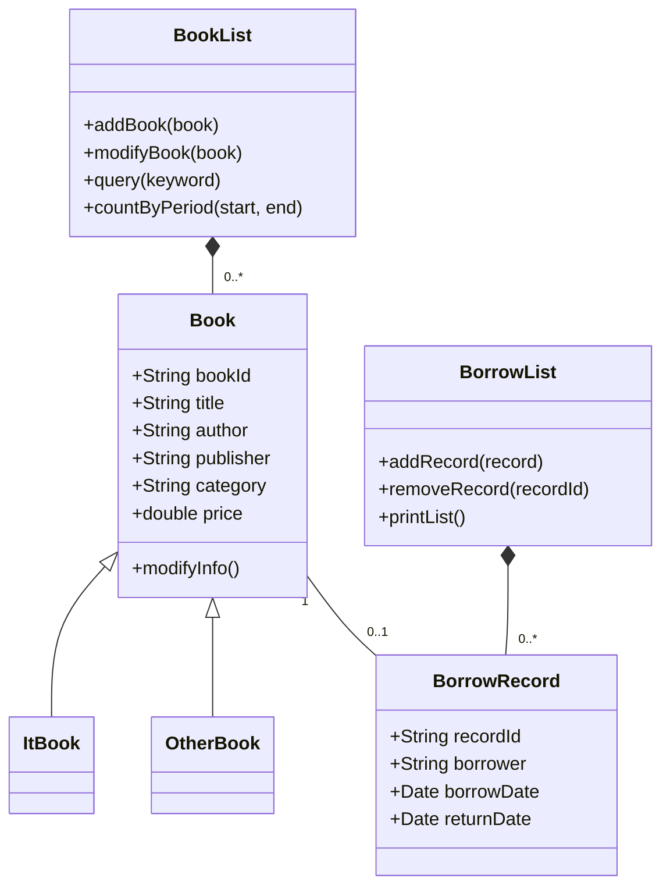
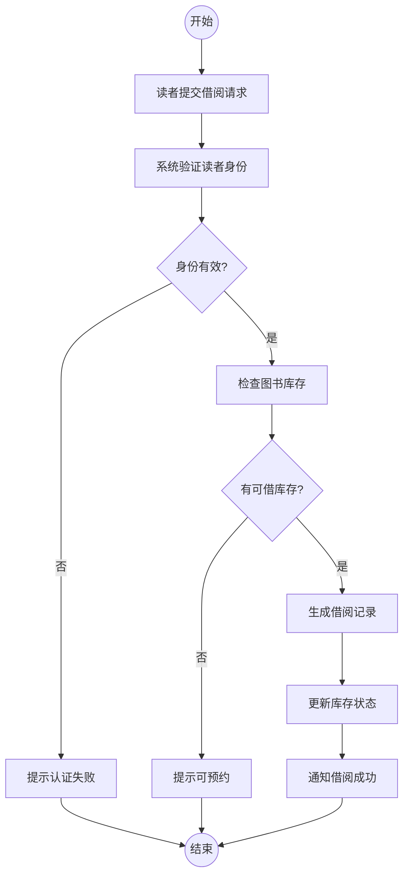
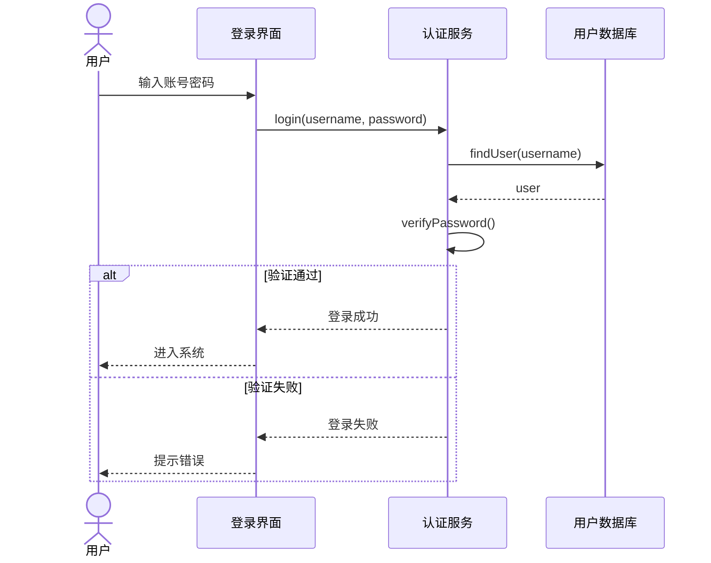
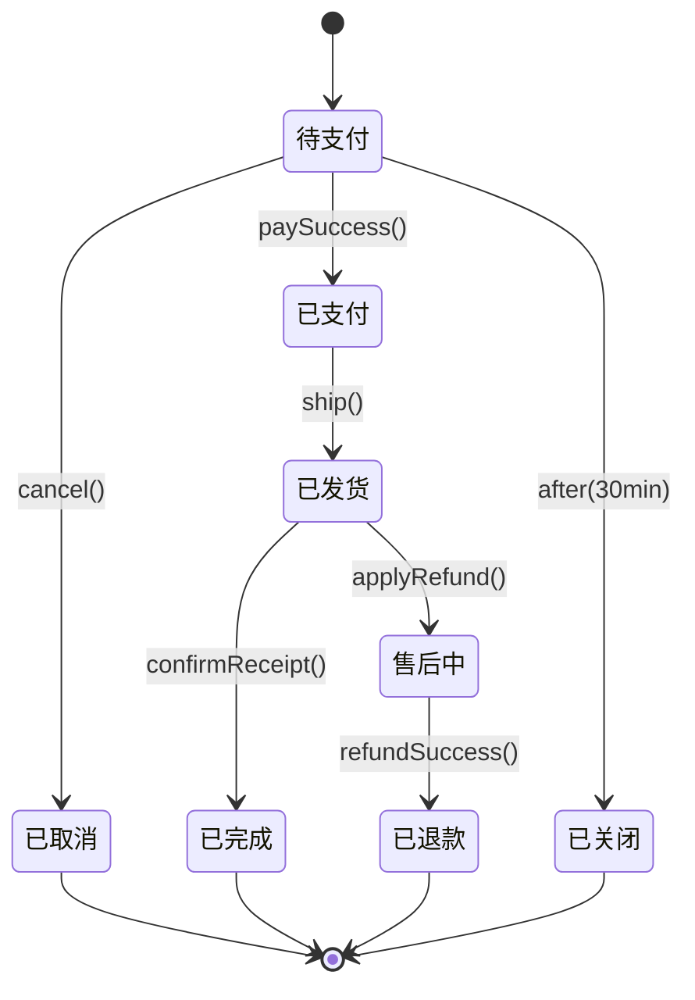
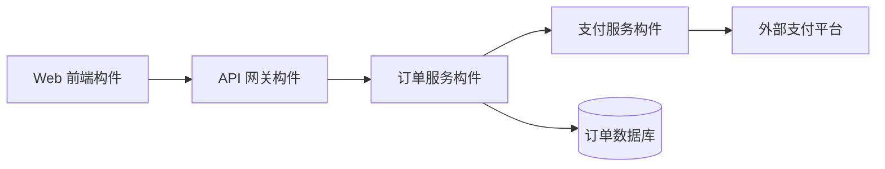
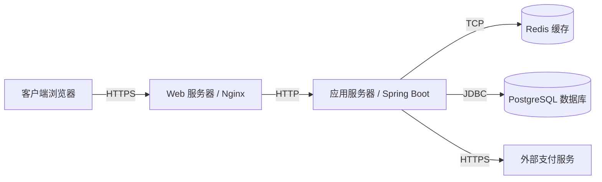

:::info
本篇整合 UML 用例图、类图、活动图、时序图、状态图、构件图和部署图。复习时不要死记图形，而要掌握每类图回答的问题、适用阶段、核心元素和常见错误。
:::

# UML 总览

UML（Unified Modeling Language，统一建模语言）是面向对象系统分析与设计的标准建模语言，用于对系统进行说明、可视化和文档化。UML 独立于具体编程语言。

## 常用图与核心问题

| UML 图 | 类型 | 回答的问题 | 常用阶段 |
| - | - | - | - |
| 用例图 | 行为需求图 | 系统向谁提供哪些功能？ | 需求分析 |
| 类图 | 静态结构图 | 系统有哪些类，它们如何关联？ | 分析、设计 |
| 对象图 | 静态实例图 | 某一时刻有哪些对象和连接？ | 验证类图 |
| 包图 | 静态结构图 | 系统模块如何分组和依赖？ | 架构设计 |
| 活动图 | 行为流程图 | 业务流程或算法如何流转？ | 分析、设计 |
| 时序图 | 交互图 | 对象按时间顺序如何传递消息？ | 设计为主 |
| 通信图 | 交互图 | 对象间如何链接并发送消息？ | 设计 |
| 状态图 | 行为状态图 | 单个对象如何随事件改变状态？ | 分析、设计 |
| 构件图 | 结构图 | 软件构件与接口如何组织？ | 架构设计 |
| 部署图 | 结构图 | 软件部署在哪些物理节点上？ | 架构设计、运维 |

:::warning
UML 建模要按需使用。考试和论文中最常用的是用例图、类图、活动图、时序图、状态图、构件图和部署图，不需要把所有 UML 图都画一遍。
:::

# 用例图

用例图展示系统功能边界、参与者和用例之间的关系，适合在需求分析阶段与用户确认系统范围。

## 核心元素

| 元素 | 含义 | 画法/要点 |
| - | - | - |
| 参与者 Actor | 与系统交互的人、外部系统、设备或时间 | 位于系统边界外，不是系统内部组件 |
| 用例 Use Case | 系统提供的完整功能或服务 | 用“动词 + 名词”命名，如“查询图书” |
| 系统边界 | 系统负责的范围 | 用矩形表示，框内是系统功能 |

## 四种关系

| 关系 | 连接对象 | 方向 | 含义 |
| - | - | - | - |
| 关联 association | 参与者与用例 | 参与者到用例或无箭头实线 | 谁使用哪个功能 |
| 包含 include | 用例与用例 | 基用例指向被包含用例 | 必须执行的公共子功能 |
| 扩展 extend | 用例与用例 | 扩展用例指向基用例 | 特定条件下可选执行 |
| 泛化 generalization | 参与者或用例 | 子类指向父类 | 继承父元素能力 |

## 用例图示例：图书馆管理系统



## 常见错误

- 把系统内部模块画成参与者。
- 用例命名成名词或技术步骤，如“数据库查询”。
- 滥用 `<<include>>` 把一个流程拆成若干步骤。
- 把 `include` 和 `extend` 箭头方向画反。

# 类图

类图描述系统静态结构，是面向对象分析与设计中最核心的结构图。

## 类的表示

类通常由三层矩形组成：

1. 类名：PascalCase。
2. 属性：描述类的特征。
3. 方法：描述类的行为。

可见性符号：

| 符号 | 可见性 | Java 对应 |
| - | - | - |
| `+` | public | `public` |
| `-` | private | `private` |
| `#` | protected | `protected` |
| `~` | package | 包级可见 |

## 类之间六种关系

| 关系 | 含义 | 强度/生命周期 | 表示 |
| - | - | - | - |
| 依赖 Dependency | 临时使用另一个类 | 最弱 | 虚线箭头 |
| 关联 Association | 对象之间长期连接 | 中等 | 实线 |
| 聚合 Aggregation | 弱整体-部分，部分可独立存在 | 较强 | 空心菱形 |
| 组合 Composition | 强整体-部分，部分依赖整体 | 最强 | 实心菱形 |
| 泛化 Generalization | 继承关系 | 强 | 空心三角实线 |
| 实现 Realization | 类实现接口 | 强 | 空心三角虚线 |

## 类图示例：个人图书管理系统



## 分析类图与设计类图

| 维度 | 分析阶段：概念类图 | 设计阶段：设计类图 |
| - | - | - |
| 面向对象 | 业务概念 | 软件实现 |
| 抽象层次 | 高 | 低 |
| 内容 | 类名、关键属性、关联、多重性 | 属性类型、方法签名、可见性、技术类 |
| 受众 | 业务分析师、领域专家 | 架构师、开发人员 |
| 是否可生成代码 | 否 | 可以作为代码骨架 |

# 活动图

活动图描述业务流程、用例事件流或算法控制流，可看作 UML 中的增强型流程图。

## 核心元素

| 元素 | 含义 |
| - | - |
| 动作节点 | 一个不可再分的步骤 |
| 控制流 | 动作执行顺序 |
| 初始节点 | 流程起点 |
| 活动终止 | 整个活动结束 |
| 决策/合并 | 条件分支与汇合 |
| 分叉/汇合 | 并发执行与同步 |
| 泳道 | 按角色或系统模块划分职责 |
| 对象流 | 表达数据或对象在动作间传递 |

## 活动图示例：借阅图书



## 分析阶段与设计阶段

| 维度 | 分析阶段 | 设计阶段 |
| - | - | - |
| 目标 | 描述业务流程或用例逻辑 | 描述算法或系统内部实现 |
| 动作语言 | 业务术语 | 技术术语 |
| 泳道 | 角色、部门、外部系统 | 层、组件、类、服务 |
| 对象流 | 少量业务对象 | 具体数据类型和对象状态 |

# 时序图与通信图

时序图按时间顺序描述对象之间的消息传递，适合细化某个用例场景。

## 时序图核心元素

| 元素 | 含义 |
| - | - |
| Actor | 发起交互的人或外部系统 |
| 对象 | 参与交互的实例 |
| 生命线 | 对象存在的时间线 |
| 激活期 | 对象正在执行操作的时间段 |
| 同步消息 | 调用方等待返回 |
| 异步消息 | 调用方不等待 |
| 返回消息 | 处理结果返回 |
| 组合片段 | `alt`、`opt`、`loop`、`par` 等控制结构 |

## 时序图示例：登录



## 常用组合片段

| 操作符 | 含义 |
| - | - |
| `alt` | 多分支，类似 if-else |
| `opt` | 可选分支，类似 if |
| `loop` | 循环 |
| `par` | 并行 |
| `break` | 中断外围流程 |
| `critical` | 临界区，不允许交错执行 |
| `ref` | 引用另一个交互图 |

## 通信图

通信图也描述对象交互，但更强调对象之间的结构链接。它没有垂直时间轴，消息顺序依靠编号表达。

| 对比项 | 时序图 | 通信图 |
| - | - | - |
| 核心维度 | 时间顺序 | 对象链接结构 |
| 消息顺序 | 自上而下 | 编号表示 |
| 优势 | 易读，适合复杂流程 | 紧凑，适合展示协作网络 |
| 选择建议 | 需要看清调用顺序时使用 | 需要强调对象关系时使用 |

# 状态图

状态图描述单个对象在事件驱动下的状态变迁，适合建模订单、会话、设备、票务等生命周期明确的对象。

## 状态图核心结构

转换语法：

```text
事件 [守卫条件] / 动作
```

常见伪状态：

| 伪状态 | 含义 |
| - | - |
| 初始状态 | 状态机起点 |
| 终止状态 | 生命周期结束 |
| 选择状态 | 根据条件分支 |
| 分叉/汇合 | 并发状态进入与同步 |
| 历史状态 | 重新进入复合状态时恢复上次子状态 |

## 状态图示例：订单生命周期



## 与其他行为图的区别

| 图 | 关注点 |
| - | - |
| 状态图 | 单个对象的状态变化 |
| 活动图 | 业务流程、工作流、算法流 |
| 时序图 | 多对象之间的消息时间顺序 |
| 通信图 | 多对象之间的链接和消息编号 |

# 构件图

构件图描述系统由哪些可替换的软件单元构成，以及这些构件通过哪些接口协作。

## 核心元素

| 元素 | 含义 |
| - | - |
| 构件 Component | 模块化、可替换的软件单元 |
| 提供接口 | 构件对外提供的服务 |
| 需求接口 | 构件运行所需要的外部服务 |
| 依赖关系 | 一个构件使用另一个构件 |

## 构件图近似示例

Mermaid 没有 UML 构件图专用语法，使用 `flowchart` 表达构件和接口依赖。



# 部署图

部署图描述系统的物理部署结构，回答软件运行在哪些硬件或执行环境上、节点之间如何通信。

## 核心元素

| 元素 | 含义 |
| - | - |
| 节点 Node | 具备计算能力的设备或执行环境 |
| 设备节点 Device | 物理硬件，如服务器、客户端、路由器 |
| 制品 Artifact | 可部署的软件产物，如 jar、war、exe、配置文件 |
| 连接 Association | 节点之间的通信路径，可标注协议 |

## 部署图近似示例



# 建模阶段选择

| 阶段 | 推荐图 | 重点 |
| - | - | - |
| 系统规划 | 上下文图、简单用例图 | 明确范围和外部接口 |
| 系统分析 | 用例图、用例描述、活动图、领域类图、状态图 | 明确“做什么” |
| 系统设计 | 设计类图、时序图、构件图、部署图、包图 | 明确“怎么做” |
| 实现与维护 | 类图、部署图、构件图 | 理解代码结构和运行环境 |

# 10. 本专题考点提炼

1. 用例图定义系统功能边界，核心是参与者、用例、系统边界和四种关系。
2. `include` 是必选公共子功能，`extend` 是条件触发的可选扩展。
3. 类图表达静态结构，重点掌握关联、聚合、组合、依赖、泛化、实现。
4. 活动图适合业务流程和算法流程，泳道用于表达职责分工。
5. 时序图强调时间顺序，通信图强调对象链接结构。
6. 状态图适合描述单个对象生命周期。
7. 构件图看软件模块与接口，部署图看物理节点和运行环境。
8. 分析阶段模型偏业务，设计阶段模型偏技术实现。

# 11. 快速自测

- 用例图中 Actor 能不能是系统内部模块？
- `include` 和 `extend` 的箭头方向分别是什么？
- 聚合和组合的生命周期差异是什么？
- 活动图和状态图的关注对象有什么不同？
- 时序图和通信图为什么可以互相转化？
- 构件图和部署图分别回答什么问题？
