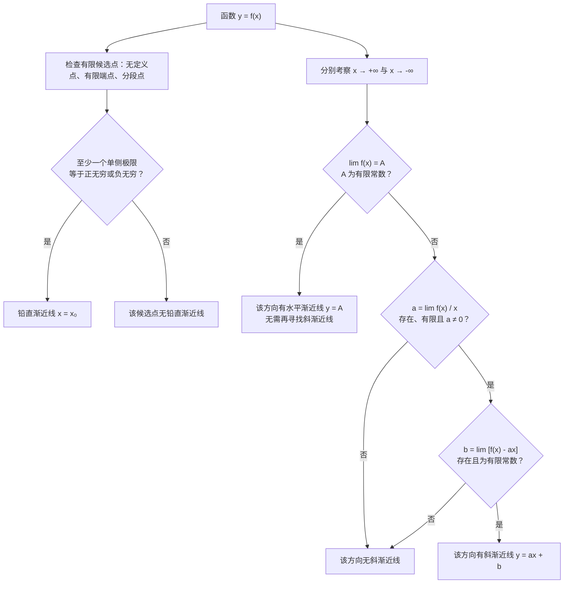

本章对应考研数学中“函数单调性的判别、函数的极值、函数图形的凹凸性、拐点及函数图形描绘”的内容。讨论时应始终先写明函数的定义域；端点、间断点和不可导点不能被导数表自动忽略。

# 一、极值的定义

设函数 $f$ 在 $x_0$ 的某个邻域内有定义。

- 若存在 $\delta>0$，对任意 $x\in(x_0-\delta,x_0+\delta)$ 都有 $f(x)\le f(x_0)$，则称 $f(x_0)$ 为 $f$ 的一个**极大值**，$x_0$ 为**极大值点**。
- 若存在 $\delta>0$，对任意 $x\in(x_0-\delta,x_0+\delta)$ 都有 $f(x)\ge f(x_0)$，则称 $f(x_0)$ 为 $f$ 的一个**极小值**，$x_0$ 为**极小值点**。

极大值和极小值统称**极值**，它们都是局部概念；“极值点”是横坐标 $x_0$，“极值”是函数值 $f(x_0)$，而图像上的点应写作 $(x_0,f(x_0))$。极值不一定是整个定义域上的最大值或最小值。

:::warning
极值与最值不可混淆。连续函数在闭区间 $[a,b]$ 上一定能取到最大值和最小值，但极值点只反映某个邻域内的比较结果。求闭区间最值时，端点必须参与比较。
:::

# 二、单调性与极值的判别

## 1. 单调性的判别

设 $f$ 在 $[a,b]$ 上连续、在 $(a,b)$ 内可导。由拉格朗日中值定理可得：

| 导数条件 | 结论 |
| --- | --- |
| $f'(x)\ge0$（$x\in(a,b)$） | $f$ 在 $[a,b]$ 上单调不减 |
| $f'(x)\le0$（$x\in(a,b)$） | $f$ 在 $[a,b]$ 上单调不增 |
| $f'(x)>0$（$x\in(a,b)$） | $f$ 在 $[a,b]$ 上严格单调增加 |
| $f'(x)<0$（$x\in(a,b)$） | $f$ 在 $[a,b]$ 上严格单调减少 |

若函数在若干区间上有定义，应分别在每个连续区间内讨论，不能跨越间断点合并单调区间。例如 $f(x)=1/x$ 在 $(-\infty,0)$、$(0,+\infty)$ 内都单调减少，但不能说它在 $(-\infty,+\infty)$ 上单调减少。

反过来，若 $f$ 在 $x_0$ 可导且在某邻域内单调不减（不增），则 $f'(x_0)\ge0$（$\le0$）。注意严格单调增加并不推出导数处处大于零，如 $f(x)=x^3$ 严格单调增加，但 $f'(0)=0$。

+++ 例题 1：由导数符号判定单调区间
求函数

$$
f(x)=x^2e^{-x}
$$

的单调区间。

函数的定义域为 $\mathbb R$，且

$$
f'(x)=e^{-x}(2x-x^2)=xe^{-x}(2-x).
$$

因为 $e^{-x}>0$，所以 $f'$ 的符号只由 $x(2-x)$ 决定：

| $x$ 的范围 | $(-\infty,0)$ | $(0,2)$ | $(2,+\infty)$ |
| --- | --- | --- | --- |
| $f'(x)$ | $-$ | $+$ | $-$ |
| $f(x)$ | 单调减少 | 单调增加 | 单调减少 |

因此，$f$ 的单调递减区间为 $(-\infty,0)$、$(2,+\infty)$，单调递增区间为 $(0,2)$。
+++

## 2. 可导极值点的一阶导数必要条件

若 $x_0$ 是定义域的内点，$f$ 在 $x_0$ 可导，且 $x_0$ 是极值点，则

$$
f'(x_0)=0.
$$

这是费马引理。它只给出**必要条件**：$f'(x_0)=0$ 的点称为驻点，驻点未必是极值点，例如 $f(x)=x^3$ 在 $x=0$ 处导数为零，却没有极值。

因此，寻找极值候选点时要同时保留：

1. 定义域内满足 $f'(x)=0$ 的点；
2. 定义域内函数有定义但 $f'(x)$ 不存在的点；
3. 若求闭区间最值，还要保留区间端点。

+++ 例题 2：辨析极值点的必要条件
判断下列说法是否正确：

> 若 $f'(x_0)=0$，则 $x_0$ 一定是极值点；若 $x_0$ 是极值点，则一定有 $f'(x_0)=0$。

两句话都不正确。

1. 取 $f(x)=x^3$，有 $f'(0)=0$，但 $f$ 在 $0$ 的两侧都单调增加，因此 $0$ 不是极值点。
2. 取 $g(x)=|x|$，$0$ 是极小值点，但 $g'(0)$ 不存在。

正确表述应为：若 $x_0$ 是定义域内点、$f$ 在 $x_0$ 可导且 $x_0$ 是极值点，才一定有 $f'(x_0)=0$。
+++

## 3. 判别极值的第一充分条件

设 $f$ 在 $x_0$ 连续，并在 $x_0$ 左、右的某个去心邻域内可导。考察 $f'$ 在 $x_0$ 两侧的符号：

| $f'$ 的符号变化 | 结论 |
| --- | --- |
| 左正右负，即 $+\to-$ | $x_0$ 是极大值点 |
| 左负右正，即 $-\to+$ | $x_0$ 是极小值点 |
| 两侧同号 | $x_0$ 不是极值点 |

该判别法不要求 $f'(x_0)$ 存在，故也适用于尖点。例如 $f(x)=|x|$ 在 $x=0$ 处不可导，但 $f'$ 由负变正，所以 $0$ 是极小值点。

+++ 例题 3：不可导点处的极值
判断

$$
f(x)=x^{\frac23}
$$

在 $x=0$ 处是否取得极值。

当 $x\ne0$ 时，

$$
f'(x)=\frac{2}{3x^{1/3}}.
$$

因此：

$$
\begin{cases}
f'(x)<0,&x<0,\\
f'(x)>0,&x>0.
\end{cases}
$$

$f'$ 在 $0$ 的左侧为负、右侧为正，所以 $f$ 先减后增，$x=0$ 是极小值点，极小值为 $f(0)=0$。虽然 $f'(0)$ 不存在，第一充分条件仍然适用。
+++

## 4. 判别极值的第二充分条件

设 $f'$ 在 $x_0$ 的某个邻域内有定义，且

$$
f'(x_0)=0,\qquad f''(x_0)\ne0.
$$

则：

$$
\begin{cases}
f''(x_0)<0,& x_0\text{ 是极大值点},\\
f''(x_0)>0,& x_0\text{ 是极小值点}.
\end{cases}
$$

原因是 $f''(x_0)$ 的符号保证 $f'$ 在 $x_0$ 两侧发生相应的符号变化。若 $f''(x_0)=0$，此法**失效而非否定极值**：$x^4$ 在 $0$ 处取极小值，$-x^4$ 在 $0$ 处取极大值，$x^3$ 在 $0$ 处却没有极值。

+++ 例题 4：使用二阶导数判别极值
求函数

$$
f(x)=x^3-3x+1
$$

的极值。

先求驻点：

$$
f'(x)=3x^2-3=3(x-1)(x+1),
$$

故 $x=-1,1$。又

$$
f''(x)=6x.
$$

于是

$$
f''(-1)=-6<0,\qquad f''(1)=6>0.
$$

因此 $x=-1$ 是极大值点，极大值为

$$
f(-1)=3;
$$

$x=1$ 是极小值点，极小值为

$$
f(1)=-1.
$$
+++

## 5. 判别极值的第三充分条件

设 $f$ 在 $x_0$ 的某邻域内 $n$ 阶可导，$n\ge2$，且

$$
f'(x_0)=f''(x_0)=\cdots=f^{(n-1)}(x_0)=0,\qquad f^{(n)}(x_0)\ne0.
$$

则：

| $n$ 的奇偶性与 $f^{(n)}(x_0)$ | 结论 |
| --- | --- |
| $n$ 为偶数，$f^{(n)}(x_0)>0$ | $x_0$ 是极小值点 |
| $n$ 为偶数，$f^{(n)}(x_0)<0$ | $x_0$ 是极大值点 |
| $n$ 为奇数 | $x_0$ 不是极值点 |

第二充分条件正是 $n=2$ 的情形。做题时“持续求导”必须止于第一个非零的高阶导数；若所求各阶导数均为零，不能凭该方法下结论。

+++ 例题 5：二阶判别失效时使用高阶导数
分别判断

$$
f(x)=x^4,\qquad g(x)=x^5
$$

在 $x=0$ 处是否取得极值。

对 $f$，有

$$
f'(0)=f''(0)=f^{(3)}(0)=0,\qquad f^{(4)}(0)=24>0.
$$

第一个非零的高阶导数为偶数阶且取正值，所以 $x=0$ 是 $f$ 的极小值点。

对 $g$，有

$$
g'(0)=g''(0)=g^{(3)}(0)=g^{(4)}(0)=0,\qquad
g^{(5)}(0)=120>0.
$$

第一个非零的高阶导数为奇数阶，所以 $x=0$ 不是 $g$ 的极值点。
+++

## 6. 闭区间上的最大值与最小值

设 $f$ 在 $[a,b]$ 连续。由闭区间上连续函数的最值定理，$f$ 一定能取得最大值和最小值。实际计算按以下步骤进行：

1. 求出 $(a,b)$ 内满足 $f'(x)=0$ 或 $f'(x)$ 不存在的所有候选点；
2. 计算这些点及端点 $a,b$ 处的函数值；
3. 比较所有函数值，最大者为最大值，最小者为最小值。

极值点未必是最值点，而闭区间最值也可能只在端点取得。

+++ 例题 6：闭区间上的最值
求函数

$$
f(x)=x^3-3x
$$

在闭区间 $[-2,3]$ 上的最大值和最小值。

由

$$
f'(x)=3x^2-3=3(x-1)(x+1)
$$

得到区间内部的驻点 $x=-1,1$。比较端点和驻点处的函数值：

$$
\begin{aligned}
f(-2)&=-2,\\
f(-1)&=2,\\
f(1)&=-2,\\
f(3)&=18.
\end{aligned}
$$

因此最大值为 $18$，在 $x=3$ 处取得；最小值为 $-2$，在 $x=-2$ 和 $x=1$ 两处取得。本题说明最值既可能在端点取得，也可能在区间内部取得。
+++

# 三、凹凸性与拐点的概念

## 1. 凹凸性的定义

设 $f$ 在区间 $I$ 上可导。

- 若 $f'$ 在 $I$ 上单调增加，则称曲线 $y=f(x)$ 在 $I$ 上**凹向上**（也常称凸）；等价地，曲线位于任一切线的上方。
- 若 $f'$ 在 $I$ 上单调减少，则称曲线 $y=f(x)$ 在 $I$ 上**凹向下**；等价地，曲线位于任一切线的下方。

若 $f$ 在 $I$ 上二阶可导，则这一定义可用 $f''$ 的符号判定。为避免“凹”“凸”的文字习惯差异，考研答题建议直接写“凹向上”或“凹向下”，并同时标明 $f''$ 的正负。

## 2. 拐点的定义

设 $f$ 在 $x_0$ 连续。若存在 $x_0$ 的一个邻域，使曲线 $y=f(x)$ 在 $x_0$ 左、右两侧分别凹向上和凹向下，则点

$$
(x_0,f(x_0))
$$

称为曲线的**拐点**。拐点强调的是曲线凹凸性的改变，而不是“二阶导数等于零”。

# 四、凹凸性与拐点的判别

## 1. 判别凹凸性

设 $f$ 在区间 $I$ 上二阶可导，则：

| $f''(x)$ 在 $I$ 内的符号 | 曲线的凹凸性 |
| --- | --- |
| $f''(x)>0$ | 凹向上 |
| $f''(x)<0$ | 凹向下 |

使用 $f''\ge0$ 或 $f''\le0$ 也可分别推出凹向上或凹向下；但在通过符号表找拐点时，必须看 $f''$ 是否在候选点两侧**变号**。

+++ 例题 7：判定凹凸区间与拐点
求曲线

$$
y=x^4-4x^3
$$

的凹凸区间和拐点。

计算二阶导数：

$$
y''=12x^2-24x=12x(x-2).
$$

由 $y''=0$ 得候选点 $x=0,2$，其符号表为：

| $x$ 的范围 | $(-\infty,0)$ | $(0,2)$ | $(2,+\infty)$ |
| --- | --- | --- | --- |
| $y''$ | $+$ | $-$ | $+$ |
| 曲线 | 凹向上 | 凹向下 | 凹向上 |

因此凹向上区间为 $(-\infty,0)$、$(2,+\infty)$，凹向下区间为 $(0,2)$。由于 $y''$ 在 $0$ 和 $2$ 两侧都变号，拐点为

$$
(0,0),\qquad (2,-16).
$$
+++

## 2. 二阶可导拐点的必要条件

若 $(x_0,f(x_0))$ 是拐点，且 $f''(x_0)$ 存在，则

$$
f''(x_0)=0.
$$

因此，求拐点的候选横坐标时，应求解 $f''(x)=0$，并补充 $f''(x)$ 不存在而 $f(x)$ 有定义的点。与极值的情形相同，这只是必要条件：例如 $f(x)=x^4$ 满足 $f''(0)=0$，但 $f''$ 在 $0$ 两侧均非负，故 $(0,0)$ 不是拐点。

+++ 例题 8：二阶导数为零不等于拐点
比较曲线

$$
y_1=x^3,\qquad y_2=x^4
$$

在原点处的性质。

两者都满足 $y_1''(0)=y_2''(0)=0$，但

$$
y_1''=6x
$$

在 $0$ 两侧变号，所以 $(0,0)$ 是 $y_1=x^3$ 的拐点；而

$$
y_2''=12x^2\ge0
$$

在 $0$ 两侧不变号，所以 $(0,0)$ 不是 $y_2=x^4$ 的拐点。由此可见，$f''(x_0)=0$ 只能用于筛选候选点。
+++

## 3. 判别拐点的第一充分条件

设 $f$ 在 $x_0$ 连续，并在 $x_0$ 左、右两侧二阶可导。若 $f''(x)$ 在 $x_0$ 两侧异号，即

$$
f''(x):\quad +\to-\quad\text{或}\quad -\to+,
$$

则 $(x_0,f(x_0))$ 是拐点。这里不要求 $f''(x_0)$ 存在或等于零。

+++ 例题 9：二阶导数不存在的拐点
设

$$
f(x)=x|x|=
\begin{cases}
-x^2,&x<0,\\
x^2,&x\ge0.
\end{cases}
$$

判断原点是否为拐点。

函数在 $0$ 处连续，并且

$$
f''(x)=
\begin{cases}
-2,&x<0,\\
2,&x>0.
\end{cases}
$$

$f''(0)$ 不存在，但 $f''$ 在 $0$ 左侧为负、右侧为正，曲线由凹向下变为凹向上。因此 $(0,0)$ 是拐点。

这说明求拐点时，除了 $f''(x)=0$ 的点，还必须检查 $f''$ 不存在但原函数有定义且连续的点。
+++

## 4. 判别拐点的第二充分条件

设 $f$ 在 $x_0$ 的某邻域内三阶可导，且

$$
f''(x_0)=0,\qquad f'''(x_0)\ne0.
$$

则 $(x_0,f(x_0))$ 是拐点。该条件保证 $f''$ 在 $x_0$ 两侧变号。

+++ 例题 10：使用三阶导数判别拐点
判断曲线

$$
y=x^3+x
$$

在原点处是否有拐点。

有

$$
y''=6x,\qquad y'''=6.
$$

因此

$$
y''(0)=0,\qquad y'''(0)=6\ne0,
$$

故 $(0,0)$ 是拐点。另一方面，$y'=3x^2+1>0$，曲线始终单调增加；这说明拐点与极值点是两类不同的概念。
+++

## 5. 判别拐点的第三充分条件

设 $f$ 在 $x_0$ 的某邻域内 $n$ 阶可导，$n\ge3$，且

$$
f''(x_0)=f^{(3)}(x_0)=\cdots=f^{(n-1)}(x_0)=0,\qquad f^{(n)}(x_0)\ne0.
$$

则当 $n$ 为奇数时，$(x_0,f(x_0))$ 是拐点；当 $n$ 为偶数时，它不是拐点。第二充分条件正是 $n=3$ 的情形。

+++ 例题 11：使用高阶导数判别拐点
分别判断

$$
f(x)=x^5+1,\qquad g(x)=x^6+1
$$

在 $x=0$ 处是否有拐点。

对 $f$，

$$
f''(0)=f^{(3)}(0)=f^{(4)}(0)=0,\qquad
f^{(5)}(0)=120\ne0.
$$

第一个非零的相关高阶导数为奇数阶，所以 $(0,1)$ 是拐点。

对 $g$，

$$
g''(0)=g^{(3)}(0)=g^{(4)}(0)=g^{(5)}(0)=0,\qquad
g^{(6)}(0)=720\ne0.
$$

第一个非零的相关高阶导数为偶数阶，所以 $(0,1)$ 不是拐点。事实上 $g''(x)=30x^4\ge0$，在 $0$ 两侧不变号。
+++

# 五、极值点与拐点的重要结论

以下结论在满足所列前提时可直接使用。

## 1. 极值点与拐点不能机械等同

若曲线在 $x_0$ 处可导，则 $x_0$ 不能同时是极值点和拐点。反之，在不可导点可以同时出现二者：

$$
f(x)=
\begin{cases}
\sqrt{-x},&x<0,\\
x^2,&x\ge0
\end{cases}
$$

在 $x=0$ 处取极小值，曲线左侧凹向下、右侧凹向上，故 $(0,0)$ 还是拐点；但该点不可导。

## 2. 多项式零点重数与图像性质

设多项式

$$
f(x)=(x-a)^n g(x),\qquad n\in\mathbb N^+,\quad g(a)\ne0.
$$

则：

- $n$ 为偶数时，$x=a$ 是极值点；
- $n>1$ 且为奇数时，$(a,0)$ 是拐点；
- $n=1$ 时，$x=a$ 一般既不是极值点也不是拐点，不能仅由这个一次因子下结论。

本结论的关键在于 $g(a)\ne0$，它保证 $g$ 在 $a$ 的某邻域内不变号。

+++ 例题 12：由零点重数判断局部图像性质
设

$$
f(x)=(x+2)^3(x-1)^4(x-4).
$$

只利用零点重数判断各零点处能够直接确定的图像性质。

- $x=-2$ 是三重零点，重数为大于 $1$ 的奇数，因此 $(-2,0)$ 是拐点。
- $x=1$ 是四重零点，重数为偶数，因此 $x=1$ 是极值点。
- $x=4$ 是一重零点，仅由一次因子只能确定曲线在此穿过 $x$ 轴，不能直接断定它是极值点或拐点。

这里的判断都是局部判断；若要求 $x=1$ 处取得极大值还是极小值，还要结合其余因子在该点附近的符号。
+++

## 3. 全部零点已知的多项式：极值点、拐点个数

设

$$
f(x)=C\prod_{i=1}^k(x-a_i)^{n_i},\qquad C\ne0,\qquad a_1<a_2<\cdots<a_k,
$$

其中 $n_i$ 为正整数，且总次数 $N=\sum_{i=1}^k n_i\ge2$。也就是说，$f$ 的全部零点均为所列互异实根。记：

- $k_1$ 为 $n_i=1$ 的个数；
- $k_2$ 为 $n_i>1$ 且为偶数的个数；
- $k_3$ 为 $n_i>1$ 且为奇数的个数。

则 $f(x)$ 的极值点和拐点个数分别为：

$$
\boxed{\text{极值点个数}=k_1+2k_2+k_3-1}
$$

$$
\boxed{\text{拐点个数}=k_1+2k_2+3k_3-2}
$$

其中，极值点公式中的 $k_2$ 来自偶重根本身，另有 $k-1$ 个导数的简单零点分布在相邻根之间；拐点公式除奇重根（重数大于 $1$）外，还计入 $f''$ 的其余简单零点。若多项式并非按全部实根完全分解，或总次数小于 $2$，不得套用该计数公式。

下面用一道计数题说明公式的使用。

+++ 例题 13：由实根重数计算极值点和拐点个数
设

$$
f(x)=(x-1)^2(x-2)^3(x-3)^4(x-4)^5(x-5),
$$

求 $f$ 的极值点和拐点个数。

各零点的重数依次为 $2,3,4,5,1$，因此

$$
k_1=1,\qquad k_2=2,\qquad k_3=2.
$$

故极值点个数为

$$
1+2\times2+2-1=6,
$$

拐点个数为

$$
1+2\times2+3\times2-2=9.
$$
+++

:::tip
原式中 $(x-5)$ 只有一个一次根，故本例应取 $k_1=1$，而不是 $2$；同时 $(x-2)^3,(x-4)^5$ 均属于 $k_3$。这是利用重数计数时最常见的漏数来源。
:::

# 六、渐近线

渐近线描述曲线趋近某条直线的行为。考研数学主要讨论铅直渐近线、水平渐近线和斜渐近线。判断时必须区分

$$
x\to x_0^-、\quad x\to x_0^+、\quad
x\to+\infty、\quad x\to-\infty
$$

这四种方向；同一函数在左右两端可能具有不同的渐近线。

## 1. 铅直渐近线

先从有限的候选横坐标中检查：

- 函数的无定义点；
- 定义域的有限端点；
- 分段函数的分段点；
- 其他可能使函数无界的点。

若至少有一个单侧极限为无穷大，即

$$
\lim_{x\to x_0^-}f(x)=\pm\infty
\quad\text{或}\quad
\lim_{x\to x_0^+}f(x)=\pm\infty,
$$

则

$$
\boxed{x=x_0}
$$

是曲线的铅直渐近线。这里只要求一个单侧极限为无穷大，不要求左右极限相等，也不要求 $f(x_0)$ 没有定义。

## 2. 水平渐近线

分别考察 $x\to+\infty$ 和 $x\to-\infty$。若某一方向上

$$
\lim_{x\to\pm\infty}f(x)=A,
$$

其中 $A$ 为有限常数，则

$$
\boxed{y=A}
$$

是曲线在该方向上的水平渐近线。

左右两个无穷方向必须分别计算。例如，一个函数可能在 $x\to+\infty$ 时以 $y=A$ 为渐近线，而在 $x\to-\infty$ 时以另一条直线 $y=B$ 为渐近线。

## 3. 斜渐近线

若在 $x\to+\infty$ 或 $x\to-\infty$ 的某一方向上存在直线

$$
y=ax+b,\qquad a\ne0,
$$

使得

$$
\lim_{x\to\pm\infty}[f(x)-(ax+b)]=0,
$$

则该直线是曲线在这个方向上的斜渐近线。

系数必须依次由

$$
\boxed{
a=\lim_{x\to\pm\infty}\frac{f(x)}x
}
$$

和

$$
\boxed{
b=\lim_{x\to\pm\infty}[f(x)-ax]
}
$$

求出。判定斜渐近线需要同时满足：

1. $a$ 存在、有限且 $a\ne0$；
2. $b$ 存在且为有限常数。

只求出 $a$ 不能断定斜渐近线存在。若 $a=0$ 且 $b$ 为有限常数，得到的是水平渐近线 $y=b$。

## 4. 寻找渐近线的顺序

下面的流程按图片中的思路展开，并补充了单侧极限和正、负无穷方向必须分开讨论的要求。

:::warning
流程图中的每个 $x\to\pm\infty$ 都应拆成 $x\to+\infty$ 与
$x\to-\infty$ 两次计算。水平渐近线和斜渐近线是“分方向”的结论，不能只算一个方向后直接写成双向结论。
:::

+++ 例题 14：求不同方向上的渐近线
求函数

$$
f(x)=\frac1x+\ln(1+e^x)
$$

的全部渐近线。

函数的定义域为

$$
(-\infty,0)\cup(0,+\infty).
$$

首先检查 $x=0$：

$$
\lim_{x\to0^-}f(x)=-\infty,\qquad
\lim_{x\to0^+}f(x)=+\infty,
$$

所以铅直渐近线为

$$
\boxed{x=0}.
$$

当 $x\to-\infty$ 时，

$$
\frac1x\to0,\qquad \ln(1+e^x)\to0,
$$

所以

$$
\lim_{x\to-\infty}f(x)=0.
$$

因此在负无穷方向有水平渐近线

$$
\boxed{y=0}.
$$

当 $x\to+\infty$ 时，利用

$$
\ln(1+e^x)=x+\ln(1+e^{-x}),
$$

可得

$$
a=\lim_{x\to+\infty}\frac{f(x)}x=1,
$$

并且

$$
\begin{aligned}
b
&=\lim_{x\to+\infty}[f(x)-x]\\
&=\lim_{x\to+\infty}
\left[\frac1x+\ln(1+e^{-x})\right]\\
&=0.
\end{aligned}
$$

因此在正无穷方向有斜渐近线

$$
\boxed{y=x}.
$$

综上，全部渐近线为

$$
x=0,\qquad y=0\ (x\to-\infty),\qquad
y=x\ (x\to+\infty).
$$
+++

# 七、最值与取值范围

## 1. 最值的定义及其与极值的关系

设函数 $f$ 的定义域为 $D$。

- 若存在 $x_M\in D$，使任意 $x\in D$ 都满足
  $f(x)\le f(x_M)$，则 $f(x_M)$ 是 $f$ 在 $D$ 上的最大值；
- 若存在 $x_m\in D$，使任意 $x\in D$ 都满足
  $f(x)\ge f(x_m)$，则 $f(x_m)$ 是 $f$ 在 $D$ 上的最小值。

最值是整个指定区间或定义域上的比较结果，极值则是局部邻域内的比较结果。

| 结论 | 是否成立 | 说明 |
| --- | --- | --- |
| 极值一定是最值 | 否 | 局部最大值可能小于别处的函数值 |
| 定义域内点处取得最大值一定是极大值 | 是 | 在该点的任意小邻域内同样最大 |
| 闭区间端点处的最值一定是极值 | 不一定 | 按两侧邻域定义，端点不是通常意义下的极值点 |
| 连续函数在闭区间上一定有最值 | 是 | 由闭区间上连续函数的最值定理保证 |
| 连续函数在开区间上一定有最值 | 否 | 上、下确界可能只在端点极限中出现而不取到 |

## 2. 闭区间 $[a,b]$ 上的最大值与最小值

若 $f$ 在 $[a,b]$ 上连续，则最大值和最小值一定存在。标准步骤是：

1. 求 $(a,b)$ 内的驻点 $f'(x)=0$；
2. 补充 $(a,b)$ 内函数有定义但不可导的点；
3. 计算所有内部候选点以及端点 $a,b$ 处的函数值；
4. 比较这些函数值，最大者为最大值，最小者为最小值。

这里不能遗漏端点，也不能只找驻点而漏掉不可导点。

+++ 例题 15：闭区间上的最值
求

$$
f(x)=x+\frac4x
$$

在 $[1,5]$ 上的最大值和最小值。

函数在 $[1,5]$ 上连续，且

$$
f'(x)=1-\frac4{x^2}.
$$

区间内部的驻点为 $x=2$。比较候选点与端点处的函数值：

$$
f(1)=5,\qquad
f(2)=4,\qquad
f(5)=\frac{29}{5}.
$$

因此

$$
\boxed{\text{最小值为 }4,\text{ 在 }x=2\text{ 处取得}},
$$

$$
\boxed{\text{最大值为 }\frac{29}{5},
\text{ 在 }x=5\text{ 处取得}}.
$$
+++

## 3. 开区间 $(a,b)$ 上的最值或取值范围

连续函数在开区间上不一定取得最大值和最小值。求解时应：

1. 求区间内部的驻点与不可导点，并计算相应函数值；
2. 求端点处的单侧极限
   $\lim_{x\to a^+}f(x)$、$\lim_{x\to b^-}f(x)$；
3. 若区间无穷，还要计算 $x\to+\infty$ 或 $x\to-\infty$ 时的极限；
4. 结合各单调区间判断边界值能否取到；
5. 写取值范围时，实际取得的有限边界使用方括号，只能无限接近而不能取到的有限边界使用圆括号。

端点极限只是取值范围边界的候选值，不是端点函数值。不能因为极限存在，就断言函数在开区间上取得该值。

+++ 例题 16：开区间上的最值与取值范围
求函数

$$
f(x)=x^2-2x
$$

在 $(0,3)$ 上的最值与取值范围。

有

$$
f'(x)=2x-2=2(x-1).
$$

所以 $f$ 在 $(0,1)$ 上单调减少，在 $(1,3)$ 上单调增加，并在
$x=1$ 处取得最小值

$$
f(1)=-1.
$$

端点单侧极限为

$$
\lim_{x\to0^+}f(x)=0,\qquad
\lim_{x\to3^-}f(x)=3.
$$

右端的 $3$ 只能无限接近而不能取到，因此函数没有最大值。由于
$f(2)=0$，数值 $0$ 虽然也是左端极限，却能在区间内部取到。

故

$$
\boxed{\text{最小值为 }-1,\quad\text{无最大值}},
$$

取值范围为

$$
\boxed{[-1,3)}.
$$
+++

## 4. 求取值范围时的补充原则

若函数在一个区间上连续，则它的值域也是一个区间。实际计算中应同时利用：

- 单调性：确定每个子区间的函数值变化方向；
- 极值：确定能够实际取到的局部边界；
- 端点值或端点极限：确定整体范围的边界；
- 连续性：保证中间函数值不会出现缺口；
- 定义域：判断边界点能否取到。

若函数在区间上不连续，不能仅比较若干候选值就断言取值范围是一个完整区间，必须分连续区间分别讨论。

# 八、曲率与曲率半径

## 1. 曲率的定义

设光滑曲线上一点的切线倾角为 $\alpha$，弧长参数为 $s$。曲率用于描述切线方向随弧长变化的快慢，定义为

$$
\boxed{
\kappa=\left|\frac{\mathrm d\alpha}{\mathrm ds}\right|
}.
$$

曲率越大，曲线弯曲得越急；曲率越小，曲线越接近直线。直线的曲率为 $0$。

当 $\kappa\ne0$ 时，曲率半径定义为曲率的倒数：

$$
\boxed{\rho=\frac1\kappa}.
$$

曲率半径越小，曲线弯曲得越急。若 $\kappa=0$，通常认为曲率半径为无穷大。

## 2. 显函数的曲率公式

设曲线由二阶可导函数

$$
y=f(x)
$$

给出，则

$$
\boxed{
\kappa
=\frac{|y''|}{[1+(y')^2]^{3/2}}
}
$$

当 $y''\ne0$ 时，曲率半径为

$$
\boxed{
\rho
=\frac{[1+(y')^2]^{3/2}}{|y''|}
}.
$$

这里的绝对值不能遗漏，因为曲率按定义是非负量。$y''$ 的正负反映凹凸方向，而不是曲率的正负。

## 3. 参数方程的曲率公式

设曲线由二阶可导的参数方程

$$
\begin{cases}
x=x(t),\\
y=y(t)
\end{cases}
$$

给出，并且在所讨论点满足正则条件

$$
[x'(t)]^2+[y'(t)]^2\ne0.
$$

则曲率为

$$
\boxed{
\kappa
=\frac{|x'y''-y'x''|}
{\left[(x')^2+(y')^2\right]^{3/2}}
},
$$

曲率半径为

$$
\boxed{
\rho
=\frac{\left[(x')^2+(y')^2\right]^{3/2}}
{|x'y''-y'x''|}
}.
$$

所有一、二阶导数都对参数 $t$ 求导。若 $x'=0$，但 $y'\ne0$，参数方程公式仍可使用；此时不宜强行化成显函数 $y=f(x)$。

## 4. 极坐标曲线的曲率公式

设极坐标曲线为

$$
r=r(\theta),
$$

其中 $r$ 关于 $\theta$ 二阶可导，并且

$$
r^2+(r')^2\ne0.
$$

则

$$
\boxed{
\kappa
=\frac{|r^2+2(r')^2-rr''|}
{\left[r^2+(r')^2\right]^{3/2}}
},
$$

相应的曲率半径为

$$
\boxed{
\rho
=\frac{\left[r^2+(r')^2\right]^{3/2}}
{|r^2+2(r')^2-rr''|}
}.
$$

这里 $r'$、$r''$ 分别表示 $r$ 关于 $\theta$ 的一阶、二阶导数。

+++ 例题 17：参数曲线的曲率与曲率半径
求曲线

$$
x=\cos^3t,\qquad y=\sin^3t
$$

在 $t=\dfrac{\pi}{4}$ 对应点处的曲率和曲率半径。

当 $t=\dfrac{\pi}{4}$ 时，对应点为

$$
\left(
\cos^3\frac{\pi}{4},
\sin^3\frac{\pi}{4}
\right)
=
\left(
\frac{\sqrt2}{4},
\frac{\sqrt2}{4}
\right).
$$

先求一阶导数：

$$
\begin{aligned}
x'&=-3\cos^2t\sin t,\\
y'&=3\sin^2t\cos t.
\end{aligned}
$$

再求二阶导数：

$$
\begin{aligned}
x''
&=6\cos t\sin^2t-3\cos^3t,\\
y''
&=6\sin t\cos^2t-3\sin^3t.
\end{aligned}
$$

在 $t=\dfrac{\pi}{4}$ 处，

$$
x'=-\frac{3\sqrt2}{4},\qquad
y'=\frac{3\sqrt2}{4},
$$

$$
x''=\frac{3\sqrt2}{4},\qquad
y''=\frac{3\sqrt2}{4}.
$$

因此

$$
|x'y''-y'x''|
=\left|-\frac98-\frac98\right|
=\frac94,
$$

并且

$$
\left[(x')^2+(y')^2\right]^{3/2}
=\left(\frac94\right)^{3/2}
=\frac{27}{8}.
$$

故曲率为

$$
\boxed{
\kappa
=\frac{\frac94}{\frac{27}{8}}
=\frac23
},
$$

曲率半径为

$$
\boxed{
\rho=\frac1\kappa=\frac32
}.
$$
+++

# 九、函数图形描绘与综合题

## 1. 作图与综合题的通用流程

完整作图不应从求导直接开始。推荐按以下顺序整理：

| 步骤 | 检查内容 | 主要目的 |
| --- | --- | --- |
| 1 | 写出定义域 | 确定无定义点、端点和分段点 |
| 2 | 检查奇偶性、周期性及其他对称性 | 减少重复讨论 |
| 3 | 求与坐标轴的交点，并判断必要的函数正负 | 确定图像的基本位置 |
| 4 | 按上一节流程寻找铅直、水平和斜渐近线 | 确定图像边界行为 |
| 5 | 求 $f'(x)$，找驻点和不可导点 | 划分单调区间并判定极值 |
| 6 | 求 $f''(x)$，找二阶导数为零或不存在的点 | 划分凹凸区间并判定拐点 |
| 7 | 计算端点单侧极限和无穷远处极限 | 判断各段图像如何连接 |
| 8 | 标出关键点并按区间依次连接 | 完成定性图形 |

## 2. 符号表的组织

应把所有会改变函数行为的横坐标按从小到大排列到同一数轴上，包括：

- 定义域分界点；
- $f'(x)=0$ 或 $f'(x)$ 不存在的点；
- $f''(x)=0$ 或 $f''(x)$ 不存在的点；
- 与渐近线、零点或题目参数有关的特殊点。

然后分别填写 $f'$、$f''$ 的符号及 $f$ 的增减、凹凸变化。间断点两侧必须分开作表，不能跨越间断点连接图像或合并单调区间。

## 3. 综合题常见错误

1. $f'(x_0)=0$ 只是极值候选条件，最终要看 $f'$ 是否变号或使用其他充分条件；
2. $f''(x_0)=0$ 只是拐点候选条件，最终必须确认凹凸性发生改变；
3. 求铅直渐近线时，一个单侧极限为无穷大已经足够；
4. 求斜渐近线时，$a$、$b$ 必须都存在，只求出 $a$ 不够；
5. $x\to+\infty$ 与 $x\to-\infty$ 必须分别讨论；
6. 求闭区间最值不能遗漏端点，求开区间范围不能把端点极限误当成已取得的函数值；
7. 作图时不能跨越无定义点或铅直渐近线连接曲线。

## 4. 典型作图例题

+++ 例题 18：隐式曲线的作图
作出曲线

$$
y^2=(1-x^2)^3
$$

的草图。

由 $y^2\ge0$ 可知必须有 $1-x^2\ge0$，故

$$
-1\le x\le1.
$$

曲线方程中的 $x$、$y$ 都只以偶次幂出现，所以曲线关于 $x$ 轴、$y$ 轴均对称。将方程写成两个函数分支：

$$
y_+=(1-x^2)^{3/2},\qquad
y_-=-(1-x^2)^{3/2}.
$$

曲线与坐标轴的交点为

$$
(\pm1,0),\qquad(0,\pm1).
$$

对上、下两个分支分别求导，得到

$$
y_+'=-3x\sqrt{1-x^2},\qquad
y_-'=3x\sqrt{1-x^2}.
$$

因此，上支在 $(-1,0)$ 上单调增加，在 $(0,1)$ 上单调减少；下支的单调性与之相反。点 $(0,1)$、$(0,-1)$ 处的切线均为水平线。

二阶导数为

$$
y_+''=\frac{3(2x^2-1)}{\sqrt{1-x^2}},\qquad
y_-''=\frac{3(1-2x^2)}{\sqrt{1-x^2}}.
$$

当 $x=\pm\dfrac1{\sqrt2}$ 时二阶导数变号，故曲线的四个拐点为

$$
\left(\pm\frac1{\sqrt2},\ \pm\frac1{2\sqrt2}\right),
$$

其中两个正负号可独立选取。

也可令

$$
x=\cos t,\qquad y=\sin^3t,qquad0\le t\le2\pi,
$$

以便按参数连续描点。由分支导数在 $x\to\pm1$ 时趋于 $0$，曲线在 $(\pm1,0)$ 处形成尖点，公共切线为 $y=0$。

综上，图形是一条关于两坐标轴对称的封闭曲线：最高点和最低点分别为 $(0,1)$、$(0,-1)$，左右尖点分别为 $(-1,0)$、$(1,0)$。

作图结果如下：

+++

+++ 例题 19：幂指函数的作图
作出函数

$$
y=x^x\qquad(x>0)
$$

的草图。

先取对数：

$$
\ln y=x\ln x.
$$

由于

$$
\lim_{x\to0^+}x\ln x=0,
$$

所以

$$
\lim_{x\to0^+}x^x=1.
$$

但 $x=0$ 不在定义域内，故图像只能趋近 $(0,1)$，不能把该点画成实点。又有

$$
\lim_{x\to+\infty}x^x=+\infty.
$$

一阶导数为

$$
y'=x^x(\ln x+1).
$$

唯一驻点满足 $\ln x+1=0$，即 $x=e^{-1}$。因此：

| $x$ 的范围 | $(0,e^{-1})$ | $e^{-1}$ | $(e^{-1},+\infty)$ |
| --- | --- | --- | --- |
| $y'$ | $-$ | $0$ | $+$ |
| $y$ | 单调减少 | 最小值 | 单调增加 |

最小值为

$$
y\left(e^{-1}\right)
=\left(e^{-1}\right)^{e^{-1}}
=e^{-1/e}.
$$

二阶导数为

$$
y''=x^x\left[(\ln x+1)^2+\frac1x\right]>0
\qquad(x>0).
$$

所以曲线在整个定义域上凹向上，没有拐点。此外，

$$
\lim_{x\to0^+}y'=-\infty,
$$

故曲线沿近似竖直的方向趋近未包含点 $(0,1)$；图像经过 $(1,1)$，随后迅速上升。函数的值域为

$$
\boxed{[e^{-1/e},+\infty)}.
$$

作图结果如下：

+++

+++ 例题 20：含铅直渐近线的函数作图
作出函数

$$
y=\frac{e^x}{x}
$$

的草图。

定义域为

$$
(-\infty,0)\cup(0,+\infty).
$$

先判断各端点处的变化趋势：

$$
\lim_{x\to0^-}\frac{e^x}{x}=-\infty,\qquad
\lim_{x\to0^+}\frac{e^x}{x}=+\infty,
$$

故 $x=0$ 是铅直渐近线；同时

$$
\lim_{x\to-\infty}\frac{e^x}{x}=0^-,
$$

故 $y=0$ 是曲线左端的水平渐近线。$x\to+\infty$ 时函数趋于 $+\infty$，右端没有水平渐近线或斜渐近线。

一阶导数为

$$
y'=\frac{e^x(x-1)}{x^2}.
$$

因此，函数在 $(-\infty,0)$、$(0,1)$ 上单调减少，在 $(1,+\infty)$ 上单调增加。右支在

$$
(1,e)
$$

处取得极小值，左支没有极值。

二阶导数为

$$
y''
=\frac{e^x(x^2-2x+2)}{x^3}
=\frac{e^x[(x-1)^2+1]}{x^3}.
$$

分子恒正，故曲线在 $(-\infty,0)$ 上凹向下，在 $(0,+\infty)$ 上凹向上。虽然 $x=0$ 两侧凹凸性不同，但函数在该点无定义，所以 $(0,f(0))$ 不是拐点。

作图时应画成互不相连的两支：左支始终位于 $x$ 轴下方，从 $y=0$ 的下方逐渐下降至 $-\infty$；右支从 $+\infty$ 下降至 $(1,e)$，再上升至 $+\infty$。其值域为

$$
\boxed{(-\infty,0)\cup[e,+\infty)}.
$$

作图结果如下：

+++

+++ 例题 21：极坐标曲线在两种坐标系中的作图
分别在极坐标系和直角坐标系中作出曲线

$$
r=\sin^2\theta
$$

的草图。

**（1）在极坐标系中分析**

因为 $r\ge0$ 且 $r(\theta+\pi)=r(\theta)$，角度相差 $\pi$ 的两个参数值对应关于原点对称的点。因此只需先考察一个长度为 $\pi$ 的区间，再将所得图形关于原点对称即可补全曲线。注意：在极坐标中，$r(\theta+\pi)=r(\theta)$ 并不表示同一点被重复描绘，因为两个极径的方向相反。此外，

$$
r(-\theta)=r(\theta),\qquad
r(\pi-\theta)=r(\theta),
$$

所以曲线关于极轴和直线 $\theta=\dfrac\pi2$ 对称。

在 $0\le\theta\le\pi$ 上选取关键角：

| $\theta$ | $0$ | $\dfrac\pi4$ | $\dfrac\pi2$ | $\dfrac{3\pi}4$ | $\pi$ |
| --- | --- | --- | --- | --- | --- |
| $r$ | $0$ | $\dfrac12$ | $1$ | $\dfrac12$ | $0$ |
| 直角坐标 | $(0,0)$ | $\left(\dfrac{\sqrt2}{4},\dfrac{\sqrt2}{4}\right)$ | $(0,1)$ | $\left(-\dfrac{\sqrt2}{4},\dfrac{\sqrt2}{4}\right)$ | $(0,0)$ |

当 $\theta$ 从 $0$ 增加到 $\pi$ 时，描出上方的一叶：曲线从原点出发，经过最高点 $(0,1)$ 后回到原点。当 $\theta$ 从 $\pi$ 增加到 $2\pi$ 时，以同样方式描出下方的一叶，其最低点为 $(0,-1)$。

**（2）转换到直角坐标系后分析**

由

$$
x=r\cos\theta,\qquad y=r\sin\theta
$$

可得参数方程

$$
x=\sin^2\theta\cos\theta,\qquad
y=\sin^3\theta.
$$

又因为

$$
x^2+y^2=r^2,\qquad y^2=r^3,
$$

所以直角坐标方程可写为

$$
\boxed{(x^2+y^2)^3=y^4}.
$$

对参数方程求导：

$$
\frac{\mathrm dx}{\mathrm d\theta}
=\sin\theta(2-3\sin^2\theta),\qquad
\frac{\mathrm dy}{\mathrm d\theta}
=3\sin^2\theta\cos\theta.
$$

在正则点处，

$$
\frac{\mathrm dy}{\mathrm dx}
=\frac{3\sin\theta\cos\theta}{2-3\sin^2\theta}.
$$

当 $\theta=\dfrac\pi2,\dfrac{3\pi}2$ 时，曲线在 $(0,\pm1)$ 处有水平切线。当

$$
\sin^2\theta=\frac23
$$

时，曲线有铅直切线，对应的四个切点为

$$
\left(\pm\frac{2}{3\sqrt3},\ \pm\frac{2\sqrt2}{3\sqrt3}\right),
$$

其中两个正负号可独立选取。在原点处参数曲线不是正则曲线，但由原点附近的变化趋势可知，上、下两叶在此相切，公共切线为 $y=0$。

因此，无论在极坐标系中描点，还是在直角坐标系中根据参数方程作图，最终图形都是关于两坐标轴对称、在原点相切的上、下两叶闭合曲线。

作图结果如下：

+++

# 参考资料

- [2026 年全国硕士研究生招生考试数学（一）考试大纲原文](https://kaoyan.wendu.com/2025/1017/212673.shtml)
- [MIT OpenCourseWare：Analysis of Curves](https://mitocw.ups.edu.ec/high-school/mathematics/exam-prep/applications-of-derivatives/analysis-of-curves/)
