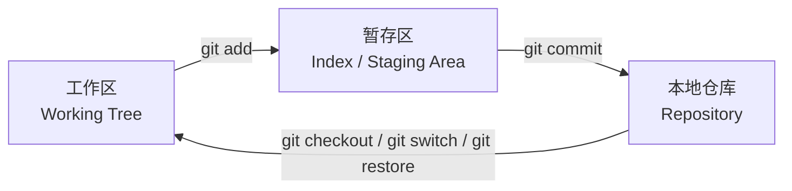
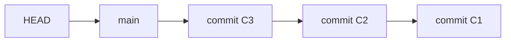
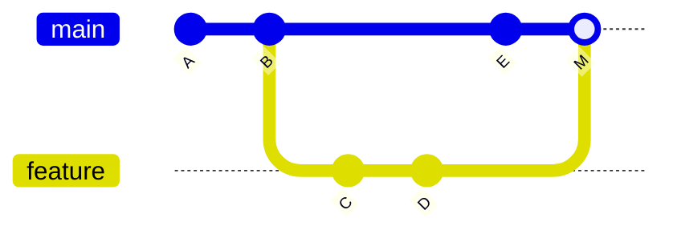
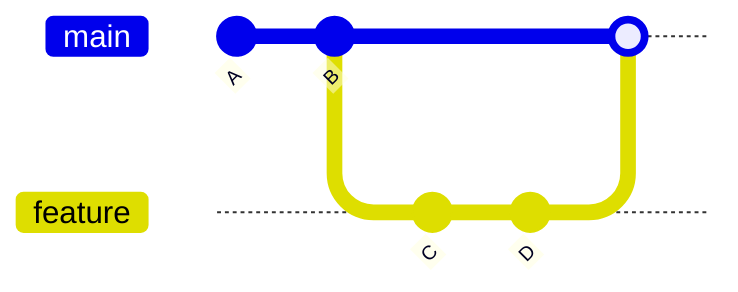
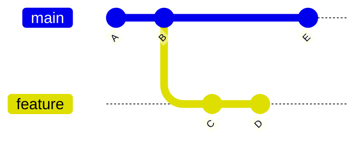
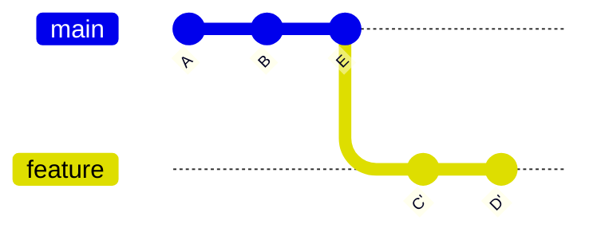

Git 的命令很多，但日常使用的核心模型很少：工作区、暂存区、本地仓库、远程仓库、分支、提交图。先理解这些概念，再学命令会轻松很多。

# Git 的三个本地区域



三个区域：

| 区域 | 含义 |
| - | - |
| 工作区 | 你正在编辑的真实文件 |
| 暂存区 | 准备进入下一次提交的修改集合 |
| 本地仓库 | 已经形成提交历史的 `.git` 数据库 |

常见流程：

```bash
git status
git add file.txt
git commit -m "docs: add git notes"
```

`git add` 不是“添加文件到 Git”这么简单，它更准确的含义是：**把当前修改放入下一次提交的候选集合**。

# 初始化仓库

在现有目录中创建 Git 仓库：

```bash
git init
```

克隆远程仓库：

```bash
git clone https://github.com/user/repo.git
```

仓库中会出现 `.git` 目录，它保存 Git 的对象、引用、配置和历史。

```bash
ls -la .git
```

不要手工修改 `.git` 内部文件，除非你明确知道后果。

# 配置身份

Git 提交需要记录作者信息。

```bash
git config --global user.name "Your Name"
git config --global user.email "you@example.com"
```

查看配置：

```bash
git config --list
git config user.name
git config user.email
```

配置层级：

| 层级 | 位置 | 作用范围 |
| - | - | - |
| system | 系统配置 | 所有用户 |
| global | 用户配置 | 当前用户所有仓库 |
| local | 仓库配置 | 当前仓库 |

仓库内单独配置：

```bash
git config user.email "project@example.com"
```

# 查看状态

```bash
git status
git status -sb
```

`git status` 是最常用命令之一。它告诉你：

- 当前分支。
- 工作区是否干净。
- 哪些文件未跟踪。
- 哪些修改未暂存。
- 哪些修改已暂存。

建议在执行修改历史或提交前先看一次：

```bash
git status
```

# 查看差异

查看工作区相对暂存区的修改：

```bash
git diff
```

查看暂存区相对上一次提交的修改：

```bash
git diff --staged
```

查看两个提交之间的差异：

```bash
git diff commit1 commit2
```

常见习惯：

```bash
git diff
git add file.txt
git diff --staged
git commit -m "..."
```

提交前看 `git diff --staged`，可以避免把无关修改提交进去。

# stage：暂存修改

暂存单个文件：

```bash
git add file.txt
```

暂存整个目录：

```bash
git add src/
```

暂存当前目录所有变化：

```bash
git add .
```

交互式暂存：

```bash
git add -p
```

`git add -p` 可以按代码块选择是否暂存，适合把一个文件中的多类修改拆成多个提交。

取消暂存：

```bash
git restore --staged file.txt
```

注意：取消暂存不会删除工作区修改，只是把它从下一次提交候选集合中移出。

# commit：提交快照

提交暂存区内容：

```bash
git commit -m "docs: add git basics"
```

打开编辑器写较长提交信息：

```bash
git commit
```

修改上一次提交：

```bash
git commit --amend
```

`commit --amend` 会生成一个新的提交替换旧提交。如果旧提交已经推送并被他人基于它开发，修改历史会影响协作，需要谨慎。

好提交的特点：

- 只做一件事。
- 能独立解释修改目的。
- 能相对容易回退。
- 提交信息说明原因，不只描述动作。

推荐提交信息：

```text
docs(git): explain staging area
fix(auth): reject expired token
refactor(api): split validation logic
```

# 查看历史

常用命令：

```bash
git log
git log --oneline
git log --oneline --graph --decorate --all
```

查看某次提交：

```bash
git show HEAD
git show commit_hash
```

查看某个文件历史：

```bash
git log -- file.txt
```

图形化历史：

```bash
git log --oneline --graph --decorate --all
```

输出大致类似：

```text
* c3f9a1d (HEAD -> feature) docs: add branch notes
* a12bd34 docs: add commit notes
| * d92aa10 (main) fix: update typo
|/
* 9ab0012 init project
```

# HEAD 是什么

`HEAD` 表示当前检出的提交位置。通常它指向当前分支，当前分支再指向某个提交。



如果直接检出某个提交而不是分支，会进入 detached HEAD 状态：

```bash
git checkout commit_hash
```

这适合临时查看旧版本，但不适合直接长期开发。需要开发时应创建分支：

```bash
git switch -c fix/from-old-version
```

# branch：分支

分支是指向提交的可移动指针。

查看分支：

```bash
git branch
git branch -a
```

创建分支：

```bash
git branch feature/login
```

切换分支：

```bash
git switch feature/login
```

创建并切换：

```bash
git switch -c feature/login
```

删除已合并分支：

```bash
git branch -d feature/login
```

强制删除未合并分支：

```bash
git branch -D feature/login
```

`-D` 可能丢失分支上未合并的提交，使用前必须确认这些提交不再需要。

# checkout 与 switch

老命令 `checkout` 功能很多：

```bash
git checkout main
git checkout -b feature/login
git checkout -- file.txt
```

它既能切换分支，又能恢复文件，语义容易混淆。

较新的 Git 推荐：

```bash
git switch main
git switch -c feature/login
git restore file.txt
```

对应关系：

| 旧写法 | 新写法 | 含义 |
| - | - | - |
| `git checkout main` | `git switch main` | 切换分支 |
| `git checkout -b feature` | `git switch -c feature` | 创建并切换分支 |
| `git checkout -- file.txt` | `git restore file.txt` | 丢弃工作区修改 |

如果项目或教程使用 `checkout`，仍然需要看懂；日常新命令可以优先用 `switch` 和 `restore`。

# merge：合并分支

假设从 `main` 创建 `feature`，两边都有新提交：



合并命令：

```bash
git switch main
git merge feature
```

如果 Git 能自动合并，会生成合并结果。若两个分支修改了同一位置，可能产生冲突。

冲突文件中会出现标记：

```text
<<<<<<< HEAD
main branch content
=======
feature branch content
>>>>>>> feature
```

解决流程：

```bash
git status
vim conflicted-file.txt
git add conflicted-file.txt
git commit
```

合并保留了真实分叉历史，适合需要保留上下文的团队协作。

# fast-forward merge

如果目标分支没有新提交，合并可以快进：



此时 `main` 只是向前移动到 `feature` 指向的提交，不产生新的 merge commit。

禁用快进并强制保留合并提交：

```bash
git merge --no-ff feature
```

# rebase：变基

`rebase` 的作用是把一组提交“搬到”另一个基底之后，得到更线性的历史。

变基前：



在 `feature` 上执行：

```bash
git switch feature
git rebase main
```

变基后可以理解为：



注意：`C'`、`D'` 是新提交，不是原来的 `C`、`D`。因为父提交变了，提交哈希也会变。

rebase 适合：

- 整理本地未公开历史。
- 让功能分支基于最新主线。
- 提交 PR 前减少无意义 merge commit。

重要原则：

```text
不要 rebase 已经公开且被他人依赖的分支历史。
```

否则会造成协作者历史不一致，需要额外处理。

# merge 与 rebase 的区别

| 对比 | merge | rebase |
| - | - | - |
| 历史形状 | 保留分叉和合并节点 | 形成更线性的历史 |
| 是否改写提交 | 不改写已有提交 | 会生成新提交 |
| 适用场景 | 团队协作、保留上下文 | 整理本地分支、同步主线 |
| 风险 | 历史可能较复杂 | 公开历史改写风险高 |

实用建议：

- 公共主分支优先用 merge 或 PR 平台合并策略。
- 本地功能分支可以 rebase 到最新主线。
- 不确定是否有人基于你的分支开发时，不要 rebase 后强推。

# 远程仓库

查看远程：

```bash
git remote -v
```

添加远程：

```bash
git remote add origin https://github.com/user/repo.git
```

拉取远程信息，不自动合并：

```bash
git fetch origin
```

拉取并合并：

```bash
git pull
```

推送本地分支：

```bash
git push origin main
git push -u origin feature/login
```

`-u` 会设置 upstream，之后可以直接：

```bash
git push
git pull
```

`fetch` 和 `pull` 的区别：

| 命令 | 行为 |
| - | - |
| `git fetch` | 只更新远程跟踪分支，不改当前工作分支 |
| `git pull` | `fetch` 后再 merge 或 rebase |

初学者排查问题时，`fetch` 更安全，因为它不会直接改当前分支。

# 撤销与恢复

## 丢弃工作区修改

```bash
git restore file.txt
```

这会丢弃未暂存修改，属于不可逆操作，应先确认。

## 取消暂存

```bash
git restore --staged file.txt
```

工作区修改仍然保留。

## 撤销某次提交

```bash
git revert commit_hash
```

`revert` 会创建一个新提交，用反向修改抵消目标提交。它不改写历史，适合公共分支。

## 回退分支指针

```bash
git reset --soft HEAD~1
git reset --mixed HEAD~1
git reset --hard HEAD~1
```

区别：

| 命令 | 提交历史 | 暂存区 | 工作区 |
| - | - | - | - |
| `--soft` | 回退 | 保留 | 保留 |
| `--mixed` | 回退 | 取消暂存 | 保留 |
| `--hard` | 回退 | 丢弃 | 丢弃 |

`reset --hard` 会丢弃工作区修改，风险高。公共分支上也不应随意 reset 已推送历史。

# stash：临时保存现场

当你正在改代码，但需要临时切换分支，可以使用 stash：

```bash
git stash
git stash list
git stash pop
```

带说明：

```bash
git stash push -m "wip: login form"
```

只应用不删除：

```bash
git stash apply
```

`stash` 适合临时保存，不适合长期存放重要工作。重要修改应尽快提交到分支。

# cherry-pick：摘取提交

把某个提交应用到当前分支：

```bash
git cherry-pick commit_hash
```

适合场景：

- 把修复从开发分支摘到发布分支。
- 只需要另一个分支上的某一个提交。

注意：cherry-pick 会创建新提交，哈希与原提交不同。

# `.gitignore`

`.gitignore` 用于忽略不应进入版本库的文件。

常见内容：

```gitignore
node_modules/
dist/
.env
*.log
__pycache__/
.DS_Store
```

注意：

- `.gitignore` 只影响未被跟踪的文件。
- 已经被 Git 跟踪的文件，即使加入 `.gitignore` 也不会自动停止跟踪。

停止跟踪但保留本地文件：

```bash
git rm --cached .env
```

敏感信息如果已经提交进历史，仅删除当前文件不够，还需要轮换密钥并清理历史。

# 一个完整日常流程

```bash
git switch main
git pull
git switch -c feature/git-notes

vim source/_posts/software-engineering/git/GT-2.md

git status
git diff
git add source/_posts/software-engineering/git/GT-2.md
git diff --staged
git commit -m "docs(git): add basic usage notes"

git push -u origin feature/git-notes
```

之后通常在 GitHub / GitLab 上创建 Pull Request，等待检查和代码评审。

# 常见问题与判断

## 什么时候 commit

当一组修改能用一句清楚的话描述时，就适合提交。

不好的粒度：

- 一次提交包含十个不相关功能。
- 每改一行就提交一次，没有独立意义。

好的粒度：

- 添加一个文档章节。
- 修复一个明确 bug。
- 重构一个函数并保持行为不变。
- 添加一组相关测试。

## 什么时候 branch

建议遇到这些情况创建分支：

- 开发新功能。
- 修复 bug。
- 尝试不确定方案。
- 准备发布。
- 做较大重构。

分支成本很低，不要在主分支上直接做风险较高的修改。

## 什么时候 merge

当一个分支的工作完成并通过检查，需要进入目标分支时使用 merge。

团队协作中通常通过 PR/MR 合并，而不是本地直接合并主分支。

## 什么时候 rebase

适合本地整理历史，或让功能分支基于最新主线。

不适合对已公开、已被他人使用的分支随意 rebase。

# 初学者高风险命令

这些命令不是不能用，但要先理解后果：

```bash
git reset --hard
git clean -fd
git push --force
git rebase
git branch -D branch_name
```

风险说明：

| 命令 | 风险 |
| - | - |
| `git reset --hard` | 丢弃工作区和暂存区修改 |
| `git clean -fd` | 删除未跟踪文件和目录 |
| `git push --force` | 改写远程分支历史 |
| `git rebase` | 改写当前分支提交历史 |
| `git branch -D` | 删除未合并分支 |

如果只是想撤销公共分支上的某个提交，优先考虑：

```bash
git revert commit_hash
```

# 最小命令清单

日常必须熟练：

```bash
git status
git diff
git add
git commit
git log --oneline --graph --decorate --all
git switch
git branch
git merge
git fetch
git pull
git push
```

进阶再掌握：

```bash
git rebase
git stash
git cherry-pick
git revert
git reset
git restore
```

Git 的学习重点不是命令数量，而是每个命令在“工作区、暂存区、提交图、分支指针、远程引用”中到底移动了什么。
